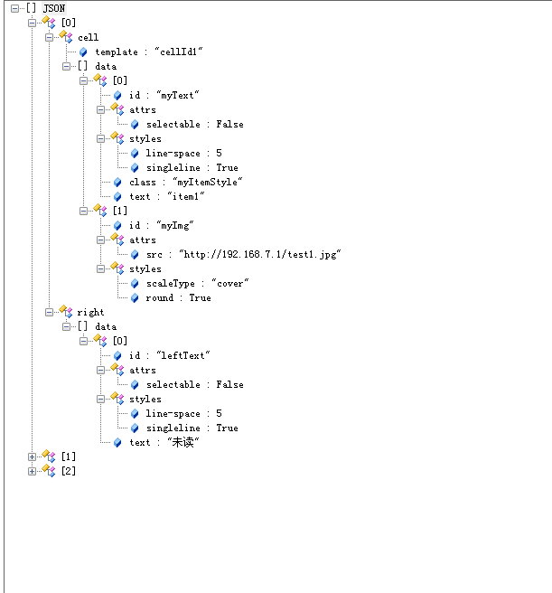

# ListAdapter组件使用 

----------

SimpleListAdapter为simplelist容器提供高性能的数据处理和访问，SimpleListAdapter需要保存数据，若数据改变则调用刷新实时展现在simplelist容器上。  

再使用ListAdapter组件的时候，需要在js里面导入：  

```javascript
 var Adapter = require("SimpleListAdapter");
```


<h2 id="cid_3">事件</h2>

无


<h2 id="cid_4">js方法</h2> 

本节目录：

> [setData(arrayData:Array&lt;Object&gt;,domObj:object): void 设置SimpleListAdapter关联数据](#ff_1)
> 
> [getData(): Array&lt;Object&gt;  获取SimpleListAdapter关联数据](#ff_2)
> 
> [refresh(): void  刷新数据并通知simplelist容器全局刷新](#ff_3)
> 
> [notifyItemRangeInserted (jsonData:Object,domObj:object): void   插入列表数据后通知simplelist容器局部刷新](#ff_4)
> 
> [notifyItemRangeChanged(jsonData:Object,domObj:object): void 更新列表数据后通知simplelist容器局部刷新](#ff_5)
> 
> [notifyItemRangeRemoved(jsonData:Object): void 移除列表数据后通知simplelist容器局部刷新](#ff_6)
> 
> [notifyItemsChanged(arrayData:Array&lt;Object&gt;,domObj:object): void 更新多条列表数据后通知simplelist容器局部刷新](#ff_7)
> 
> [notifyItemsRemoved(arrayData:Array&lt;Object&gt;,animator:boolean): void 移除多条列表数据后通知simplelist容器局部刷新](#ff_8)

<span id="ff_1">**setData(arrayData:Array&lt;Object&gt;,domObj:object): void**</span>

<code>设置SimpleListAdapter关联数据</code>   
  
参数：

arrayData：需设置的列表数据，json数组格式，必选项，定义参见：[数据格式定义说明](#sjgs)

domObj：当前js运行环境对象，可选参数，component模板中使用，传入this即可

返回值：无


<span id="ff_2">**getData(): Array&lt;Object&gt;**</span>  

<code>获取SimpleListAdapter关联数据</code> 

参数： 无 

返回值：已设置的列表数据，json数组格式,定义参见：[数据格式定义说明](#sjgs)


<span id="ff_3">**refresh(): void**</span>   

<code>刷新数据并通知simplelist容器全局刷新</code>  

参数：无   

返回值：无

**注：**  
1：数据更新后，必须调用该方法通知simplelist容器更新UI；

2：某些应用场景下，请用notifyItemRangeInserted，notifyItemRangeChanged，notifyItemRangeRemoved局部刷新方法代替提高列表效率

<span id="ff_4">**notifyItemRangeInserted (jsonData:Object,domObj:object): void**</span>  

<code>插入列表数据后通知simplelist容器局部刷新</code>   

参数：

jsonData：刷新参数，json格式，定义如下：  

> index：插入 item数据索引（0开始计数），数字类型，必选项；
> 
> datas：插入item对应的数据，json数组格式，定义参见：[数据格式定义说明](#sjgs)；
> 
> animator：是否启用动画，bool型，可选项，默认false，true：启用动画；false：不启用动画；  

domObj：当前js运行环境对象，可选项，component模板中使用，传入this即可


返回值：无
 
<span id="ff_5">**notifyItemRangeChanged(jsonData:Object,domObj:object):void**</span>

<code>更新列表数据后通知simplelist容器局部刷新</code>

参数：

jsonData：刷新参数，json格式，定义如下：

> index：更新item数据索引（0开始计数），数字类型，必选项；
> 
> datas：更新item对应的数据，json数组格式，定义参见：[数据格式定义说明](#sjgs)

domObj：当前js运行环境对象，可选参数，component模板中使用，传入this即可。

返回值：无

<span id="ff_6">**notifyItemRangeRemoved(jsonData:Object):void**</span>

<code>移除列表数据后通知simplelist容器局部刷新</code>

参数：

jsonData： 移除参数，json格式，定义如下：

> index：移除item数据索引（0开始计数），数字类型，必选项；
> 
> count：移除item个数，数字类型，可选项，默认为1；
> 
> animator：是否启用动画，bool型，可选项，默认false，true：启用动画；false：不启用动画

返回值：无

<span id="ff_7">**notifyItemsChanged(arrayData:Array&lt;Object&gt;,domObj:object):void**</span>

<code>更新多条列表数据后通知simplelist容器局部刷新</code>

参数：

arrayData：需刷新的item参数集，数字类型，数组成员为json对象，定义如下：

> index：更新item数据索引（0开始计数），数字类型，必选项；
> 
> data：更新item对应的数据，json格式，定义参见：[数据格式定义说明](#sjgs)

domObj：当前js运行环境对象，可选参数，component模板中使用，传入this即可；

返回值：无


<span id="ff_8">**notifyItemsRemoved(arrayData:Array&lt;Object&gt;,animator:boolean):void**</span>

<code>移除多条列表数据后通知simplelist容器局部刷新</code>

参数：

arrayData：需移除的item参数集，数字类型，数组成员为json对象，定义如下：

> index：移除item数据索引（0开始计数），数字类型，必选项；

animator：是否启用动画，bool型，可选项，默认false，true：启用动画；false：不启用动画

返回值：无


<h2 id="sjgs">数据格式定义</h2>   



 

**数据示例**
`````
[
	{
		//标识item区域，固定字段cell
		"cell":{
			//item对应标识模板id，固定字段template
			"template":"cellId1",
			//item对应控件数组，固定字段data
			"data":[
				//控件区分
				{
					//对应控件id，固定字段id
					"id":"myText",
					//对应控件普通属性设置，固定字段attrs
					"attrs":{
						"selectable":false
					},
					//对应控件style样式设置，固定字段styles
					"styles":{
						"line-space":5,
						"singleline":true
					},
					//对应控件class样式设置，key固定字段class
					"class":"myItemStyle",
					//对应控件文本设置，key固定字段text
					"text":"item1"
				},
				//控件区分
				{
					"id":"myImg",
					"attrs":{
						"src":"http://192.168.7.1/test1.jpg"
					},
					"styles":{
						"scaleType":"cover",
						"round":true
					}
				}
			]
		},
		//标识right右侧滑动区域，固定字段right
		"right":{
			//item右侧区域对应控件数组，固定字段data
			"data":[
				{
					"id":"leftText",
					"attrs":{
						"selectable":false
					},
					"styles":{
						"line-space":5,
						"singleline":true
					},
					"text":"未读"
				}
			]
		}
	}，
	{
		"cell":{
			"template":"cellId1",
			"data":[
				{
					"id":"myText",
					"attrs":{
						"selectable":true
					},
					"styles":{
						"line-space":5,
						"singleline":true
					},
					"class":"myItemStyle",
					"text":"item2"
				},
				{
					"id":"myImg",
					"attrs":{
						"src":"http://192.168.7.1/test2.jpg"
					},
					"styles":{
						"scaleType":"cover",
						"round":true
					}
				}
			]
		},
		"right":{
			"data":[
				{
					"id":"leftText",
					"attrs":{
						"selectable":false
					},
					"styles":{
						"line-space":5,
						"singleline":true
					},
					"text":"未读"
				}
			]
		}
	}，
	{
		"cell":{
			"template":"cellId2",
			"data":[
				{
					"id":"myText",
					"attrs":{
						"selectable":false
					},
					"styles":{
						"lien-space":5,
						"singleline":true
					},
					"class":"myItemStyle",
					"text":"item3"
				},
				{
					"id":"myImg",
					"attrs":{
						"src":"http://192.168.7.1/test3.jpg"
					},
					"styles":{
						"scaleType":"cover",
						"round":true
					}
				}
			]
		},
		"right":{
			"data":[
				{
					"id":"leftText",
					"attrs":{
						"selectable":false
					},
					"styles":{
						"line-space":5,
						"singleline":true
					},
					"text":"已读"
				}
			]
		}
	}
]
```


