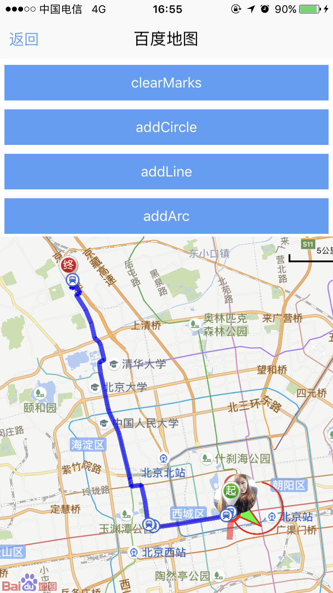
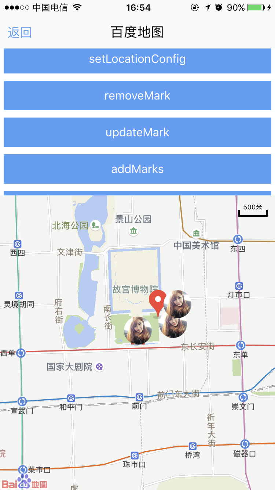

# baidumap 组件使用 

----------

百度地图UI组件,提供百度地图功能集成。  

使用百度地图定位功能标准版已经内置百度key值，如果开发者自行打包后，需要自己去百度地图官网申请对应key值。

在官方平台打包的sprite客户端签名证书的sha1值为：
```
0D:ED:5B:2A:C3:C6:40:44:B4:8C:97:EF:2B:FB:7E:6A:6C:86:24:47
```
android包名以实际打包的为准，如：com.fiberhome.sprite.client。

Ios用的是bundleid以实际为准（一般情况是证书appid）如：cn.com.fiberhome.sprite


<h2 id="cid_0">属性</h2> 

本节目录：

> [公共属性](#sx_0)	
> 
> [maptype	地图显示方式](#sx_1)
>
>[traffic	  是否显示交通图](#sx_2)
>
>[gesture  是否禁用所有手势](#sx_3)
>
>[zoom  是否启用缩放手势（可以通过js修改）](#sx_4)
>
>[zoomLevel  地图缩放比例](#sx_5)
>
>[scroll 	是否启用平移手势](#sx_6)
>
>[rotate  是否启用旋转手势](#sx_7)
>
>[rotateNumber  地图旋转角度](#sx_8)
>
>[overLook  是否启用俯视手势](#sx_9)
>
>[overLookNumber  地图俯仰角](#sx_10)
>
>[mapPoi  是否显示地图默认标注](#sx_11)
>
>[scaleControl  是否显示地图比例尺](#sx_12)
>
>[zoomControl  是否显示地图缩放按钮](#sx_13)


<span id="sx_0">**公共属性**</span>  

[参见公共属性章节](https://gitdocument.exmobi.cn/sprite-api/ggsx.html)，包括：id、style、class；

<span id="sx_1">**maptype**</span>

<code>地图显示方式</code>

字符串枚举型,取值[normal, satellite]

> normal：普通地图（默认）
> 
> satellite：卫星地图


<span id="sx_2">**traffic**</span>

<code>是否显示交通图</code>

bool型

> true：显示交通图
> 
> false：不显示交通图(默认)

<span id="sx_3">**gesture**</span>

<code>是否禁用所有手势</code>

bool型

> true：开启地图所有手势事件 (默认)
> 
> false：禁用地图所有手势事件

<span id="sx_4">**zoom**</span>

<code>是否启用缩放手势</code>

bool型

> true：启用缩放手势(默认)
> 
> false：不启用缩放手势


<span id="sx_5">**zoomLevel**</span>

<code>地图缩放比例</code>

取值范围[3-21],默认15

<span id="sx_6">**scroll**</span>

<code>是否启用平移手势</code>

bool型

> true：启用平移手势(默认)
> 
> false：不启用平移手势

<span id="sx_7">**rotate**</span>

<code>是否启用旋转手势</code>

bool型

> true：启用旋转手势(默认)
> 
> false：不启用旋转手势

<span id="sx_8">**rotateNumber**</span>

<code>地图旋转角度</code>

数值型

取值范围：-180-180，默认0；


<span id="sx_9">**overLook**</span>

<code>是否启用俯视手势</code>

bool型

> true：启用俯视手势(默认)
> 
> false：不启用俯视手势

<span id="sx_10">**overLookNumber**</span>

<code>地图俯仰角</code>

数值型

取值范围：-45-0，默认0


<span id="sx_11">**mapPoi**</span>

<code>是否显示地图默认标注</code>

bool型

> true：显示地图默认标注 (默认)
> 
> false：不显示地图默认标注


<span id="sx_12">**scaleControl**</span>

<code>是否显示地图比例尺</code>

bool型

> true：显示地图比例尺(默认)
> 
> false：不显示地图比例尺

<span id="sx_13">**zoomControl**</span>

<code>是否显示地图缩放按钮</code>

bool型

> true：显示地图缩放按钮(默认)
> 
> false：不显示地图缩放按钮

注：仅Android支持


<h2 id="cid_1">样式</h2>

**公共样式**  

[参见公共样式章节](https://gitdocument.exmobi.cn/sprite-api/ggys.html)，包括：  

> 尺寸
> 
> 定位 
> 
> 外边距
> 
> flexbox布局：align-self,flex


<h2 id="cid_2">事件</h2>

本节目录：

> **地图事件**
> 
> [loaded  地图加载完成后触发](#sj_0)
> 
> [click  单击地图空白区域触发](#sj_1)
> 
> [poiClick  单击地图Poi区域（周边兴趣点）触发](#sj_2)
> 
> [doubleClick  双击地图触发](#sj_3)
> 
> [longClick  长按地图触发 ](#sj_4) 
> 
> [mapStatusChangeFinish   地图状态改变结束触发](#sj_5)
> 
> **普通Mark点事件**  
> 
> [markClick  单击地图mark标注点触发](#sj_6)
> 
> [markDragStart  拖动mark标注点开始时触发](#sj_7)
> 
> [markDragEnd  拖动mark标注点结束时触发](#sj_8)
> 
> **定位点事件**
> 
> [locationClick  单击定位点触发](#sj_9)


<span id="sj_0">**loaded**</span>

<code>地图加载完成后触发</code>

一些地图相关的操作必须放在该事件里面执行。

event事件对象包括：  

> type：事件类型,字符串类型,固定值：loaded；
> 
> target：触发事件的目标组件,dom对象；
> 
> timestamp：事件触发的时间戳,单位毫秒,数字类型
 
<span id="sj_1">**click**</span>

<code>单击地图空白区域触发</code>

event事件对象包括：  

> type：事件类型,字符串类型,固定值：click；
> 
> target：触发事件的目标组件,dom对象；
> 
> timestamp：事件触发的时间戳,单位毫秒,数字类型
 
param对象为Json对象,定义如下：

> latitude：点击位置纬度,数字类型
> 
> longitude：点击位置经度,数字类型

<span id="sj_2">**poiClick**</span>

<code>单击地图Poi区域（周边兴趣点）触发</code>

event事件对象包括：  

> type：事件类型,字符串类型,固定值：poiClick；
> 
> target：触发事件的目标组件,dom对象；
> 
> timestamp：事件触发的时间戳,单位毫秒,数字类型

param对象为Json对象,定义如下：

> name：poi点击点名称,字符串类型
> 
> latitude：点击位置纬度,数字类型
> 
> longitude：点击位置经度,数字类型


<span id="sj_3">**doubleClick**</span>

<code>双击地图触发</code>

event事件对象包括：  

> type：事件类型,字符串类型,固定值：doubleClick
> 
> target：触发事件的目标组件,dom对象
> 
> timestamp：事件触发的时间戳,单位毫秒,数字类型
    
param对象为Json对象,定义如下：

> latitude：双击位置纬度,数字类型
> 
> longitude：双击位置经度,数字类型

<span id="sj_4">**longClick**</span>

<code>长按地图触发</code>

event事件对象包括：  

> type：事件类型,字符串类型,固定值：longClick；
> 
> target：触发事件的目标组件,dom对象；
> 
> timestamp：事件触发的时间戳,单位毫秒,数字类型
    
param对象为Json对象,定义如下：

> latitude：长按位置纬度,数字类型,
> 
> longitude：长按位置经度,数字类型, 


<span id="sj_5">**mapStatusChangeFinish**</span>

<code>地图状态改变结束触发</code>

event事件对象包括：  

> type：事件类型,字符串类型,固定值：mapStatusChangeFinish；
> 
> target：触发事件的目标组件,dom对象；
> 
> timestamp：事件触发的时间戳,单位毫秒,数字类型
    
param对象为Json对象,定义如下：

> latitude：地图中心点位置纬度,数字类型,
> 
> longitude：地图中心点位置经度,数字类型,

**注：**iOS地图初始加载完毕后即调用该事件

<span id="sj_6">**markClick**</span>

<code>单击地图mark标注点触发</code>

event事件对象包括：  

> type：事件类型,字符串类型,固定值：markClick；
> 
> target：触发事件的目标组件,dom对象；
> 
> timestamp：事件触发的时间戳,单位毫秒,数字类型
    
param对象为Json对象,定义如下：

> id：标注点标识值,字符串类型 
> 
> latitude：纬度,数字类型
> 
> longitude：经度,数字类型；
> 
> icon：标注点图标路径,字符串类型,本地图片：res:前缀,file:前缀
> 
> coorType：坐标系类型,字符串枚举型,[bd09ll,wgs84,gcj02]
> 
> - bd09ll：百度地图坐标系
> 
> - wgs84：标准gps坐标系
> 
> - gcj02：由中国国家测绘局制订的地理信息系统的坐标系统
> 
> title：标注点名称,字符串类型    draggable：标注点是否可拖拽,bool型
> 
> -  true：可拖拽,
> 
> -  false：不可拖拽
> 
> animateType：标注点展现方式,字符串枚举型,[none,drop]
> 
> - none：无动画
>  
> - drop：从上往下掉下  
> 
> rotate：标注点旋转角度,数字    
>    
> alpha：标注点透明度,数字,[0-1]

<span id="sj_7">**markDragStart**</span>

<code>拖动mark标注点开始时触发</code>

event事件对象包括：  

> type：事件类型,字符串类型,固定值：markDragStart；
> 
> target：触发事件的目标组件,dom对象；
> 
> timestamp：事件触发的时间戳,单位毫秒,数字类型
    
param对象为Json对象,定义如下：

> id：标注点标识值,字符串类型 
> 
> latitude：纬度,数字类型
> 
> longitude：经度,数字类型；
> 
> icon：标注点图标路径,字符串类型,本地图片：res:前缀,file:前缀
> 
> coorType：坐标系类型,字符串枚举型,[bd09ll,wgs84,gcj02]
> 
> -   bd09ll：百度地图坐标系
> 
> -   wgs84：标准gps坐标系
> 
> -   gcj02：由中国国家测绘局制订的地理信息系统的坐标系统
> 
> title：标注点名称,字符串类型  
> 
> draggable：标注点是否可拖拽,bool型
> 
> -  true：可拖拽
> 
> -  false：不可拖拽
> 
> animateType：标注点展现方式,字符串枚举型,[none,drop]
> 
> -  none：无动画
> 
> -  drop：从上往下掉下    

rotate：标注点旋转角度,数字    

alpha：标注点透明度,数字,[0-1]


<span id="sj_8">**markDragEnd**</span>

<code>拖动mark标注点结束时触发</code>

event事件对象包括：  

> type：事件类型,字符串类型,固定值：markDragEnd；
> 
> target：触发事件的目标组件,dom对象；
> 
> timestamp：事件触发的时间戳,单位毫秒,数字类型
    
param对象为Json对象,定义如下：

> id：标注点标识值,字符串类型 
> 
> latitude：纬度,数字类型
> 
> longitude：经度,数字类型；
> 
> icon：标注点图标路径,字符串类型,本地图片：res:前缀,file:前缀
> 
> coorType：坐标系类型,字符串枚举型,[bd09ll,wgs84,gcj02]
> 
> - bd09ll：百度地图坐标系
> 
> - wgs84：标准gps坐标系
> 
> - gcj02：由中国国家测绘局制订的地理信息系统的坐标系统
> 
> title：标注点名称,字符串类型    
> 
> draggable：标注点是否可拖拽,bool型,true：可拖拽,false：不可拖拽
> 
> animateType：标注点展现方式,字符串枚举型,[none,drop]
> 
> -  none：无动画,drop：从上往下掉下
> 
> -  rotate：标注点旋转角度,数字   
> 
> alpha：标注点透明度,数字,[0-1]


<span id="sj_9">**locationClick**</span>

<code>单击定位点触发</code>

event事件对象包括：  

> type：事件类型,字符串类型,固定值：locationClick；
> 
> target：触发事件的目标组件,dom对象；
> 
> timestamp：事件触发的时间戳,单位毫秒,数字类型
    
param对象为Json对象,定义如下：

> latitude：定位点纬度,数字类型
> 
> longitude：定位点经度,数字类型

**注：**仅Android支持


<h2 id="cid_3">js方法</h2>

本节目录：

> [公共方法](#ff_0)
> 
> **标注点**
> 
> [addMark(jsonData:Object): string  添加单个Mark标注点](#ff_1)
> 
> [removeMark(jsonData:Object): boolean  移除单个Mark标注点  ](#ff_2)
> 
> [updateMark(jsonData:Object): boolean  更新单个Mark标注点](#ff_3)
> 
> [addMarks(jarrayData:Array&lt;Object&gt;): Array&lt;Object&gt;    添加多个Mark标注点](#ff_4)
> 
> [removeMarks(jarrayData:Array&lt;Object&gt;): boolean   移除多个Mark标注点](#ff_5)
> 
> [clearMarks(): boolean  移除地图上所有Mark标注点](#ff_6)
> 
> **定位**
> 
> [setShowUserLocation(isShow:boolean): void  地图是否显示定位图层](#ff_7)
> 
> [setLocationData(jsonData:Object): void  添加定位点 ](#ff_8) 
> 
> [setLocationConfig(jsonData:Object): void  设置定位点配置参数](#ff_9)
> 
> **覆盖物** 
> 
> [addLine(jsonData:Object): string  地图添加折线](#ff_10)
> 
> [addCircle(jsonData:Object): string  地图添加圆形覆盖物 ](#ff_11)
> 
> [addArc(jsonData:Object): string  地图添加弧线](#ff_12)
> 
> [addPolygon(jsonData:Object): string  地图添加多边形](#ff_13)
> 
> [addText(jsonData:Object): string  地图添加文字](#ff_14)
> 
> [removeOverlay(jsonData:Object): boolean  移除遮盖物](#ff_15)
> 
> [clearOverlays(): boolean  移除所有遮盖物](#ff_16)
> 
> **路线规划标注**
> 
> [markTransitRoute(jsonData:Object,callback:Function): void  公交路径规划并标注  ](#ff_11)
> 
> [markDrivingRoute(jsonData:Object,callback:Function): void  驾车路径规划并标注](#ff_18)
> 
> [markWalkingRoute(jsonData:Object,callback:Function): void   步行路径规划并标注](#ff_19)
> 
> [markBikingRoute(jsonData:Object,callback:Function): void  骑行路径规划并标注](#ff_20)
> 
> [removeRoute (jsonData:Object): void   移除地图中指定标注规划路线](#ff_21)
> 
>[ clearRoutes(): void  清除地图中所有标注规划路线](#ff_22)
> 
> **行政区域检索标注** 
> 
> [markDistrict (jsonData:Object,callback:Function): void   行政区域检索并标注](#ff_23)
> 
> [removeDistrict (jsonData:Object): void 移除地图中指定区域标注](#ff_24)
> 
> [clearDistricts(): void 清除地图中所有标注区域 ](#ff_25)
> 
> **公交路线查询标注** 
> 
> [markBusLine(jsonData:Object,callback:Function): void  公交路线查询并标注](#ff_26)
> 
> [removeBusLine(jsonData:Object): void  移除地图中指定标注公交路线](#ff_27)
> 
> [clearBusLines(): void  清除地图中所有标注公交路线 ](#ff_28)
> 
> **其他**
> 
> [setMapCenter(jsonData:Object): boolean  设置地图中心点位置](#ff_29) 
> 
> [getMapCenter(): Object  获取地图中心点位置](#ff_30)
> 
> [getBounds(): Object  返回地图可视区域,以地理坐标表示 ](#ff_31)
> 
> [snapshot(jsonData:Object,callback:Function): void   地图截屏](#ff_32)


<span id="#ff_0"><code>**公共方法**</code></span>

[事件相关](https://gitdocument.exmobi.cn/sprite-api/ggff.html#cid_0)，包括：

> [on(messageName:string,callback:Function): void   组件注册事件的触发函数](https://gitdocument.exmobi.cn/sprite-api/ggff.html#jjxg_1)   
> 
> [fire(messageName:string,params:Array&lt;any&gt;): void  组件事件的触发函数](https://gitdocument.exmobi.cn/sprite-api/ggff.html#jjxg_2)   
> 
> [off(messageName:string,callback:Function): void  组件移除事件的触发函数](https://gitdocument.exmobi.cn/sprite-api/ggff.html#jjxg_3)  
>  
> [getOn(messageName:string): Array&lt;Function&gt;  获取已绑定的事件的触发函数](https://gitdocument.exmobi.cn/sprite-api/ggff.html#jjxg_4)   

[动画相关](https://gitdocument.exmobi.cn/sprite-api/ggff.html#cid_1)，包括： 
 
> [startAnimation(jsonData:Object,callback:Function): void  启动UI组件动画](https://gitdocument.exmobi.cn/sprite-api/ggff.html#dhxg_1)   
> 
> [startAnimator(jsonData:Object,callback:Function): void  启动UI组件属性动画](https://gitdocument.exmobi.cn/sprite-api/ggff.html#dhxg_2)   
> 
> [startKeyFrameAnimator(jsonData:Object,callback:Function): void  启动UI组件关键帧动画](https://gitdocument.exmobi.cn/sprite-api/ggff.html#dhxg_3)  
>  
> [ releaseAnimator(): void  结束控件动画](https://gitdocument.exmobi.cn/sprite-api/ggff.html#dhxg_4)   

[尺寸和位置](https://gitdocument.exmobi.cn/sprite-api/ggff.html#cid_2)，包括：  

> [getFrame(): Object  获取组件在父容器中的位置](https://gitdocument.exmobi.cn/sprite-api/ggff.html#cchwz_1)   
> 
> [setFrame(frame:Object): void  设置组件在父容器中的位置](https://gitdocument.exmobi.cn/sprite-api/ggff.html#cchwz_2)   
> 
> [getCenter(): Object  获取组件中心点在父容器中的位置](https://gitdocument.exmobi.cn/sprite-api/ggff.html#cchwz_3)  
>
> [getAbsoluteFrame(): Object  获取组件在绘制窗口中的位置](https://gitdocument.exmobi.cn/sprite-api/ggff.html#cchwz_4)   


[普通Dom节点操作](https://gitdocument.exmobi.cn/sprite-api/ggff.html#cid_3)，包括：  

> [getParent(): IElement  获取父节点](https://gitdocument.exmobi.cn/sprite-api/ggff.html#ptdom_1)   
> 
> [getNext(): IElement  获取同级下一个节点](https://gitdocument.exmobi.cn/sprite-api/ggff.html#ptdom_2)   
> 
> [getPrevious(): IElement  获取同级前一个节点](https://gitdocument.exmobi.cn/sprite-api/ggff.html#ptdom_3)  
> 
> [remove(): void  从父容器中移除自身](https://gitdocument.exmobi.cn/sprite-api/ggff.html#ptdom_4)  
> 
 
> [setAttr(attrName:string,attrValue:string): void  设置节点属性](https://gitdocument.exmobi.cn/sprite-api/ggff.html#ptdom_6)   
>
> [getAttr(attrName:string):string  获取节点属性值](https://gitdocument.exmobi.cn/sprite-api/ggff.html#ptdom_7) 
>
> [getAttrs(): Object  获取节点所有属性](https://gitdocument.exmobi.cn/sprite-api/ggff.html#ptdom_8) 
>
> [removeAttr(attrName:string): void  移除节点属性](https://gitdocument.exmobi.cn/sprite-api/ggff.html#ptdom_9) 
>
> [hasAttr(attrName:string): boolean  节点是否具有该属性](https://gitdocument.exmobi.cn/sprite-api/ggff.html#ptdom_10) 
> 
> [setStyle(styleName:string,styleValue:string): void  设置节点样式值](https://gitdocument.exmobi.cn/sprite-api/ggff.html#ptdom_13)  
>
> [getStyle(styleName:string):string  获取节点样式值](https://gitdocument.exmobi.cn/sprite-api/ggff.html#ptdom_14)   
>
> [clearStyle(styleName:string): void  移除节点样式值](https://gitdocument.exmobi.cn/sprite-api/ggff.html#ptdom_15)    
>
> [setClassStyle(className:string,domobj:IElement): void   设置节点对应Class样式](https://gitdocument.exmobi.cn/sprite-api/ggff.htm#ptdom_16) 
>  
> [getClassStyle(): string  获取节点已设置Class样式](https://gitdocument.exmobi.cn/sprite-api/ggff.html#ptdom_17)  
>  
> [getTag(): string  获取UI组件类型](https://gitdocument.exmobi.cn/sprite-api/ggff.html#ptdom_18)  
>  
> [getId(): string  获取UI组件Id标识](https://gitdocument.exmobi.cn/sprite-api/ggff.html#ptdom_19) 


<span id="ff_1">**addMark(jsonData:Object): string**</span>

<code>添加单个Mark标注点</code>

参数：

 jsonData：需添加标注点数据,Json对象,定义如下：

> latitude：纬度,数字类型,必选项；
> 
> longitude：经度,数字类型,必选项；
> 
> icon：标注点图标路径,可选项,字符串类型,本地图片：res:前缀,file:前缀
> 
> coorType：坐标系类型,字符串枚举型,可选项,[bd09ll,wgs84,gcj02]
> 
> - bd09ll：百度地图坐标系（默认）
> 
> - wgs84：标准gps坐标系
> 
> - gcj02：由中国国家测绘局制订的地理信息系统的坐标系统
> 
> title：标注点名称,字符串类型,可选项
> 
> draggable：标注点是否可拖拽,bool型,可选项,true：可拖拽,false：不可拖拽（默认）
> 
> animateType：标注点展现方式,字符串枚举型,可选项,[none,drop],none：无动画（默认）,drop：从上往下掉下
> 
> rotate：标注点逆时针旋转角度,数字,取值范围0-360,可选项,默认为0不旋转
> 
> alpha：标注点透明度,数字,[0-1],可选项,默认为1不透明,注：仅Android支持

返回值：标注点唯一id值,字符串类型


<span id="ff_2">**removeMark(jsonData:Object): boolean**</span>

<code>移除单个Mark标注点</code>

参数：

jsonData：需移除标注点数据,Json对象,定义如下：

> id：需移除标注点标识值,字符串类型,必选项； 

返回值：移除标注点是否成功

<span id="ff_3">**updateMark(jsonData:Object): boolean**</span>

<code>更新单个Mark标注点</code>

参数：

 jsonData：需更新标注点数据,Json对象,定义如下：

> id：需更新标注点标识值,字符串类型,必选项；
>  
> latitude：纬度,可选项,数字类型
> 
> longitude：经度,可选项,数字类型；
> 
> icon：标注点图标路径,字符串类型,可选项,本地图片：res:前缀,file:前缀
> 
> coorType：坐标系类型,字符串枚举型,可选项,[bd09ll,wgs84,gcj02]
> 
> - bd09ll：百度地图坐标系（默认）
> 
> - wgs84：标准gps坐标系
> 
> - gcj02：由中国国家测绘局制订的地理信息系统的坐标系统
> 
> title：标注点名称,字符串类型,可选项
> 
> draggable：标注点是否可拖拽,bool型,可选项,true：可拖拽,false：不可拖拽（默认）
> 
> animateType：标注点展现方式,字符串枚举型,可选项,[none,drop]
> 
> -  none：无动画（默认）
> 
> -  drop：从上往下掉下
> 
> rotate：标注点旋转角度,数字,可选项,默认为0不旋转
> 
> alpha：标注点透明度,数字,[0-1],可选项,默认为1不透明,注：仅Android支持

返回值：更新标注点是否成功

<span id="ff_4">**addMarks(jarrayData:Array&lt;Object&gt;): Array&lt;Object&gt;**</span>

<code>添加多个Mark标注点</code>

参数：

arrayData：需添加标注点集合数据,数组类型,数组成员为Json对象,定义如下：

> latitude：纬度,数字类型,必选项；
> 
> longitude：经度,数字类型,必选项；
> 
> icon：标注点图标路径,必选项,字符串类型,本地图片：res:前缀,file:前缀
> 
> coorType：坐标系类型,字符串枚举型,可选项,[bd09ll,wgs84,gcj02]
> 
> - bd09ll：百度地图坐标系（默认）
> 
> - wgs84：标准gps坐标系
> 
> - gcj02：由中国国家测绘局制订的地理信息系统的坐标系统
> 
> title：标注点名称,字符串类型,可选项
> 
> draggable：标注点是否可拖拽,bool型,可选项,true：可拖拽,false：不可拖拽（默认）
> 
> animateType：标注点展现方式,字符串枚举型,可选项,【none,drop】,none：无动画（默认）,drop：从上往下掉下
> 
> rotate：标注点旋转角度,数字,可选项,默认为0不旋转
> 
> alpha：标注点透明度,数字,【0-1】,可选项,默认为1不透明,注：仅Android支持

返回值：标注点id集,字符串数组类型


<span id="ff_5">**removeMarks(jarrayData:Array&lt;Object&gt;): boolean**</span>

<code>移除多个Mark标注点</code>

参数：

arrayData：需移除标注点集合,数组类型,数组成员为Json对象,定义如下：

> id：需移除标注点标识值,字符串类型,必选项； 

返回值：移除标注点集合是否成功 


<span id="ff_6">**clearMarks(): boolean**</span>

<code>移除地图上所有Mark标注点</code>

参数：无

返回值：是否移除成功


<span id="ff_7">**setShowUserLocation(isShow:boolean): void**</span>

<code>地图是否显示定位图层</code>


参数：

isShow：是否显示定位图层,bool型,必选项,

> true：显示定位图层；
> 
> false：关闭定位图层

返回值：无


<span id="ff_8">**setLocationData(jsonData:Object): void**</span>

<code>添加定位点</code>

该方法配合setShowUserLocation一起用，注意setShowUserLocation必须在该方法之前设置true。

参数：

jsonData：需添加定位点数据,Json对象,定义如下：

> latitude：纬度,数字类型,bd09ll百度地图坐标系,必选项
> 
> longitude：经度,数字类型,bd09ll百度地图坐标系,必选项
> 
> accuracy：精度信息,数字,必选项,单位：米
>
>direction：方向0-360； 

返回值：无


<span id="ff_9">**setLocationConfig(jsonData:Object): void**</span>

该方法配合setShowUserLocation和setLocationData一起使用，该方法必须在setLocationData之前先设置好。

<code>设置定位点配置参数</code>

参数：

jsonData：定位点参数配置,Json对象,定义如下：

> accuracyCircleFillColor：精度圈填充颜色,字符串类型,支持RGB（rgb(255, 0, 0)）,十六进制（#rrggbb）,（#aarrggbb）可选项
> 
> accuracyCircleStrokeColor：精度圈边框颜色,字符串类型,支持RGB（rgb(255, 0, 0)）,十六进制（#rrggbb）,（#aarrggbb）可选项
> 
> icon：定位点图标路径,字符串类型,可选项,本地图片：res:前缀,file:前缀,注：仅Android支持  
> 
> enableDirection：是否允许显示方向信息,bool型,可选项
> 
> locationMode：定位图层显示方式,字符串枚举型,[normal,following,compass]
> 
> - normal：普通模式（默认）,
> 
> - following：跟随模式
> 
> - compass：罗盘模式

返回值：无


<span id="ff_10">**addLine(jsonData:Object): string**</span>

<code>地图添加折线</code>

参数：

jsonData：需要添加线参数,json类型,定义如下：

> points：折线多个点组成的数组,数组成员为Json对象,定义如下：
> 
> - latitude：点纬度,数字类型,bd09ll百度地图坐标系,必选项
> 
> - longitude：点经度,数字类型,bd09ll百度地图坐标系,必选项
> 
> lineColors：折线颜色组成的数组,数组成员为Json对象,定义如下：
> 
> - lineColor：线颜色,字符串类型,支持RGB（rgb(255, 0, 0)）,rgba(255, 0, 0, 0.5),十六进制（#rrggbb）,（#aarrggbb）可选项,默认黑色
> 
> - lineWidth：线宽度,数字类型,默认2

返回值：添加覆盖物唯一标识id值


<span id="ff_11">**addCircle(jsonData:Object): string**</span>

<code>地图添加圆形覆盖物</code>

参数：

jsonData：需要添加圆形覆盖物参数,json类型,定义如下：

> latitude：圆中心点纬度,数字类型,bd09ll百度地图坐标系,必选项
> 
> longitude：圆中心点经度,数字类型,bd09ll百度地图坐标系,必选项
> 
> radius：圆半径,数字类型,必选项
> 
> lineWidth：圆边框宽度,数字类型,默认2
> 
> lineColor：圆边框色,字符串类型,支持RGB（rgb(255, 0, 0)）,rgba(255, 0, 0, 0.5),十六进制（#rrggbb）,（#aarrggbb）可选项,默认黑色
> 
> fillColor：圆中心填充色,,字符串类型,支持RGB（rgb(255, 0, 0)）,RGBA（rgb(255, 0, 0)）,十六进制（#rrggbb）,（#aarrggbb）可选项,默认透明色

返回值：添加覆盖物唯一标识id值


<span id="ff_12">**addArc(jsonData:Object): string**</span>

<code>地图添加弧线</code>

参数：

jsonData：需要添加线参数,json类型,定义如下：

> points：弧线多个点组成的数组,数组成员为Json对象,定义如下：
> 
>  latitude：点纬度,数字类型,bd09ll百度地图坐标系,必选项
>  
>  longitude：点经度,数字类型,bd09ll百度地图坐标系,必选项
>      
> lineColor：弧线颜色,字符串类型,支持RGB（rgb(255, 0, 0)）,rgba(255, 0, 0, 0.5),十六进制（#rrggbb）,（#aarrggbb）可选项,默认黑色
> 
> lineWidth：弧线宽度,数字类型,默认2

返回值：添加覆盖物唯一标识id值

<span id="ff_13">**addPolygon(jsonData:Object): string**</span>

<code>地图添加多边形</code>

参数：

jsonData：需要添加多边形参数,json类型,定义如下：

> points：多边形多个点组成的数组,数组成员为Json对象,定义如下：
> 
> -  latitude：点纬度,数字类型,bd09ll百度地图坐标系,必选项
> 
> -  longitude：点经度,数字类型,bd09ll百度地图坐标系,必选项
> 
> lineColor：边框线颜色,字符串类型,支持RGB（rgb(255, 0, 0)）,rgba(255, 0, 0, 0.5),十六进制（#rrggbb）,（#aarrggbb）可选项,默认黑色
> 
> lineWidth：边框线宽度,数字类型,默认2
> 
> fillColor：多边形中心填充色,,字符串类型,支持RGB（rgb(255, 0, 0)）,RGBA（rgb(255, 0, 0)）,十六进制（#rrggbb）,（#aarrggbb）可选项,默认透明色

返回值：添加覆盖物唯一标识id值


<span id="ff_14">**addText(jsonData:Object): string**</span>

<code>地图添加文字</code>

**注：**仅Android支持

参数：

jsonData：需要添加文字参数,json类型,定义如下：

> latitude：文字纬度,数字类型,bd09ll百度地图坐标系,必选项
> 
> longitude：文字经度,数字类型,bd09ll百度地图坐标系,必选项
> 
> text：文字值,字符串类型,必选项
> 
> color：文字颜色,字符串类型,支持RGB（rgb(255, 0, 0)）,rgba(255, 0, 0, 0.5),十六进制（#rrggbb）,（#aarrggbb）可选项,默认黑色
> 
> size：文字尺寸,数字类型,可选项,默认15
> 
> bgColor：文字背景色,字符串类型,支持RGB（rgb(255, 0, 0)）,RGBA（rgb(255, 0, 0)）,十六进制（#rrggbb）,（#aarrggbb）可选项,默认透明色
> 
> rotate：文字旋转角度,逆时针,数字类型,可选项

返回值：添加覆盖物唯一标识id值


<span id="ff_15">**removeOverlay(jsonData:Object): boolean**</span>

<code>移除遮盖物</code>

参数：

jsonData：需移除遮盖物数据,Json对象,定义如下：

> id：需移除遮盖物标识值,字符串类型,必选项； 

返回值：移除遮盖物是否成功


<span id="ff_16">**clearOverlays(): boolean**</span>

<code>移除所有遮盖物</code>

参数：无

返回值：移除遮盖物是否成功


<span id="ff_17">**markTransitRoute(jsonData:Object,callback:Function): void**</span>

<code>公交路径规划并标注</code>

参数：

jsonData：公交路线标注参数,Json对象定义如下：

> from：起点名,字符串类型,必选项
> 
> to：终点名,字符串类型,必选项
> 
> city：需查询的公交路线所在城市名,字符串类型,必选项
> 
> policy：公交查询策略,字符串枚举型,可选项,
[EBUS_NO_SUBWAY,EBUS_TIME_FIRST,EBUS_TRANSFER_FIRST,EBUS_WALK_FIRST]

> - EBUS_NO_SUBWAY：公交检索策略常量：不含地铁
> 
> - EBUS_TIME_FIRST：公交检索策略常量：时间优先
> 
> - EBUS_TRANSFER_FIRST：公交检索策略常量：最少换乘（默认）
> 
> - EBUS_WALK_FIRST：公交检索策略常量：最少步行距离

callFunction：结果回调,该回调函数具有Json对象入参,定义如下：

> code ：回应状态码,数字[0,-1]
> 
> -  0：标注成功；
> 
> -  -1：标注失败；
> 
> id：公交路线规划唯一标识,字符串类型；

返回值：无

<span id="ff_18">**markDrivingRoute(jsonData:Object,callback:Function): void**</span>

<code>驾车路径规划并标注</code>

参数：

jsonData：驾车路线标注参数,Json对象定义如下：

> from：起点名,字符串类型,必选项
> 
> fromCity：起点所在城市名,字符串类型,可选项
> 
> to：终点名,字符串类型,必选项
> 
> toCity：终点所在城市名,字符串类型,可选项
> 
> passByList：途经点参数,数组类型,可选参数,数组成员为Json对象,定义如下：
> 
> - passBy：途径点名,字符串类型,必选项
> 
> - passCity：途径点所在城市名,字符串类型,必选项
> 
> policy：驾车查询策略字符串枚举型[ECAR_AVOID_JAM,ECAR_DIS_FIRST,ECAR_FEE_FIRST,ECAR_TIME_FIRST]
> 
> - ECAR_AVOID_JAM：驾乘策略： 躲避拥堵
> 
> - ECAR_DIS_FIRST：驾乘检索策略常量：最短距离（默认）
> 
> - ECAR_FEE_FIRST：驾乘检索策略常量：较少费用
> 
> - ECAR_TIME_FIRST：驾乘检索策略常量：时间优先

callFunction：结果回调,该回调函数具有Json对象入参,定义如下：

> code ：回应状态码,数字[0,-1]
> 
> - 0：标注成功；
> 
> - -1：标注失败；
> 
> id：驾车路线规划唯一标识,字符串类型；

返回值：无


<span id="ff_19">**markWalkingRoute(jsonData:Object,callback:Function): void**</span>

<code>步行路径规划并标注</code>

参数：
jsonData：路线标注参数,Json对象定义如下：

> from：起点名,字符串类型,必选项
> 
> fromCity：起点所在城市名,字符串类型,可选项
> 
> to：终点名,字符串类型,必选项
> 
> toCity：终点所在城市名,字符串类型,可选项

callFunction：结果回调,该回调函数具有Json对象入参,定义如下：

> code ：回应状态码,数字[0,-1]
> 
> - 0：标注成功；
> 
> - -1：标注失败；
> 
> id：步行路线规划唯一标识,字符串类型；

返回值：无

**注：**步行规划目前仅支持同城


<span id="ff_20">**markBikingRoute(jsonData:Object,callback:Function): void**</span>

<code>骑行路径规划并标注</code>

参数：

jsonData：路线标注参数,Json对象定义如下：

> from：起点名,字符串类型,必选项
> 
> fromCity：起点所在城市名,字符串类型,可选项
> 
> to：终点名,字符串类型,必选项
> 
> toCity：终点所在城市名,字符串类型,可选项

callFunction：结果回调,该回调函数具有Json对象入参,定义如下：

> code ：回应状态码,数字[0,-1]
> 
> - 0：标注成功；
> 
> - -1：标注失败；
> 
> id：骑行路线规划唯一标识,字符串类型；

返回值：无

**注：**骑行规划目前仅支持同城


<span id="ff_21">**removeRoute (jsonData:Object): void**</span>

<code>移除地图中指定标注规划路线</code>

参数：

jsonData：需移除规划路线参数,Json对象,定义如下：

id：需移除规划路线标识值,字符串类型,必选项； 

返回值：无


<span id="ff_22">**clearRoutes(): void **</span>

<code>清除地图中所有标注规划路线</code>

参数：无 

返回值：无


<span id="ff_23">**markDistrict (jsonData:Object,callback:Function): void**</span>

<code>行政区域检索并标注</code>

参数：

jsonData：区域参数,Json对象定义如下：

> district：区名称,字符串类型,必选项
> 
> city：区所在城市名,字符串类型,必选项
> 
> lineColor：边框线颜色,字符串类型,支持RGB（rgb(255, 0, 0)）,rgba(255, 0, 0, 0.5),十六进制（#rrggbb）,（#aarrggbb）可选项,默认#AA00FF88
> 
> lineWidth：边框线宽度,数字类型,默认2
> 
> fillColor：填充色,,字符串类型,支持RGB（rgb(255, 0, 0)）,RGBA（rgb(255, 0, 0)）,十六进制（#rrggbb）,（#aarrggbb）可选项,默认#AAFFFF00

callFunction：结果回调,该回调函数具有Json对象入参,定义如下：

> code ：回应状态码,数字[0,-1]
> 
> - 0：标注成功；
> 
> - -1：标注失败；
> 
> id：区域规划唯一标识,字符串类型；

返回值：无


<span id="ff_24">**removeDistrict (jsonData:Object): void**</span>

<code>移除地图中指定区域标注</code>

参数：

jsonData：需移除区域标注参数,Json对象,定义如下：

> id：需移除区域标注标识值,字符串类型,必选项； 

返回值：无


<span id="ff_25">**clearDistricts(): void**</span>

<code>清除地图中所有标注区域</code>

参数：无 

返回值：无


<span id="ff_26">**markBusLine(jsonData:Object,callback:Function): void**</span>

<code>公交路线查询并标注</code>

参数：

jsonData：公交路线标注参数,Json对象定义如下：

> busLine：需查询公交线路名称,字符串类型,必选项
> 
> city：需查询的公交所在城市名,字符串类型,必选项
    
callFunction：结果回调,该回调函数具有Json对象入参,定义如下：

> code ：回应状态码,数字[0,-1]
> 
> - 0：标注成功；
> 
> - -1：标注失败；
> 
> id：公交路线唯一标识,字符串类型；

返回值：无

**注:** 点击公交节点图标,弹出公交站点信息


<span id="ff_27">**removeBusLine(jsonData:Object): void**</span>

<code>移除地图中指定标注公交路线</code>

参数：

jsonData：需移除公交路线参数,Json对象,定义如下：

> id：需移除公交路线标识值,字符串类型,必选项； 

返回值：无

<span id="ff_28">**clearBusLines(): void**</span>

<code>清除地图中所有标注公交路线</code>

参数：无 

返回值：无

<span id="ff_29">**setMapCenter(jsonData:Object): boolean**</span>

<code>设置地图中心点位置</code>

参数：

jsonData：中心点设置,Json对象,定义如下：

> latitude：中心点纬度,数字类型,必选项；
> 
> longitude：中心点经度,数字类型,必选项；
> 
> coorType：坐标系类型,字符串枚举型,[bd09ll,wgs84,gcj02]
> 
> -   bd09ll：百度地图坐标系（默认）
> 
> -   wgs84：标准gps坐标系
> 
> -   gcj02：由中国国家测绘局制订的地理信息系统的坐标系统

返回值：bool型,中心点是否设置成功

<span id="ff_30">**getMapCenter(): Object**</span>

<code>获取地图中心点位置</code>

参数：无

返回值：Json对象,定义如下：

> latitude：中心点纬度,数字类型；
> 
> longitude：中心点经度,数字类型；

**注：** 返回坐标系类型为bd09ll百度地图坐标系


<span id="ff_31">**getBounds(): Object**</span>

<code>返回地图可视区域,以地理坐标表示</code>

参数：无

返回值：Json数据,定义如下：

> northeastLongitude：地图可视东北角的百度坐标系经度,bd09ll百度地图坐标系,字符串；
> 
> northeastLatitude：地图可视东北角的百度坐标系纬度,bd09ll百度地图坐标系,字符串；
> 
> southwestLongitude：地图可视区域西南角的百度坐标系经度,bd09ll百度地图坐标系,字符串；
> 
> southwestLatitude：地图可视区域西南角的百度坐标系纬度,bd09ll百度地图坐标系,字符串

**注：**返回坐标系类型为bd09ll百度地图坐标系

<span id="ff_32">**snapshot(jsonData:Object,callback:Function): void**</span>

<code>地图截屏</code>

地图截屏,图片格式png

参数：
jsonData：截屏参数,Json对象,定义如下：

> path：截屏保存图片文件路径（包含文件名）,支持res: file:,字符串类型,必选项； 

callFunction：截屏回调,该回调函数具有Json对象入参,定义如下：

> code ：回应状态码,数字[0,-1]
> 
>  - 0：截屏成功；
>  
>  - -1：截屏失败；
> 
> path：生成截屏图片文件全路径,字符串类型；

返回值：无


<h2 id="cid_4">示例</h2>  

示例代码1，测试baidumap功能，参考演示应用示例：apps\yuanhongqian\spriteui\baidumaip.uixml，代码中用到了官方封装的模板titlebar，模板的使用可参考[https://gitdocument.exmobi.cn/sprite-official-ui/index.html](https://gitdocument.exmobi.cn/sprite-official-ui/index.html "https://gitdocument.exmobi.cn/sprite-official-ui/index.html") 

```html
<page>
    <script>
        <![CDATA[
        var index = 1;
        var window = require("Window");
        var document = require("Document");
        var ui = require("UI");
        require("titlebarUI");
        require("buttonUI");
        var console = require("Console");

        function toast(msg) {
            var json = {};
            json.content = msg;
            ui.toast(json);
        }

        window.on("loaded", function () {

            //titlebar关闭页面  
            var title = document.getElement("title");
            title.on("ltextClick", function (e) {
                var json = {};
                window.close(json);

            });

            //触发回调 监听顶层box 根据id区分
            var box = document.getElement("baidumap");
            box.on("loaded", function (e) {
                console.log("loaded");
                addMarkTest();
            });
            box.on("click", function (e, param) {
                console.log("click");
                console.log(param);
            });
            box.on("doubleClick", function (e, param) {

                console.log("doubleClick");
                console.log(param);
            });
            box.on("longClick", function (e, param) {

                console.log("longClick");
                console.log(param);
            });

            box.on("mapStatusChangeFinish", function (e, param) {
                return;
                console.log("mapStatusChangeFinish");
                console.log(param);
            });

            box.on("markClick", function (e, param) {
                console.log("markClick");
                console.log(param);
            });

            box.on("markDragStart", function (e, param) {
                console.log("markDragStart");
                console.log(param);
            });
            box.on("markDragEnd", function (e, param) {
                console.log("markDragEnd");
                console.log(param);
            });

            var rootBox = document.getElement("rootBox");
            rootBox.on("click", function (e) {
                var id = e.target.getId();
                if (id == "removeMark") {
                    removeMarkTest();
                } else if (id == "updateMark") {
                    updateMarkTest();
                } else if (id == "addMarks") {
                    addMarksTest();
                } else if (id == "removeMarks") {
                    removeMarksTest();
                } else if (id == "clearMarks") {
                    clearMarksTest();
                } else if (id == "addCircle") {
                    addCircleTest();
                } else if (id == "addLine") {
                    addLineTest();
                } else if (id == "addArc") {
                    addArcTest();
                } else if (id == "addPolygon") {
                    addPolygonTest();
                } else if (id == "removeOverlay") {
                    removeOverlayTest();
                } else if (id == "clearOverlays") {
                    clearOverlaysTest();
                } else if (id == "markTransitRoute") {
                    markTransitRouteTest();
                } else if (id == "markDrivingRoute") {
                    markDrivingRouteTest();
                } else if (id == "markWalkingRoute") {
                    markWalkingRouteTest();
                } else if (id == "markBikingRoute") {
                    markBikingRouteTest();
                } else if (id == "removeRoute") {
                    removeRouteTest();
                } else if (id == "clearRoutes") {
                    clearRoutesTest();
                } else if (id == "markDistrict") {
                    markDistrictTest();
                } else if (id == "removeDistrict") {
                    removeDistrictTest();
                } else if (id == "clearDistricts") {
                    clearDistrictsTest();
                } else if (id == "markBusLine") {
                    markBusLineTest();
                } else if (id == "removeBusLine") {
                    removeBusLineTest();
                } else if (id == "clearBusLines") {
                    clearBusLinesTest();
                } else if (id == "setCenter") {
                    setCenterTest();
                } else if (id == "snapshot") {
                    snapshotTest();
                } else if (id == "getCenterBound") {
                    getCenterBoundTest();
                } else if (id == "setLocationData") {
                    setLocationDataTest();
                } else if (id == "setLocationConfig") {
                    setLocationConfigTest();
                }


            });
        });


        function setLocationConfigTest() {
            var box = document.getElement("baidumap");
            var json1 = {};
            json1.locationMode = "compass";
            json1.accuracyCircleFillColor = "#FF00FF";
            json1.accuracyCircleStrokeColor = "#00FFFF";
            box.setLocationConfig(json1);
        }

        function setLocationDataTest() {

            var box = document.getElement("baidumap");
            box.setShowUserLocation(true);
            //box.startLocation();

            var json = {};
            json.latitude = 32.047745;
            json.longitude = 118.79158;
            json.accuracy = 500;
            json.direction = 180;
            box.setLocationData(json);
        }

        function addMarkTest() {
            var box = document.getElement("baidumap");
            var json = {};
            json.latitude = 39.915;
            json.longitude = 116.404;
            json.animateType = "drop";
            json.icon = "res:spritetest/image/touxiang.png";
            json.draggable = true;
            var id = box.addMark(json);
            console.log("markid:" + id);

            json = {};
            json.latitude = 39.919;
            json.longitude = 116.408;
            json.animateType = "drop";
            json.draggable = true;
            //json.icon = "res:spritetest/image/touxiang2.png"
            id = box.addMark(json);
            console.log("markid:" + id);

        }

        function removeMarkTest() {
            var box = document.getElement("baidumap");
            var json = {};
            json.id = "0";
            box.removeMark(json);
        }

        function updateMarkTest() {
            var box = document.getElement("baidumap");
            var json = {};
            json.id = "0";
            json.latitude = 39.915;
            json.longitude = 116.410;
            box.updateMark(json);
        }

        function addMarksTest() {
            var box = document.getElement("baidumap");
            var ary = new Array();
            var json = {};
            json.latitude = 39.916;
            json.longitude = 116.411;
            json.icon = "res:spritetest/image/touxiang.png"
            ary.push(json);

            json = {};
            json.latitude = 39.919;
            json.longitude = 116.412;
            json.icon = "res:spritetest/image/touxiang.png"
            ary.push(json);
            var ids = box.addMarks(ary);
            console.log(ids);
        }

        function removeMarksTest() {
            var box = document.getElement("baidumap");
            var ary = new Array();
            var json = {};
            json.id = "2";
            ary.push(json);

            json = {};
            json.id = "3";
            ary.push(json);
            box.removeMarks(ary);
        }

        function clearMarksTest() {
            var box = document.getElement("baidumap");
            box.clearMarks();
        }

        function addCircleTest() {
            var box = document.getElement("baidumap");
            var json = {};
            json.latitude = 39.915;
            json.longitude = 116.404;
            json.radius = 500;
            json.lineColor = "#FF0000";
            json.fillColor = "#00FF00";
            box.addCircle(json);
        }

        function addLineTest() {
            var box = document.getElement("baidumap");
            var json = {};
            var points = new Array();


            var point = {};
            point.latitude = 39.915;
            point.longitude = 116.404;
            points.push(point);

            point = {};
            point.latitude = 39.900;
            point.longitude = 116.400;
            points.push(point);


            var lineColors = new Array();
            var lc1 = {};
            lc1.lineColor = "rgba(255,0,0,0.5)";
            lineColors.push(lc1);
            //lineColors.push("#FF0000");

            json.points = points;
            json.lineWidth = 4;
            json.lineColors = lineColors;
            box.addLine(json);
        }

        function addArcTest() {
            var box = document.getElement("baidumap");
            var json = {};
            var points = new Array();


            var point = {};
            point.latitude = 39.915;
            point.longitude = 116.404;
            points.push(point);

            point = {};
            point.latitude = 39.905;
            point.longitude = 116.410;
            points.push(point);

            point = {};
            point.latitude = 39.930;
            point.longitude = 116.430;
            points.push(point);


            json.points = points;
            json.lineColor = "#FF0000";
            json.lineWidth = 1;
            //json.lineColors = lineColors;
            box.addArc(json);
        }

        function addPolygonTest() {
            var box = document.getElement("baidumap");
            var json = {};
            var points = new Array();


            var point = {};
            point.latitude = 39.915;
            point.longitude = 116.404;
            points.push(point);

            point = {};
            point.latitude = 39.905;
            point.longitude = 116.425;
            points.push(point);

            point = {};
            point.latitude = 39.930;
            point.longitude = 116.408;
            points.push(point);


            json.points = points;
            json.lineColor = "#FF0000";
            json.lineWidth = 1;
            json.fillColor = "#00FF00";
            //json.lineColors = lineColors;
            box.addPolygon(json);
        }

        function removeOverlayTest() {
            var box = document.getElement("baidumap");
            var json = {};
            json.id = "0";
            box.removeOverlay(json);
        }

        function clearOverlaysTest() {
            var box = document.getElement("baidumap");
            box.clearOverlays();
        }

        function markTransitRouteTest() {
            var box = document.getElement("baidumap");
            var json = {};
            json.from = "天安门";
            json.to = "百度大厦";
            json.city = "北京市";
            json.policy = "EBUS_NO_SUBWAY";
            box.markTransitRoute(json, baiduCallBack);
        }

        function markDrivingRouteTest() {
            var box = document.getElement("baidumap");
            var json = {};
            json.from = "天安门";
            json.fromCity = "北京市";
            json.to = "百度大厦";
            json.toCity = "北京市";
            json.policy = "ECAR_AVOID_JAM";

            var ary = new Array();
            var pass = {};
            pass.passBy = "中国人民大学";
            pass.passCity = "北京市";
            ary.push(pass);
            json.passByList = ary;

            box.markDrivingRoute(json, baiduCallBack);
        }

        function markWalkingRouteTest() {
            var box = document.getElement("baidumap");
            var json = {};
            json.from = "天安门";
            json.fromCity = "北京市";
            json.to = "百度大厦";
            json.toCity = "北京市";
            box.markWalkingRoute(json, baiduCallBack);
        }

        function markBikingRouteTest() {
            var box = document.getElement("baidumap");
            var json = {};
            json.from = "天安门";
            json.fromCity = "北京市";
            json.to = "百度大厦";
            json.toCity = "北京市";
            box.markBikingRoute(json, baiduCallBack);
        }

        function removeRouteTest() {
            var box = document.getElement("baidumap");
            var json = {};
            json.id = "0";
            box.removeRoute(json);
        }

        function clearRoutesTest() {
            var box = document.getElement("baidumap");
            box.clearRoutes();
        }

        function markDistrictTest() {
            var box = document.getElement("baidumap");
            var json = {};
            json.district = "建邺区";
            json.city = "南京市";
            json.fillColor = "#00FF00";
            json.lineColor = "#FF0000";
            json.lineWidth = 4;
            box.markDistrict(json, baiduCallBack);
        }

        function removeDistrictTest() {
            var box = document.getElement("baidumap");
            var json = {};
            json.id = "0";
            box.removeDistrict(json);
        }

        function clearDistrictsTest() {
            var box = document.getElement("baidumap");
            box.clearDistricts();
        }


        function markBusLineTest() {
            var box = document.getElement("baidumap");
            var json = {};
            json.busLine = 26;
            json.city = "南京";
            box.markBusLine(json, baiduCallBack);
        }

        function removeBusLineTest() {
            var box = document.getElement("baidumap");
            var json = {};
            json.id = "0";
            box.removeBusLine(json);
        }

        function clearBusLinesTest() {
            var box = document.getElement("baidumap");
            box.clearBusLines();
        }

        function baiduCallBack(json) {
            console.log(json);
            toast(json.code + " " + json.id);

        }

        function setCenterTest() {
            var box = document.getElement("baidumap");
            var json = {};
            json.latitude = 31.995944;
            json.longitude = 118.744326;
            json.coorType = "bd09ll";
            box.setCenter(json);
        }

        function snapshotTest() {
            var box = document.getElement("baidumap");
            var json = {};
            json.path = "res:tt/1.jpg"
            box.snapshot(json, snapshotCallBack);
        }

        function snapshotCallBack(json) {
            toast(json.code + " " + json.path);

        }

        function getCenterBoundTest() {
            var box = document.getElement("baidumap");
            var json = box.getCenter();
            //toast(json.latitude + " " + json.longitude);
            json = box.getBounds();
            toast(json.southwestLongitude + " " + json.southwestLatitude);
        }

    ]]>
    </script>
    <style>
        @import url(res:spritetest/css/import.css);
        button {
            margin: 5 5 5 5;
        }
        
        titlebar {
            height: 66;
            padding: 20 0 0 0;
        }
    </style>
    <ui>
        <box class="rootBox" id="rootBox">
            <titlebar title="百度地图" id="title" ltext="返回" />
            <scroll style="height:200">
                <box style="flex-direction:column;width:fill_screen">
                    <button value="setLocationData" id="setLocationData" />
                    <button value="setLocationConfig" id="setLocationConfig" />
                    <button value="removeMark" id="removeMark" />
                    <button value="updateMark" id="updateMark" />
                    <button value="addMarks" id="addMarks" />
                    <button value="removeMarks" id="removeMarks" />
                    <button value="clearMarks" id="clearMarks" />
                    <button value="addCircle" id="addCircle" />
                    <button value="addLine" id="addLine" />
                    <button value="addArc" id="addArc" />
                    <button value="addPolygon" id="addPolygon" />
                    <button value="removeOverlay" id="removeOverlay" />
                    <button value="clearOverlays" id="clearOverlays" />
                    <button value="markTransitRoute" id="markTransitRoute" />
                    <button value="markDrivingRoute" id="markDrivingRoute" />
                    <button value="markWalkingRoute" id="markWalkingRoute" />
                    <button value="markBikingRoute" id="markBikingRoute" />
                    <button value="removeRoute" id="removeRoute" />
                    <button value="clearRoutes" id="clearRoutes" />
                    <button value="markDistrict" id="markDistrict" />
                    <button value="removeDistrict" id="removeDistrict" />
                    <button value="clearDistricts" id="clearDistricts" />
                    <button value="markBusLine" id="markBusLine" />
                    <button value="removeBusLine" id="removeBusLine" />
                    <button value="clearBusLines" id="clearBusLines" />
                    <button value="setCenter" id="setCenter" />
                    <button value="getCenterBound" id="getCenterBound" />
                    <button value="snapshot" id="snapshot" />
                </box>
            </scroll>
            <baidumap id="baidumap" style="flex:1" />
        </box>
    </ui>
</page>


```

代码效果：

     
 


