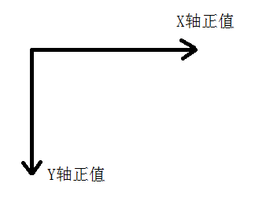
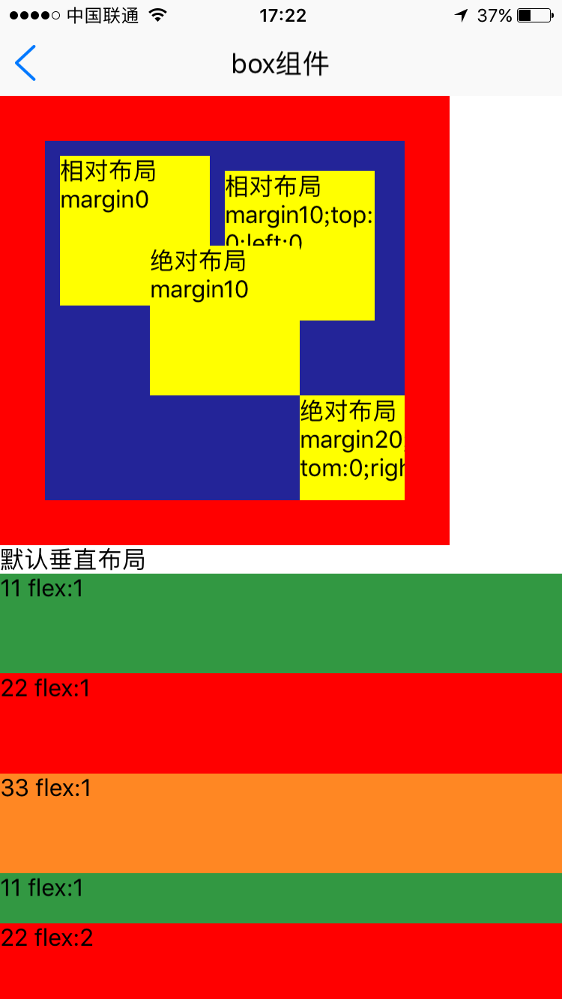
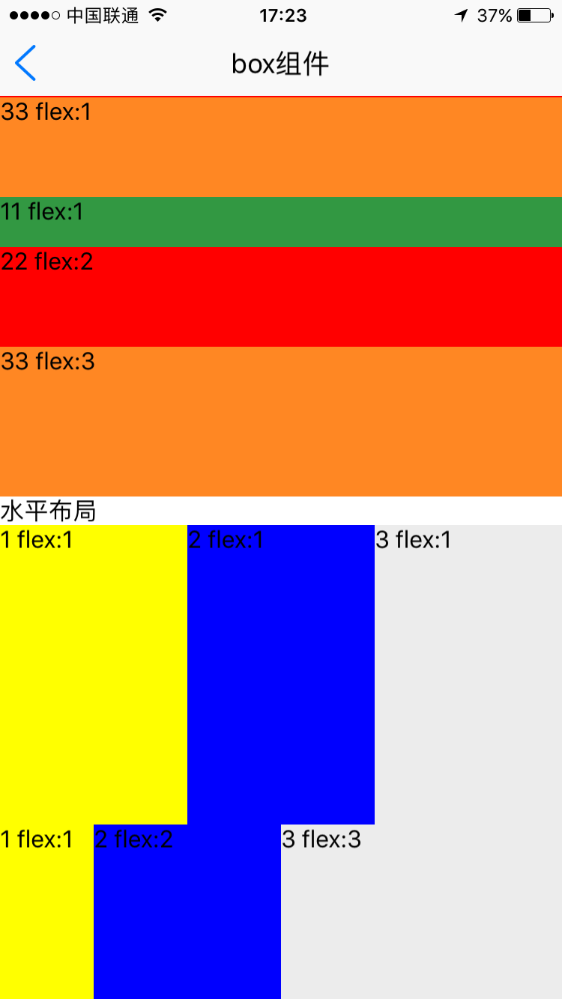
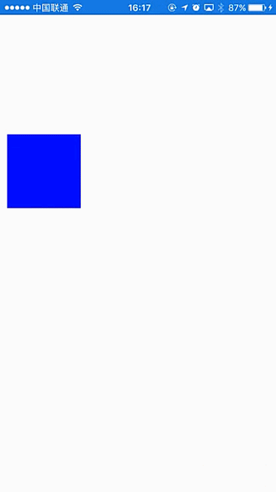

# box组件使用 

----------

box容器为用于包裹其他UI组件的基础布局容器，采用flexbox模型布局，支持嵌套任意类型的UI组件或容器。

注：文本不支持直接放置于box容器中，请用&lt;text&gt;标签包裹使用。

<h2 id="cid_0">属性</h2>

**公共属性**  

[参见公共属性章节](https://gitdocument.exmobi.cn/sprite-api/ggsx.html)，包括：id、style、class；


<h2 id="cid_1">样式</h2>

**公共样式**  

[参见公共样式章节](https://gitdocument.exmobi.cn/sprite-api/ggys.html)，包括：  

> 尺寸
> 
> 定位
> 
> 内边距
> 
> 外边距
> 
> 边框
> 
> 背景
> 
> flexbox布局


**background-image**  

<code>背景图片</code>

只支持本地图，当同时设置背景图及背景色时，背景图优先级别高于背景色。格式：background-image:url (url);

> 本地图片url路径格式：res:前缀，file:前缀，相对路径；


<h2 id="cid_2">事件</h2>

本节目录：

> 
> [公共事件](#sj_1)   
> 
> [touchDown  按下UI组件时触发](#sj_2)  
> 
> [touchMove 在UI组件上面移动时多次触发](#sj_3)   
> 
> [touchUp  在UI组件上抬起时触发](#sj_4)   
>
> [touchCancel  意外导致当前touch过程中断时触发](#sj_5)  

**注：**   

- 当快速点击时事件的执行顺序为touchDown->touchUp->click  

- 当长按时事件的执行顺序为touchDown->longTouch->touchUp

- 当按住并移动时事件的执行顺序为touchDown->touchMove->touchUp  (touchCancel)  
 
- 当长按并移动时事件的执行顺序为touchDown->longTouch->touchMove->touchUp (touchCancel)  
 
- android在执行touchDown后基本上会马上执行touchMove（对移动事件监听比较灵敏）。

<span id="sj_1">**公共事件**</span>  

[参见公共事件章节](https://gitdocument.exmobi.cn/sprite-api/ggsj.html)，包括：  

> click事件
> 
> longTouch事件

<span id="sj_2">**touchDown**</span>  

<code>按下UI组件时触发</code>  

event事件对象包括： 

> type：事件类型，字符串类型，固定值：touchDown；  
> 
> target：触发事件的目标组件，dom对象；  
> 
> timestamp：事件触发的时间戳,单位毫秒，数字类型
 
param对象为Json对象，定义如下：  

>  x：按下时x轴坐标值；
> 
>  y：按下时y轴坐标值；  

**注：**  

- 只要有按下去的动作touchDown一定会触发，一般用于做UI组件点击下去的效果。

- 对应android，只要touchDown触发，基本上touchMove也会触发。
 
示例：  

```javascript
var box1 = document.getElement("box1");
box1.on("touchDown",function(e){
	console.log("进入touchDown");
});
```  


```javascript
var box1 = document.getElement("box1");
box1.on("touchDown",function(e,param){
	console.log("进入touchDown"+param.x);
});
```  


<span id="sj_3">**touchMove**</span>  

<code>在UI组件上面移动时多次触发</code>  

event事件对象包括：   

> type：事件类型，字符串类型，固定值：touchMove；
> 
> target：触发事件的目标组件，dom对象；
> 
> timestamp：事件触发的时间戳,单位毫秒，数字类型；
    
param对象为Json对象，定义如下：  

> x：移动时x轴坐标值；   
> 
> y：移动时y轴坐标值；  
> 
> distanceX：x轴相对于上次回传点的位移坐标值；  
> 
> distanceY：y轴相对于上次回传点的位移坐标值；

  


**注：** 当长时间移动触发touchMove后，就不会触发click事件了。

示例： 

```javascript
var box1 = document.getElement("box1");
box1.on("touchMove",function(e,param){
	console.log("进入touchMove"+param.x);
});
```  

<span id="sj_4">**touchUp**</span>  

<code>在UI组件上抬起时触发</code>  

event事件对象包括：

> type：事件类型，字符串类型，固定值：touchUp；
> 
> target：触发事件的目标组件，dom对象；
> 
> timestamp：事件触发的时间戳,单位毫秒，数字类型；

param对象为Json对象，定义如下：

> x：抬起时x轴坐标值；
> 
> y：抬起时y轴坐标值；

**注：**  如果box在滚动容器，当容器滚动的时候就不会触发touchUp了，这时会触发touchCancel事件。  


示例： 

```javascript
var box1 = document.getElement("box1");
box1.on("touchUp",function(e,param){
	console.log("touchUp"+param.x);
});

```


<span id="sj_5">**touchCancel**</span> 

<code>意外导致当前touch过程中断时触发</code>  

event事件对象包括： 

> type：事件类型，字符串类型，固定值：touchCancel；  
> 
> target：触发事件的目标组件，dom对象； 
> 
> timestamp：事件触发的时间戳,单位毫秒，数字类型；

param对象为Json对象，定义如下：  

> x：抬起时x轴坐标值；  
> 
> y：抬起时y轴坐标值；

**注：**   

- 如果组件包含在滚动容器中，如果滑动滚动容器，一般情况会触发该事件。

- 如果要做组件点击抬起的效果，建议在touchUp和touchCancel里面都执行抬起的效果代码。  

示例： 

```javascript
var box1 = document.getElement("box1");
box1.on("touchCancel",function(e,param){
	console.log("touchCancel"+param.x);
});
```


<h2 id="cid_3">js方法</h2>

**公共方法**  

[事件相关](https://gitdocument.exmobi.cn/sprite-api/ggff.html#cid_0)，包括：

> [on(messageName:string,callback:Function): void   组件注册事件的触发函数](https://gitdocument.exmobi.cn/sprite-api/ggff.html#jjxg_1)   
> 
> [fire(messageName:string,params:Array&lt;any&gt;): void  组件事件的触发函数](https://gitdocument.exmobi.cn/sprite-api/ggff.html#jjxg_2)   
> 
> [off(messageName:string,callback:Function): void  组件移除事件的触发函数](https://gitdocument.exmobi.cn/sprite-api/ggff.html#jjxg_3)  
>  
> [getOn(messageName:string): Array&lt;Function&gt;  获取已绑定的事件的触发函数](https://gitdocument.exmobi.cn/sprite-api/ggff.html#jjxg_4)   

[动画相关](https://gitdocument.exmobi.cn/sprite-api/ggff.html#cid_1)，包括： 

> [startAnimation(jsonData:Object,callback:Function): void  启动UI组件动画](https://gitdocument.exmobi.cn/sprite-api/ggff.html#dhxg_1)   
> 
> [startAnimator(jsonData:Object,callback:Function): void  启动UI组件属性动画](https://gitdocument.exmobi.cn/sprite-api/ggff.html#dhxg_2)   
> 
> [startKeyFrameAnimator(jsonData:Object,callback:Function): void  启动UI组件关键帧动画](https://gitdocument.exmobi.cn/sprite-api/ggff.html#dhxg_3)  
>  
> [ releaseAnimator(): void  结束控件动画](https://gitdocument.exmobi.cn/sprite-api/ggff.html#dhxg_4)   

[尺寸和位置](https://gitdocument.exmobi.cn/sprite-api/ggff.html#cid_2)，包括：  

> [getFrame(): Object  获取组件在父容器中的位置](https://gitdocument.exmobi.cn/sprite-api/ggff.html#cchwz_1)   
> 
> [setFrame(frame:Object): void  设置组件在父容器中的位置](https://gitdocument.exmobi.cn/sprite-api/ggff.html#cchwz_2)   
> 
> [getCenter(): Object  获取组件中心点在父容器中的位置](https://gitdocument.exmobi.cn/sprite-api/ggff.html#cchwz_3)  
>  
> [getAbsoluteFrame(): Object  获取组件在绘制窗口中的位置](https://gitdocument.exmobi.cn/sprite-api/ggff.html#cchwz_4)   

[普通Dom节点操作](https://gitdocument.exmobi.cn/sprite-api/ggff.htmll#cid_3)，包括：  

> [getParent(): IElement  获取父节点](https://gitdocument.exmobi.cn/sprite-api/ggff.html#ptdom_1)   
> 
> [getNext(): IElement  获取同级下一个节点](https://gitdocument.exmobi.cn/sprite-api/ggff.html#ptdom_2)   
> 
> [getPrevious(): IElement  获取同级前一个节点](https://gitdocument.exmobi.cn/sprite-api/ggff.html#ptdom_3)  
> 
> [remove(): void  从父容器中移除自身](https://gitdocument.exmobi.cn/sprite-api/ggff.html#ptdom_4)  
> 
> [clone(isDeep:boolean):IElement  对当前Dom节点进行克隆](https://gitdocument.exmobi.cn/sprite-api/ggff.html#ptdom_5)  
>  
> [setAttr(attrName:string,attrValue:string): void  设置节点属性](https://gitdocument.exmobi.cn/sprite-api/ggff.html#ptdom_6)   
>
> [getAttr(attrName:string):string  获取节点属性值](https://gitdocument.exmobi.cn/sprite-api/ggff.html#ptdom_7) 
>
> [getAttrs(): Object  获取节点所有属性](https://gitdocument.exmobi.cn/sprite-api/ggff.html#ptdom_8) 
>
> [removeAttr(attrName:string): void  移除节点属性](https://gitdocument.exmobi.cn/sprite-api/ggff.html#ptdom_9) 
>
> [hasAttr(attrName:string): boolean  节点是否具有该属性](https://gitdocument.exmobi.cn/sprite-api/ggff.html#ptdom_10) 
>
> [setStyle(styleName:string,styleValue:string): void  设置节点样式值](https://gitdocument.exmobi.cn/sprite-api/ggff.html#ptdom_13)  
>
> [getStyle(styleName:string):string  获取节点样式值](https://gitdocument.exmobi.cn/sprite-api/ggff.html#ptdom_14)   
>
> [clearStyle(styleName:string): void  移除节点样式值](https://gitdocument.exmobi.cn/sprite-api/ggff.html#ptdom_15)    
>
> [setClassStyle(className:string,domobj:IElement): void   设置节点对应Class样式](https://gitdocument.exmobi.cn/sprite-api/ggff.html#ptdom_16) 
>  
> [getClassStyle(): string  获取节点已设置Class样式](https://gitdocument.exmobi.cn/sprite-api/ggff.html#ptdom_17)  
>  
> [getTag(): string  获取UI组件类型](https://gitdocument.exmobi.cn/sprite-api/ggff.html#ptdom_18)  
>  
> [getId(): string  获取UI组件Id标识](https://gitdocument.exmobi.cn/sprite-api/ggff.html#ptdom_19) 


[容器类Dom节点操作](https://gitdocument.exmobi.cn/sprite-api/ggff.html#cid_4)：包括：

> [getElement(id:string): IElement  根据Id获取容器内UI控件对象](https://gitdocument.exmobi.cn/sprite-api/ggff.html#rqczdom_1)   
> 
> [getElements(rule:string):Array&lt;IElement&gt;  根据特定规则获取容器内UI控件对象集](https://gitdocument.exmobi.cn/sprite-api/ggff.html#rqczdom_2)   
> 
> [getChildren():Array&lt;IElement&gt;  容器获取子节点集](https://gitdocument.exmobi.cn/sprite-api/ggff.html#rqczdom_3)  
>  
> [getFirstChild(): IElement  容器获取首子节点](https://gitdocument.exmobi.cn/sprite-api/ggff.html#rqczdom_4) 
>  
> [getLastChild(): IElement  容器获取尾节点](https://gitdocument.exmobi.cn/sprite-api/ggff.html#rqczdom_5) 
>  
> [appendChild(Obj:IElement): void  容器添加子节点至尾部](https://gitdocument.exmobi.cn/sprite-api/ggff.html#rqczdom_6) 
>  
> [insertBefore(domObj:IElement,beforeDomObj:IElement): void  容器在指定的已有的子节点之前插入新节点](https://gitdocument.exmobi.cn/sprite-api/ggff.html#rqczdom_7) 
>  
> [insertAfter (domObj:IElement,afterDomObj:IElement): void  容器在指定的已有的子节点之后插入新节点](https://gitdocument.exmobi.cn/sprite-api/ggff.html#rqczdom_8) 
>  
> [replaceChild(newDomObj:IElement,oldDomObj:IElement): void  容器替换子节点](https://gitdocument.exmobi.cn/sprite-api/ggff.html#rqczdom_9) 
>  
> [clear(): void  清空容器内所有子节点](https://gitdocument.exmobi.cn/sprite-api/ggff.html#rqczdom_10) 
>  
> [getInnerHTML(): string  动态获取容器内子节点xml](https://gitdocument.exmobi.cn/sprite-api/ggff.html#rqczdom_11)   


**refresh(): void**  

<code>刷新组件内布局</code>  

参数：无

返回值：无

**注：** 刷新后组件区域不变，某些场景下可代替document.refresh()获得更好的刷新效果  


<h2 id="cid_4">示例</h2>

示例代码1，测试box布局，参考演示应用示例：apps\yuanhongqian\spriteui\boxtest.uixml，代码中用到了官方封装的模板titlebar，模板的使用可参考[https://gitdocument.exmobi.cn/sprite-official-ui/index.html](https://gitdocument.exmobi.cn/sprite-official-ui/index.html "https://gitdocument.exmobi.cn/sprite-official-ui/index.html")  

```html
<page>
	<script>
		<![CDATA[
		var window = require("Window");
		var document = require("Document");
		var ui = require("UI");
		var ListAdapter = require("ListAdapter");
		require("titlebarUI");
		var console = require("Console");
		var screenWidth = window.getScreenWidth();
		var adapter = null;
		window.on("loaded", function () {
			//titlebar关闭页面
			var title = document.getElement("title");
			title.on("liconClick", function (e) {
				var json = {};
				window.close(json);
			});

			var box1 = document.getElement("box1");

			box1.on("touchDown", function (e) {
				console.log("进入touchDown");
			});

			box1.on("touchUp", function (e) {
				console.log("进入touchUp");
			});

			box1.on("click", function (e) {
				console.log("进入了click");
			});

			box1.on("longTouch", function (e) {
				console.log("进入了longTouch");
			});

			box1.on("touchMove", function (e) {
				console.log("进入了touchMove");
			});


			box1.on("touchCancel", function (e) {
				console.log("进入了touchCancel");
			});
		});	
    ]]>
	</script>
	<style>
		@import url("spriteLayout");
		@import url("spriteColor");
	</style>
	<ui>
		<box style="height:fill_screen;width:fill_screen">
			<titlebar title="box组件" id="title" licon="res:yuanhongqian/image/icon.png" style="licon-width:24;licon-height:24" class="titlebar-hasstatus"
			/>
			<scroll class="flex1">
				<box class="row-flex-start" style="padding:10;border-color:red;border-width:30;background-color:#232498;width:300;height:300">
					<box id="box1" style="width:100;height:100;margin:0;background-color:yellow;top:0;;right:0;bottom:0">
						<text>相对布局margin0
						</text>
					</box>
					<box style=";width:100;height:100;margin:10;background-color:yellow;top:0;left:0">
						<text>相对布局margin10;top:0;left:0</text>
					</box>
					<box style="position:absolute;;margin:0;background-color:yellow;;top:70;left:70;width:100;height:100">
						<text>绝对布局margin10</text>
					</box>
					<box style="position:absolute;width:100;height:100;margin:20;background-color:yellow;bottom:0;right:0">
						<text>绝对布局margin20;bottom:0;right:0</text>
					</box>
				</box>

				<text>默认垂直布局</text>
				<box style="flex-direction:column;height: 200;background-color: blue;align-items:flex-start;justify-content:center;">
					<box style="background-color: #329842;flex:1">
						<text>11 flex:1</text>
					</box>
					<box style="background-color: red;flex:1">
						<text>22 flex:1</text>
					</box>

					<box style="background-color: #ff8723;flex:1">
						<text>33 flex:1</text>
					</box>
				</box>
				<box style="flex-direction:column;height: 200;background-color: blue;align-items:flex-start;justify-content:center;">
					<box style="background-color: #329842;flex:1">
						<text>11 flex:1</text>
					</box>
					<box style="background-color: red;flex:2">
						<text>22 flex:2</text>
					</box>

					<box style="background-color: #ff8723;flex:3">
						<text>33 flex:3</text>
					</box>
				</box>
				<text>水平布局</text>
				<box id="box" style="background-color:red;height:200;flex-direction:row;">
					<box style="background-color:yellow;flex:1">
						<text>1 flex:1</text>
					</box>
					<box style="background-color:blue;flex:1">
						<text>2 flex:1</text>
					</box>
					<box style="background-color:#ececec;flex:1">
						<text>3 flex:1</text>
					</box>
				</box>
				<box id="box" style="background-color:red;height:200;flex-direction:row;">
					<box style="background-color:yellow;flex:1">
						<text>1 flex:1</text>
					</box>
					<box style="background-color:blue;flex:2">
						<text>2 flex:2</text>
					</box>
					<box style="background-color:#ececec;flex:3">
						<text>3 flex:3</text>
					</box>
				</box>
			</scroll>
		</box>
	</ui>
</page>

```
示例代码效果图：


  

示例代码2，测试可以移动box，参考演示应用示例：apps\spritetest\page\touchMoveTest.uixml

```html
<page>
    <script>
        <![CDATA[
       
        var window = require("Window");
        var document = require("Document");
        var ui = require("UI");
        var console = require("Console");
        window.on("loaded", function () {
            var test = document.getElement("test");
            test.on("touchMove", function (e, param) {
                setRect1(param.distanceX, param.distanceY);
            });
            test.on("click", function (e) {
                var json = {};
                window.close(json);
            });

            function setRect1(x, y) {
                var json = test.getFrame();
                json.x = json.x + x;
                json.y = json.y + y;
                test.setFrame(json);
            }
        });
    ]]>
    </script>
    <style>
        @import url(res:spritetest/css/import.css);
    </style>
    <ui>
        <box class="rootBox" id="box">
            <box style="flex:1;backround-color:black" id="scroll">
                <box style="width:100;height:100;background-color:blue" id="test"></box>
            </box>
        </box>
    </ui>
</page>
```
代码效果图：

  


