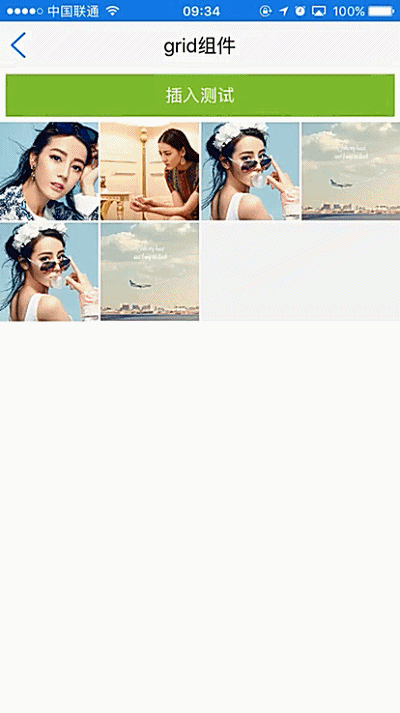

# grid组件使用 

----------

grid网格布局组件，用于多行多列网状结构显示，cell单元格宽度根据grid容器所占宽度及col列数分割，高度与宽度成比例（高宽一致），grid本身不具有滚动条，高度根据所包裹内容自扩充。  


**注：**    使用grid时需要设置其宽度，也可以用flex来分割区域，如果不设置宽度，其内容无非显示。


<h2 id="cid_1">属性</h2>   


**公共属性**  

[参见公共属性章节](https://gitdocument.exmobi.cn/sprite-api/ggsx.html)，包括：id、style、class；


**col**  

<code>每行列数</code>    

取值数字，默认为4


<h2 id="cid_2">样式</h2>  

**公共样式**  

[参见公共样式章节](https://gitdocument.exmobi.cn/sprite-api/ggys.html)，包括：  
 
> 尺寸
> 
> 定位 
> 
> 内边距
> 
> 外边距
> 
> 背景
>
> 显影 
> 
> flexbox布局：align-self，flex


**col-spacing**  

<code>cell列间距</code>

取值数字，单位dp，默认为0

**row-spacing**  

<code>cell行间距</code>

取值数字，单位dp，默认为0


**cell-scale**  

<code>组文字大小</code> 

行列比例，单位dp，默认值：1  


<h2 id="cid_3">事件</h2>

**公共事件**

[参见公共事件章节](https://gitdocument.exmobi.cn/sprite-api/ggsj.html)，包括：  

> click事件
> 
> longTouch事件


<h2 id="cid_4">js方法</h2>   


<span id="ff_1">**公共方法**</span>  


[事件相关](https://gitdocument.exmobi.cn/sprite-api/ggff.html#cid_0)，包括：

> [on(messageName:string,callback:Function): void   组件注册事件的触发函数](https://gitdocument.exmobi.cn/sprite-api/ggff.html#jjxg_1)   
> 
> [fire(messageName:string,params:Array&lt;any&gt;): void  组件事件的触发函数](https://gitdocument.exmobi.cn/sprite-api/ggff.html#jjxg_2)   
> 
> [off(messageName:string,callback:Function): void  组件移除事件的触发函数](https://gitdocument.exmobi.cn/sprite-api/ggff.html#jjxg_3)  
>  
> [getOn(messageName:string): Array&lt;Function&gt;  获取已绑定的事件的触发函数](https://gitdocument.exmobi.cn/sprite-api/ggff.html#jjxg_4)   

[动画相关](https://gitdocument.exmobi.cn/sprite-api/ggff.html#cid_1)，包括： 
 
> [startAnimation(jsonData:Object,callback:Function): void  启动UI组件动画](https://gitdocument.exmobi.cn/sprite-api/ggff.html#dhxg_1)   
> 
> [startAnimator(jsonData:Object,callback:Function): void  启动UI组件属性动画](https://gitdocument.exmobi.cn/sprite-api/ggff.html#dhxg_2)   
> 
> [startKeyFrameAnimator(jsonData:Object,callback:Function): void  启动UI组件关键帧动画](https://gitdocument.exmobi.cn/sprite-api/ggff.html#dhxg_3)  
>  
> [ releaseAnimator(): void  结束控件动画](https://gitdocument.exmobi.cn/sprite-api/ggff.html#dhxg_4)   

[尺寸和位置](https://gitdocument.exmobi.cn/sprite-api/ggff.html#cid_2)，包括：  

> [getFrame(): Object  获取组件在父容器中的位置](https://gitdocument.exmobi.cn/sprite-api/ggff.html#cchwz_1)   
> 
> [setFrame(frame:Object): void  设置组件在父容器中的位置](https://gitdocument.exmobi.cn/sprite-api/ggff.html#cchwz_2)   
> 
> [getCenter(): Object  获取组件中心点在父容器中的位置](https://gitdocument.exmobi.cn/sprite-api/ggff.html#cchwz_3)  
>
> [getAbsoluteFrame(): Object  获取组件在绘制窗口中的位置](https://gitdocument.exmobi.cn/sprite-api/ggff.html#cchwz_4)   


[普通Dom节点操作](https://gitdocument.exmobi.cn/sprite-api/ggff.html#cid_3)，包括：  

> [getParent(): IElement  获取父节点](https://gitdocument.exmobi.cn/sprite-api/ggff.html#ptdom_1)   
> 
> [getNext(): IElement  获取同级下一个节点](https://gitdocument.exmobi.cn/sprite-api/ggff.html#ptdom_2)   
> 
> [getPrevious(): IElement  获取同级前一个节点](https://gitdocument.exmobi.cn/sprite-api/ggff.html#ptdom_3)  
> 
> [remove(): void  从父容器中移除自身](https://gitdocument.exmobi.cn/sprite-api/ggff.html#ptdom_4)  
> 
 
> [setAttr(attrName:string,attrValue:string): void  设置节点属性](https://gitdocument.exmobi.cn/sprite-api/ggff.html#ptdom_6)   
>
> [getAttr(attrName:string):string  获取节点属性值](https://gitdocument.exmobi.cn/sprite-api/ggff.html#ptdom_7) 
>
> [getAttrs(): Object  获取节点所有属性](https://gitdocument.exmobi.cn/sprite-api/ggff.html#ptdom_8) 
>
> [removeAttr(attrName:string): void  移除节点属性](https://gitdocument.exmobi.cn/sprite-api/ggff.html#ptdom_9) 
>
> [hasAttr(attrName:string): boolean  节点是否具有该属性](https://gitdocument.exmobi.cn/sprite-api/ggff.html#ptdom_10) 
> 
> [setStyle(styleName:string,styleValue:string): void  设置节点样式值](https://gitdocument.exmobi.cn/sprite-api/ggff.html#ptdom_13)  
>
> [getStyle(styleName:string):string  获取节点样式值](https://gitdocument.exmobi.cn/sprite-api/ggff.html#ptdom_14)   
>
> [clearStyle(styleName:string): void  移除节点样式值](https://gitdocument.exmobi.cn/sprite-api/ggff.html#ptdom_15)    
>
> [setClassStyle(className:string,domobj:IElement): void   设置节点对应Class样式](https://gitdocument.exmobi.cn/sprite-api/ggff.htm#ptdom_16) 
>  
> [getClassStyle(): string  获取节点已设置Class样式](https://gitdocument.exmobi.cn/sprite-api/ggff.html#ptdom_17)  
>  
> [getTag(): string  获取UI组件类型](https://gitdocument.exmobi.cn/sprite-api/ggff.html#ptdom_18)  
>  
> [getId(): string  获取UI组件Id标识](https://gitdocument.exmobi.cn/sprite-api/ggff.html#ptdom_19) 

[容器类Dom节点操作](https://gitdocument.exmobi.cn/sprite-api/ggff.html#cid_4)：包括：

> [getElement(id:string): IElement  根据Id获取容器内UI控件对象](https://gitdocument.exmobi.cn/sprite-api/ggff.html#rqczdom_1)   
> 
> [getElements(rule:string): Array&lt;IElement&gt;  根据特定规则获取容器内UI控件对象集](https://gitdocument.exmobi.cn/sprite-api/ggff.html#rqczdom_2)   
> 
> [getChildren():Array&lt;IElement&gt;  容器获取子节点集](https://gitdocument.exmobi.cn/sprite-api/ggff.html#rqczdom_3)  
>  
> [getFirstChild(): IElement  容器获取首子节点](https://gitdocument.exmobi.cn/sprite-api/ggff.html#rqczdom_4) 
>  
> [getLastChild(): IElement  容器获取尾节点](https://gitdocument.exmobi.cn/sprite-api/ggff.html#rqczdom_5) 
>  
> [appendChild(Obj:IElement): void  容器添加子节点至尾部](https://gitdocument.exmobi.cn/sprite-api/ggff.html#rqczdom_6) 
>  
> [insertBefore(domObj:IElement,beforeDomObj:IElement): void  容器在指定的已有的子节点之前插入新节点](https://gitdocument.exmobi.cn/sprite-api/ggff.html#rqczdom_7) 
>  
> [insertAfter (domObj:IElement,afterDomObj:IElement): void  容器在指定的已有的子节点之后插入新节点](https://gitdocument.exmobi.cn/sprite-api/ggff.html#rqczdom_8) 
>  
> [replaceChild(newDomObj:IElement,oldDomObj:IElement): void  容器替换子节点](https://gitdocument.exmobi.cn/sprite-api/ggff.html#rqczdom_9) 
>  
> [clear(): void  清空容器内所有子节点](https://gitdocument.exmobi.cn/sprite-api/ggff.html#rqczdom_10) 
>  
> [getInnerHTML(): string  动态获取容器内子节点xml](https://gitdocument.exmobi.cn/sprite-api/ggff.html#rqczdom_11)  


**refresh(): void**  

<code>刷新组件内布局</code>  

参数：无

返回值：无

**注：** 刷新后组件区域不变，某些场景下可代替document.refresh()获得更好的刷新效果  


<h2 id="cid_5">示例</h2>  


示例代码1，测试grid事件和方法，参考演示应用示例：apps\yuanhongqian\spriteui\grid.uixml，代码中用到了官方封装的模板titlebar，模板的使用可参考[https://gitdocument.exmobi.cn/sprite-official-ui/index.html](https://gitdocument.exmobi.cn/sprite-official-ui/index.html "https://gitdocument.exmobi.cn/sprite-official-ui/index.html") 

```html
<page>
    <script>
    <![CDATA[

        var window = require("Window");
        var document = require("Document"); 
        require("titlebarUI"); 
        require("buttonUI");

        window.on("loaded", function() {

       

        var topFreshTime = "";
        var bottomFreshTime = "";
        var title = document.getElement("title"); 
        title.on("liconClick", function(e) {
            var json = {};
            json.data = {};
           
            window.close(json);

        });

        var grid = document.getElement("grid");
       
        var insert = document.getElement("insert");
         insert.on("click", function(e) {
            var json = {};
            json.src = "res:yuanhongqian/image/bg3.jpg";
            var dom = document.createElement("image", json);
            grid.appendChild(dom);
            document.refresh();

            
        });
      });
    ]]>
    </script>
    <style>
     @import url("spriteLayout");
     @import url("spriteColor"); 
    button {
        margin: 5;
        background-color: #88D038;
        background-click-color: #669D2A
    }
    
    grid {
        background-color: #F6F6F6;
        col-spacing: 2;
        row-spacing: 2;
    }
    
    image {
        width: 80;
        height: 80;
        scaleType: cover;
    }
    </style>
    <ui>
     <box class="full">
         <titlebar title="grid组件" id="title" licon="res:yuanhongqian/image/icon.png"  style="licon-width:24;licon-height:24" class="titlebar-hasstatus" />
        <scroll class="full">
           
            <box class="box1">
                <button id="insert" value="插入测试" />
            </box>
            <grid id="grid" style="">
                <image src="res:yuanhongqian/image/1.jpg" />
                <image src="res:yuanhongqian/image/2.jpg" />
                <image src="res:yuanhongqian/image/3.jpg" />
                <image src="res:yuanhongqian/image/bg3.jpg" />
                <image src="res:yuanhongqian/image/3.jpg" />
            </grid>
            
        </scroll>
        </box>
    </ui>
</page>
```

代码效果：

  
 
示例代码2，测试grid基本布局及删除，示例代码参考apps\yuanhongqian\sprite_xiaoguo\grid.uixml

```html

<page>
      <script>
            <![CDATA[
   
            var window = require("Window");
            var document = require("Document");
            var ui = require("UI");
            var time = require("Time");
            var console = require("Console");
            var myappjs = require("myapp");
            var app = require("App");

            window.on("loaded", function () {

                  var screenWidth = window.getScreenWidth();
                  //关闭页面
                  var imageid = document.getElement("imageid");
                  imageid.on("click", function (e) {
                        var json = {};
                        window.close(json);
                  });

                  var rtext = document.getElement("rtext");
                  var grid1 = document.getElement("grid1");
                  var childeren = grid1.getChildren();
                  rtext.on("click", function (e) {

                        childeren[0].setStyle("visibility", "hidden");
                        for (var i = childeren.length -1 ; i >= 0; i--) {
                              if (i != 0) {
                                    var json = childeren[i - 1].getFrame();
                                    var = {};
                                    var aniAry = new Array(): Object;
                                    var jsonAni = {};
                                    jsonAni.delay = 0;
                                    jsonAni.duration = 300;
                                    jsonAni.curve = "linear";
                                    jsonAni.props = {};
                                    jsonAni.props.x = json.x;
                                    jsonAni.props.y = json.y;
                                    aniAry.push(jsonAni);
                                    jsonData.animators = aniAry;
                                    childeren[i].startAnimator(jsonData, function () { });

                              }

                              if (i == 0) {
                                    //这里考虑异步处理，因为前面有动画，不能马上删除
                                    time.setTimeout(function () {
                                          childeren[0].remove();
                                          childeren.splice(0, 1);
                                          document.refresh();
                                    }, 10);
                              }
                        }
                  });
            });

            app.on("orientation", function (e, orientation) {
                  var screenWidth = window.getScreenWidth();

            });	
    ]]>
      </script>
      <style>
            @import url("spriteLayout");
            @import url("spriteColor");
            text {
                  text-align: center;
            }
      </style>
      <ui>
            <box class="bg-white full" id="box">
                  <box class="titlebar-hasstatus" style="background-color:#549FF7;">

                        <text class="titlebar-text white">grid效果</text>
                        <box id="imageid" class="titlebar-lcaption">
                              <image class="margin8 titlebar-image" src="res:yuanhongqian/image/back.png" />
                        </box>
                        <box id="rtext" class="titlebar-rcaption">
                              <text class="margin8 text-center" style="color:#ffffff">移除</text>
                        </box>
                  </box>
                  <line />
                  <scroll class="flex1" style="background-color:#ececec">
                        <grid id="grid1" style="align-items:flex-start; justify-content:flex-start;row-spacing:10;background-color:#ffffff;cell-scale:1"
                              col="4">
                              <box id="box_1" style="align-items:center;justify-content:center;">
                                    <image src="res:yuanhongqian/image/shuoshuo.png" style="width:65;height:65" />
                                    <text style="margin:10 0 4 0;color:#000000;font-size:13;font-weight:bold;">说说</text>
                              </box>
                              <box id="box_2" style="align-items:center;justify-content:center">
                                    <image src="res:yuanhongqian/image/zhaopian.png" style="width:65;height:65" />
                                    <text style="margin:10 0 4 0;color:#000000;font-size:13;font-weight:bold;">照片</text>
                              </box>
                              <box style="align-items:center;justify-content:center">
                                    <image src="res:yuanhongqian/image/shipin.png" style="width:65;height:65" />
                                    <text style="margin:10 0 4 0;color:#000000;font-size:13;font-weight:bold;">视频</text>
                              </box>
                              <box style="align-items:center;justify-content:center">
                                    <image src="res:yuanhongqian/image/shuiyinxiangji.png" style="width:65;height:65" />
                                    <text style="margin:10 0 4 0;color:#000000;font-size:13;font-weight:bold;">动效相机</text>
                              </box>
                              <box style="align-items:center;justify-content:center;">
                                    <image src="res:yuanhongqian/image/rizhi.png" style="width:65;height:65" />
                                    <text style="margin:10 0 4 0;color:#000000;font-size:13;font-weight:bold;">日志</text>
                              </box>
                              <box style="align-items:center;justify-content:center;">
                                    <image src="res:yuanhongqian/image/qiandao.png" style="width:65;height:65" />
                                    <text style="margin:10 0 4 0;color:#000000;font-size:13;font-weight:bold;">签到</text>

                              </box>

                              </grid>
                              <box style="height:10;" />
                              <line style="line-size:0.5" />

                              <box style="padding:15 10 20 10;background-color:#ffffff;">
                                    <slider style="height:170">
                                          <grid id="grid" style="align-items:flex-start; justify-content:flex-start;row-spacing:6;cell-scale:1;cell-scale:1.1" col="5">
                                                <box style="align-items:center;justify-content:flex-start;;">
                                                      <image src="res:yuanhongqian/image/20160126194705meishi.png" style="width:45;height:45" />
                                                      <text style="margin:8 0 4 0;color:#000000;font-size:13;;">美食</text>
                                                </box>
                                                <box style="align-items:center;justify-content:flex-start;;">
                                                      <image src="res:yuanhongqian/image/20160126202805dianying.png" style="width:45;height:45" />
                                                      <text style="margin:8 0 4 0;color:#000000;font-size:13;;">电影</text>
                                                </box>
                                                <box style="align-items:center;justify-content:flex-start;;">
                                                      <image src="res:yuanhongqian/image/20160126203337jiudian.png" style="width:45;height:45" />
                                                      <text style="margin:8 0 4 0;color:#000000;font-size:13;;">酒店</text>
                                                </box>
                                                <box style="align-items:center;justify-content:flex-start;">
                                                      <image src="res:yuanhongqian/image/20160126202841xiuxianyule.png" style="width:45;height:45" />
                                                      <text style="margin:8 0 4 0;color:#000000;font-size:13;;">休闲娱乐</text>
                                                </box>
                                                <box style="align-items:center;justify-content:flex-start;;">
                                                      <image src="res:yuanhongqian/image/20160126203251waimai.png" style="width:45;height:45" />
                                                      <text style="margin:8 0 4 0;color:#000000;font-size:13;;">外卖</text>
                                                </box>
                                                <box style="align-items:center;justify-content:flex-start;;">
                                                      <image src="res:yuanhongqian/image/2016101111034420161011huochejipiao.png" style="width:45;height:45" />
                                                      <box style="flex-direction:row;">
                                                            <text style="flex:1;margin:8 0 4 0;color:#000000;font-size:13; text-overflow:ellipsis;singleline:true;">机票/火车票
                                                            </text>
                                                      </box>
                                                </box>
                                                <box style="align-items:center;justify-content:flex-start;;">
                                                      <image src="res:yuanhongqian/image/20160126202946liren.png" style="width:45;height:45" />
                                                      <text style="margin:8 0 4 0;color:#000000;font-size:13;;">丽人</text>
                                                </box>
                                                <box style="align-items:center;justify-content:flex-start;;">
                                                      <image src="res:yuanhongqian/image/20160126203440zhoubianyou.png" style="width:45;height:45" />
                                                      <text style="margin:8 0 4 0;color:#000000;font-size:13;;">周边游</text>
                                                </box>
                                                <box style="align-items:center;justify-content:flex-start;;">
                                                      <image src="res:yuanhongqian/image/20160126205426shenghuofuwu.png" style="width:45;height:45" />
                                                      <text style="margin:8 0 4 0;color:#000000;font-size:13;;">生活服务</text>
                                                </box>
                                                <box style="align-items:center;justify-content:flex-start;;">
                                                      <image src="res:yuanhongqian/image/20160126203542ktv.png" style="width:45;height:45" />
                                                      <text style="margin:8 0 4 0;color:#000000;font-size:13;;">KTV</text>
                                                </box>
                                          </grid>
                                          <box>
                                                <text>1</text>
                                          </box>


                                    </slider>
                                    <box class="slider-bottom-notext-mark-box">
                                          <box id="markbox2_1" style="background-color:#FF4600" class="markbox" />
                                          <box id="markbox2_2" class="markbox" style="background-color:#909090" />

                                    </box>
                              </box>


                  </scroll>
            </box>
      </ui>
</page>

```

  


