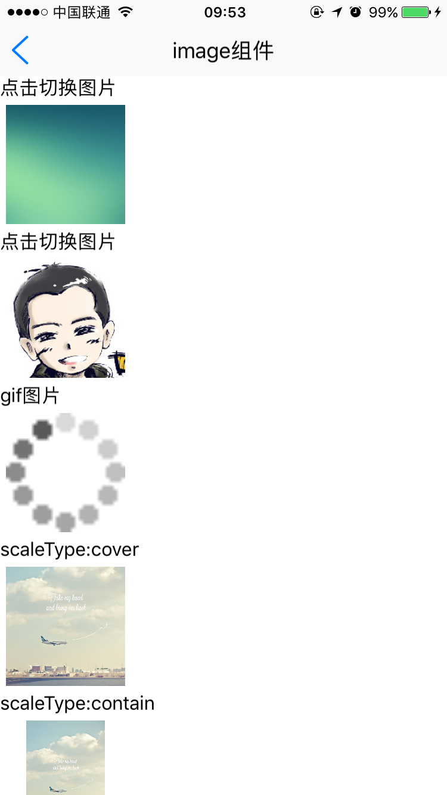

# image组件使用 

----------

image图片组件用于图片类控件展现，支持本地，网络图片及base64编码图片，支持图片帧动画。

image图片组件支持加载点九图,固定采用拉伸模式，图片以 .9.png为后缀，如border.9.png，Android系统支持直接加载点九图，iOS系统需要通过point9area设置点九图四边不拉伸区域范围。

**注：** 图片组件需要指定宽高


<h2 id="cid_0">属性</h2> 


**公共属性**  

[参见公共属性章节](https://gitdocument.exmobi.cn/sprite-api/ggsx.html)，包括：id、style、class；

**src**    

<code>需加载图片路径</code>  

需加载图片路径，支持本地，网络图片及base64编码图： 

> 本地图片：res:前缀，file:前缀，相对路径
> 
> 网络图片：http://、 https://  
> 
> base64编码图片, 支持以下几种方式： 
> 
> - data:image/gif;base64,   base64编码的gif图片数据；
> 
> - data:image/png;base64,   base64编码的png图片数据；
>  
> - data:image/jpeg;base64,   base64编码的jpeg图片数据；
> 
> - data:image/x-icon;base64,   base64编码的icon图片数据
 
 

**defaultSrc**  

<code>默认加载图片</code>   

默认加载图片，网络加载过程中或图片加载失败时显示，只支持本地图片：  

> 本地图片：res:前缀，file:前缀，相对路径


<h2 id="cid_1">样式</h2>

**公共样式**  

[参见公共样式章节](https://gitdocument.exmobi.cn/sprite-api/ggys.html)，包括：  
 
> 尺寸
> 
> 定位 
> 
> 内边距
> 
> 外边距
> 
> 背景
>
> 显影 
> 
> flexbox布局：align-self，flex


**cacheType**  

<code>网络图片缓存方式</code>

网络图片缓存方式，[none,memory,disk]  

> none：不缓存  
> 
> memory：程序启动后重新请求并缓存；  
> 
> disk：缓存图片保留，下次程序启动读取缓存图片展现
  


**scaleType**  

<code>图片显示尺寸调整</code>  

组件尺寸和图片尺寸不成比例的时候如何调整图片的大小,[ stretch,cover, contain ]  

> stretch：拉伸图片且不维持宽高比，直到宽高都刚好填满容器（默认）
> 
> cover：在保持图片宽高比的前提下缩放图片，直到宽度和高度都大于等于容器视图的尺寸，图片所占区间不留空
> 
> contain: 在保持图片宽高比的前提下缩放图片，直到宽度和高度都小于等于容器视图的尺寸，图片所占区间可能留空


**round**  

<code>设置图片是否以圆形显示</code>

设置图片是否以圆形显示，[true，false]  

> true：以圆形方式裁剪后显示 
> 
> false：图片正常显示（默认）


**fade**  

<code>网络图片加载时是否采用渐显方式</code>  

设置图片是否加载时是否采用渐显方式，[true，false]  

> true：渐显  
> 
> false：不渐显  （默认）


**point9area**  

<code>点9图拉伸区域设置</code>  

点9图拉伸。上，右，下，左四个不拉伸区域长度，用于iOS系统拉伸点九图使用  

**注：** Android无需设置  

示例： 

```css
image{
  point9area:10 5 10 5;
}

```


<h2 id="cid_2">事件</h2>


**公共事件** 

[参见公共事件章节](https://gitdocument.exmobi.cn/sprite-api/ggsj.html)，包括：  

> click事件
> 
> longTouch事件


**loaded**  

<code>图片加载完成后触发</code>    

图片加载完成后触发，event事件对象包括：
  
> type：事件类型，字符串类型，固定值：loaded；
> 
> target：触发事件的目标组件，dom对象；
> 
> timestamp：事件触发的时间戳,单位毫秒，数字类型；

param对象为Json对象，定义如下：  

> width：图片宽度原始像素值，数字类型；  
> 
> height：图片高度原始像素值，数字类型；

**注：**  该事件监听必须放在window的loaded事件里面。

示例：

```javascript

  vimage.on("loaded",function(e,param){
	var imageWidth = param.width;
	var imageHeight = param.height;
	vimage.setStyle("width",imageWidth);
	vimage.setStyle("height",imageHeight);
	document.refresh();

 });

```


**failed**  

<code>图片加载失败时触发</code>    

图片加载失败时触发，event事件对象包括：   

> type：事件类型，字符串类型，固定值：failed；
> 
> target：触发事件的目标组件，dom对象；
> 
> timestamp：事件触发的时间戳,单位毫秒，数字类型；


<h2 id="cid_3">js方法</h2>

本节目录：

> [公共方法](#ff_0)
> 
> [setFrameAnimation(jsonData:Object): void  设置图片帧动画相关参数](#ff_1)
> 
> [startFrameAnimation(): void  开始播放图片帧动画](#ff_2)
> 
> [stopFrameAnimation(): void 停止播放图片帧动画](#ff_3)
> 
> [isFrameAnimation void  是否正在播放图片帧动画](#ff_4)

<span id="ff_0"><code>**公共方法**</code></span>  

[事件相关](https://gitdocument.exmobi.cn/sprite-api/ggff.html#cid_0)，包括：

> [on(messageName:string,callback:Function): void   组件注册事件的触发函数](https://gitdocument.exmobi.cn/sprite-api/ggff.html#jjxg_1)   
> 
> [fire(messageName:string,params:Array&lt;any&gt;): void  组件事件的触发函数](https://gitdocument.exmobi.cn/sprite-api/ggff.html#jjxg_2)   
> 
> [off(messageName:string,callback:Function): void  组件移除事件的触发函数](https://gitdocument.exmobi.cn/sprite-api/ggff.html#jjxg_3)  
>  
> [getOn(messageName:string): Array&lt;Function&gt;  获取已绑定的事件的触发函数](https://gitdocument.exmobi.cn/sprite-api/ggff.html#jjxg_4)   

[动画相关](https://gitdocument.exmobi.cn/sprite-api/ggff.html#cid_1)，包括： 
 
> [startAnimation(jsonData:Object,callback:Function): void  启动UI组件动画](https://gitdocument.exmobi.cn/sprite-api/ggff.html#dhxg_1)   
> 
> [startAnimator(jsonData:Object,callback:Function): void  启动UI组件属性动画](https://gitdocument.exmobi.cn/sprite-api/ggff.html#dhxg_2)   
> 
> [startKeyFrameAnimator(jsonData:Object,callback:Function): void  启动UI组件关键帧动画](https://gitdocument.exmobi.cn/sprite-api/ggff.html#dhxg_3)  
>  
> [ releaseAnimator(): void  结束控件动画](https://gitdocument.exmobi.cn/sprite-api/ggff.html#dhxg_4)   

[尺寸和位置](https://gitdocument.exmobi.cn/sprite-api/ggff.html#cid_2)，包括：  

> [getFrame(): Object  获取组件在父容器中的位置](https://gitdocument.exmobi.cn/sprite-api/ggff.html#cchwz_1)   
> 
> [setFrame(frame:Object): void  设置组件在父容器中的位置](https://gitdocument.exmobi.cn/sprite-api/ggff.html#cchwz_2)   
> 
> [getCenter(): Object  获取组件中心点在父容器中的位置](https://gitdocument.exmobi.cn/sprite-api/ggff.html#cchwz_3)  
>
> [getAbsoluteFrame(): Object  获取组件在绘制窗口中的位置](https://gitdocument.exmobi.cn/sprite-api/ggff.html#cchwz_4)   


[普通Dom节点操作](https://gitdocument.exmobi.cn/sprite-api/ggff.html#cid_3)，包括：  

> [getParent(): IElement  获取父节点](https://gitdocument.exmobi.cn/sprite-api/ggff.html#ptdom_1)   
> 
> [getNext(): IElement  获取同级下一个节点](https://gitdocument.exmobi.cn/sprite-api/ggff.html#ptdom_2)   
> 
> [getPrevious(): IElement  获取同级前一个节点](https://gitdocument.exmobi.cn/sprite-api/ggff.html#ptdom_3)  
> 
> [remove(): void  从父容器中移除自身](https://gitdocument.exmobi.cn/sprite-api/ggff.html#ptdom_4)  
> 
> [clone(isDeep:boolean):IElement  对当前Dom节点进行克隆](https://gitdocument.exmobi.cn/sprite-api/ggff.html#ptdom_5)
>  
> [setAttr(attrName:string,attrValue:string): void  设置节点属性](https://gitdocument.exmobi.cn/sprite-api/ggff.html#ptdom_6)   
>
> [getAttr(attrName:string):string  获取节点属性值](https://gitdocument.exmobi.cn/sprite-api/ggff.html#ptdom_7) 
>
> [getAttrs(): Object  获取节点所有属性](https://gitdocument.exmobi.cn/sprite-api/ggff.html#ptdom_8) 
>
> [removeAttr(attrName:string): void  移除节点属性](https://gitdocument.exmobi.cn/sprite-api/ggff.html#ptdom_9) 
>
> [hasAttr(attrName:string): boolean  节点是否具有该属性](https://gitdocument.exmobi.cn/sprite-api/ggff.html#ptdom_10) 
> 
> [setStyle(styleName:string,styleValue:string): void  设置节点样式值](https://gitdocument.exmobi.cn/sprite-api/ggff.html#ptdom_13)  
>
> [getStyle(styleName:string):string  获取节点样式值](https://gitdocument.exmobi.cn/sprite-api/ggff.html#ptdom_14)   
>
> [clearStyle(styleName:string): void  移除节点样式值](https://gitdocument.exmobi.cn/sprite-api/ggff.html#ptdom_15)    
>
> [setClassStyle(className:string,domobj:IElement): void   设置节点对应Class样式](https://gitdocument.exmobi.cn/sprite-api/ggff.htm#ptdom_16) 
>  
> [getClassStyle(): string  获取节点已设置Class样式](https://gitdocument.exmobi.cn/sprite-api/ggff.html#ptdom_17)  
>  
> [getTag(): string  获取UI组件类型](https://gitdocument.exmobi.cn/sprite-api/ggff.html#ptdom_18)  
>  
> [getId(): string  获取UI组件Id标识](https://gitdocument.exmobi.cn/sprite-api/ggff.html#ptdom_19) 


<span id="ff_1">**setFrameAnimation(jsonData:Object): void**</span>  

<code>设置图片帧动画相关参数</code>  

参数：  

jsonData：图片帧动画设置对象，json类型，定义如下：

> images：图片路径字符串数组，动画顺序执行，图片路径支持res: file:前缀，必选项；
> 
> duration：动画总播放时间，单位s每帧时间为=总时间/帧数，必选项；
> 
> repeat：动画是否重复，bool型，true：重复；false：只执行一次(默认)，可选项；

返回值：无  

示例：

```javascript  

AnimationImage = document.getElement("setFrameAnimation");
var json = {};
var ary = new Array(); 
ary.push("res:yuanhongqian/image/1.jpg");
ary.push("res:yuanhongqian/image/2.jpg");
ary.push("res:yuanhongqian/image/3.jpg");
json.images = ary;
json.duration = 0.5;
json.repeat = true;
AnimationImage.setFrameAnimation(json);

if (AnimationImage.isFrameAnimation())
    AnimationImage.stopFrameAnimation();
else
    AnimationImage.startFrameAnimation();

```


<span id="ff_2">**startFrameAnimation(): void**</span>  

<code>开始播放图片帧动画</code>    

参数：无  

返回值：无  


<span id="ff_3">**stopFrameAnimation(): void**</span>  

<code>停止播放图片帧动画</code>    

参数：无  

返回值：无  


<span id="ff_4">**isFrameAnimation: bool**</span>  

<code>是否正在播放图片帧动画</code>    

参数：无  

返回值：bool型，true：正在播放；false：已结束


<h2 id="cid_4">示例</h2>  


示例代码，测试image布局样式和功能，参考演示应用示例：apps\yuanhongqian\spriteui\image.uixml，代码中用到了官方封装的模板titlebar，模板的使用可参考[https://gitdocument.exmobi.cn/sprite-official-ui/index.html](https://gitdocument.exmobi.cn/sprite-official-ui/index.html "https://gitdocument.exmobi.cn/sprite-official-ui/index.html") 

```html

<page>
    <script>
        <![CDATA[

        var window = require("Window");
        var document = require("Document");
        var Time = require("Time");
        var ui = require("UI");

        var console = require("Console");
        require("titlebarUI");
        require("buttonUI");


        var AnimationImage = null;

        window.on("loaded", function () {


            AnimationImage = document.getElement("setFrameAnimation");
            var json = {};
            var ary = new Array(); 
            ary.push("res:yuanhongqian/image/1.jpg");
            ary.push("res:yuanhongqian/image/2.jpg");
            ary.push("res:yuanhongqian/image/3.jpg");
            json.images = ary;
            json.duration = 0.5;
            json.repeat = true;
            AnimationImage.setFrameAnimation(json);

            if (AnimationImage.isFrameAnimation())
                AnimationImage.stopFrameAnimation();
            else
                AnimationImage.startFrameAnimation();


            var title = document.getElement("title");
            title.on("liconClick", function (e) {
                var json = {};
                window.close(json);
            });
        });

        function alert(msg) {
            var json = {};
            json.title = "提示";
            json.content = msg;
            json.buttonText = "确定";
            ui.alert(json);
        }

    ]]>
    </script>
    <style>
        @import url("spriteLayout");
        @import url("spriteColor");
        image {
            width: 100;
            height: 100;
            margin: 5 5 5 5;
        }
        
        button {
            height: 50;
            margin: 5 5 5 5;
        }
    </style>
    <ui>
        <box class="full">

            <titlebar title="image组件" id="title" licon="res:yuanhongqian/image/icon.png" style="licon-width:24;licon-height:24" class="titlebar-hasstatus"
            />
            <scroll id="scroll" style="width:fill_screen;flex:1">
                <text>点击切换图片</text>
                <image src="res:yuanhongqian/image/bg.jpg" clickSrc="res:yuanhongqian/image/bg2.jpg" />
                <text>点击切换图片</text>
                <image src="http://cdn.duitang.com/uploads/item/201205/14/20120514213552_NYXHG.jpeg" clickSrc="res:yuanhongqian/image/bg.jpg"
                />
                <text>gif图片</text>
                <image src="res:yuanhongqian/image/loading.gif" />
                <text>scaleType:cover</text>
                <image src="res:yuanhongqian/image/bg3.jpg" style="scaleType:cover" />
                <text>scaleType:contain</text>
                <image src="res:yuanhongqian/image/bg3.jpg" style="scaleType:contain" />
                <text>scaleType:stretch</text>
                <image src="res:yuanhongqian/image/bg3.jpg" style="scaleType:stretch" />
                <text>设置图片圆形</text>
                <image src="res:yuanhongqian/image/bg3.jpg" style="round:true" />
                <text>设置图片边框弧度</text>
                <image src="res:yuanhongqian/image/bg3.jpg" style="border-radius:10 10 10 10" />
                <text>图片帧切换</text>
                <image id="setFrameAnimation" />
             
                <text>点9图</text>
                <image src="res:yuanhongqian/image/point9.png" style="width:300;height:300;point9area:17 34 30 20" />
                <image src="res:yuanhongqian/image/point9.png" style="width:100;height:300;point9area:17 34 30 20" />
                <text>base64图片</text>
                <image src="data:image/png;base64,iVBORw0KGgoAAAANSUhEUgAAADgAAAAxCAYAAACPiWrWAAAAVG5wVGMAAgIJAAAAAAAAAAAAAAAJAAAABQAAAAUAAAADAAAAAAAAABQAAAAVAAAAEQAAABIAAAABAAAAAQAAAAEAAAAB/4O37gAAAAEAAAABAAAAAQAAAAFZMCTnAAAObUlEQVRo3t2aeZBcV3XGf+e+pffp6e5ZpJE0kpA0kpCFZeSA5HgPEbJlU8aU4wApQnCIDfkDjKGwi4SEoghZqmIMxoZQKZaEENtlF2uxB1ciBxnbQbLlTdvI0kijWbunt9dvuzd/dI8kY9makYWguFW3+nW9fv3Od7/v3HPOvVeMMZytJiLHr8/m/74qm35bDPl1NcXvePudB2ifka6H3pXOForL0snUoCgyr8rhZt3WnPjQnWtLwFYgokwM/thkfb+e9PaaI1/SvxYflN6thcFNb7r29za/7rrBlcuHMl25QUtZKW0MrdAgIiTtF9n7UslIG5MBxIBSIAKOgoQNOVfoSgjFJOQTkHUFR4FGyYEj5X3f/++nfnH/D3Z+c3Tnkz80Ew82zhpAWXHz4KXXv+Uj1771spsKxWyqWY1peQG1lsGP4bX9iqQDL0wbkBPEnIowS7WBWgpcS3DsNrikDRlHSLuQtCBhCykHUg50J4Rs0gHg6HTT+9RXfn7fPZ9/8J/M/nueOS3A5PJNyl54ebIxedgze75uXirJW1Zf/+fv+uSbr73ohvJkQKNcQykhkxCGehWD3YIIbB+OmWi02Xg5dGmnDW6WTUQ6A2JQgCjBsdq/yyWEfFJYmIPetGCAKDb0FbOA4l9/8Nzj773tCx/UT3/mkVf0wajqpddfvfGO7szrM32X377db7aOiZhG6DdUtti/7F23ve/9F118/pX+RIMeFdBdtBipGBJO29JsAh4bMeybMvRmhFfSRKBB6xN+JmIQaYN1LEgAyuoMgDLkEgolcLQGfmzIOBBP1bFti5u2rrnQyPvultXvf6d5/tRM2gCx10BZKfvGm675wLYbrvvA4YMjR6IobFhu0i719g4WulL2+OEKhYRhaKHiyWOGSMN00zBS0fz8kJB1oec04ADCaBYYx6U8K1cRiLUhiNsyda32Ow6VNTFQSCksgXoAYRwR6wY3vnn1hm+94623SnbTraa+o35KiYrjWnRtXLzmD2+68f0fevcnenvt5LFjAcZAFEb4TR+AuGOgCCzpFqabhjA+MaFYAvOZTpV0FDoLVEHCEjIJSFjgR+BFBtsScom2HxoBLzAUUkLKBpJZdo9UvY/e8dkbZx6567smnDYvjYNRqJneMfLcQ5/+6qf/+h/+Ynhf+Vgu7VIt12k1/PbbOzIKYrjsNcKKklDzTxiq5gFuljUDxBriziA5FtgWNEMYrRkmG4Ygakvaj2CiaThSMdR8qIeGwzOG50Zq9CwopC68+KK3In2plwv0AliEB2qjP7rrp3f+3V23TUzNjA8sKqKNPg6i5kN3GoZ6FE+MaKzO6M8vX22/TZt2FwHHbstRa6j7hlqrrQw6gxBpaPhQbhoagcEAMx6M1w2VpqbZhLVDiy+0lpy35JQAjTG6o8AYJuoTD39u+z3//C9/4zWbzWIxh9YGL2yP8PXrLAZ7hYwrRPoMAruB2cjkWODabZCRhlYEftgGKrR/pw2EscELDa2oDTrWMN1oMx1qoVbz6e3rGcj0LVz1sqmaMSYGAqAF0+XDP7z3x9/4j+98KZt1EdtCgD+5wCKfFB7Zb8gm5udvJ+E7PmNaqm1spCGK28BmA6g27e9RDEF04r4xUPMNzdAQm7a8/cBg2VbWVhReMVUzxhgRCQFNNDy546Gv/OcFF5x32boN6zbYzTJHa4av/V9M3TeU0m3H1+bMQMYaQj2b0rQN76j3OHvmZMY77tAKQB+fIU+wjEEJ2CKiOorsuNavOJFppzYaqDG6Y/jRR3Z83yamGlr8116Nq6A/K1jqzMDRMT42J+Vz5sWZjzmF30rnhj5pEF7k121P+9Vbp062Z0dARBov7H3yYLlS1ZaVVK4VY6kX58ivNsc+q8+JqPmWS2Ec+qK1OR4KfuMVOoZYbDyVoyVpDEInvRDaDL7YB0+TbGtlWY6InAXOzrQZQBFbSQJJ0NRCVjdYFO/Dt7KMWwuxlIVWMZ10dr71oFG/GXQGAUK3gKcEp1GmP3qWUsZi6eSPGRp5EE9l2L78ViYzlzMexUzXnHInGswDoPkNgDMaLJdGKoeaGuGCsftYF+5k0C6T9kZpLt8Cb/8iiYm9XPXo3ejyV3jBWWVXNx67Grh/ngCNda7BGTtFPZGmf8+DXHHkbtbYo9iZXprlaY4u3ET31Z/EcW3UkvXUjIv+9kfYMFCRz23L/ukjH71w7d7de9777u9Vn5zTmowRo86pvymXZjLNkl2f47qnb2HIrTDjDDBZjxhtWaiL/xLbtfGny/iNAPXabVT6L2RsbIKpqZiLXr/uDX901Rt3hH81sHUuDB6vQ88VPi+Xo/e5h7jiqQ+TGRhi1HPAVCGo4feuJ5lfTHlsChN60Gxg9ywm6l9Pc89PkVSe8aCFm+tJlZOLvjVzS2Hg9BIVLWeWlM2/RU4OtzrGhsc/Qhao1JrouApiEzQrBKtX0QhBGuMnUhzJ0rK7UEYwzRnCIImJIiRTcNcsXfr5OchPrHNFYJR2WHngyywcP0A9UaQZBPgGpHkMxqeJoxAlmtCbodpo4bea0JxAWw5O1KDPTFF0IpRfQwcBKmHdeHqJYqxzwaABXN/HL63n8S2fodZ9HpEkECWkvaMMPHkXpXSRZ6eSTEwvpKSPUFF95OICy+w0R3o3cd8B/+Hl+tD9ly916M6bRYjaMIdZVJ8T+gQQr87B0haigW2IBtVJuEMLRvuvIEPA2BEXhwKD2TH2NLI8P5ZlvGsblYvepD/+zY/fb3b+7N55hQmNOXdxUCncuIHbfHHKncIQ2XnKcURCWqRtQ7Gnl1wkND0PT7rQtkPGDQoi4hhjwjkv3Ss4t3EQ85J6wiBYUR3XtDrllZDNZFBW2zRXIozfkEbTi04GNxeAYs51oJ+jnB3bQRBEDI1AgyAL84nunoFlxXlJ1Pw2btCIIEoQ0cx4YFsebz/f5Y//7VMfqsapm6Z8Hi0lqABfmIPxRp2oOH+rMFJpthfB3nm+RV9K4eT6E4sXFPocra8Fto6Pj42fnkFjtIljxJFzJr/YtJcnT1XghnF7adELYUlB2LjYJucK+6c0hUzAQC4FqC8D7+nr6z99wRtEUT0IgsC2FSLya+8GwbagLyv0Z4VSpt2LGaGYbl93JSHpCFeutHEUHCzHDBRcVixIce/nP/sJ4D1z8kFjTCxLrjg4Nj7WGFw64FZrglJnj6ooNlidZQI/1CQdRSOAoqt500oLVwmRUe0lW20TGY6vUDUCn3pLUMSsWJBHQ3jDzX//9w988fa/nV+5NL5//85dzxxasXRtYWqsMjtLn5Vo4NpC09ckHMWiksO+kRZ+ZHHpG3MUkkJsXFJJh2p1gpztkXSTGGPQcYDYXSgnhSU2OesQ25/4n2D0mW88BbfPs6I3U/t27fjZw2tWrD/ftbNUpiso69XTGMWa5f0JIk8zPN4itSJLrZyiXjtCX2IR+dwiqjNj7H16D75kGMo/Rth4Gs9rkCltpLTqZo6N7CbT1cvU5OMslwcz2x942/1fvvOGD/zZrQ98dl4boFJcu3XtNR/8x0sv2rr+2NExwjDCmgdIpaDlx1SbET15FwTGKyF33LiUKNb8+8NTNFs+16yb5NI1EcnezfT3DhBN/YSR3V/DU6/D6VpDdzamVMrjRwl+8JPtJKJdbP79beQWbqG275MYgYH+HhKl3jyZm6tzymQAmNn3v8/+4nv3/fLpxyaSXTm8IKBSrVFtNKg1m6ftY9M18lm4dlMPdc/j2FQNMQHNQPPE8AQ3XFrggY+tY8t5DVau3kS+qwe/VSGY3kFPIWbd6hKp3CDDkwPsPbaIupch5Tbx/DpB5WfUvBS5/ssJvGkmplvs3vHo7XOWqIhYxpiqOJmvP+Ymi/7m6965YGBVvz9TpVqvY7RGRL2sX4pAtRmxsKToymh2HxyjXA9Y1J8hmdB8+G1rSSdzuPEE2YVbOdwsklEtMtFeTHIRpvQODkyWqY7+mK7wl1AXjjobWbT0CuxVVxEG38Gu7SC17Gqmn/gqcTyK7Xbd0dz/sefSKz71tdNKVNprhrYxJhQ3s4qVf/Duxa+97Nr+JUNrlZW2Qz8gCHyiKD75GeI4pjzToN4KyaVd+gtpFhSzXL6hn8UFl5lmxOtXLeCS9QuoVyvs/PmXUMFell9yDw4+R3bdTYM1NMp70JUfUcoLiXQJpSwgoNFy8ew3EMQJCslxVr3xNoYfv5Op4W+zfN0ldBfyhGG0eW4+2AbpABGWu4DS6ouTgxu3FJau35TJFxcoJ9kFlnO8Aokik85m5ZILVrKsL8WuvROMTDS4cGUvH71+NT25E8I5OPwsw7+8E1eVyWdTFBddyczkMBOjO3ESedJunXSuDzdVQJRCaw1GY0lEHNWYqUHQapHKFhCxMFGV7tICkgnhqV3PPzT3UxYdJjupvo2TWUamf0gVl6xwcj2Douzs7L5J5LXCvv7e3C1vv2rdFW9YWxyvSem5Q1Urk3XcazYvs/oLBVqVZzmy57uYYBSbMq6bJZHKEngTxNqQTBfb2wQqgdYGY9q7pG1XkOPyt6zO4YTQw01msawUE6OHqYwf4IVDk/vnd06mDdLq9NkHc53uHJ+0RIR22RICyb5SPl3IJXV3PsHmTcuvfMuWoTtes6DRl7QClFsiVl3YjoNSCkShLAtB8IOYKI7QcZs1xxYMGmOg6UXtJRkBQaGNxvc8KlNjweTY6JF0Sh6eaci9Z3QYrwNUnTRJycvsjczuVMUn7UEytFhWrFtdWp1MptesW11asmZ5frHl2L2u6xZt281ZtpWzlEr0FRPKsZBYh6bebOmjx+pGax0K1Ip5t25ZUjeGGaN43kTx8EzFeyaO/acdJzG67Zbt8Zzj4BzAzjW3UUBsXuGltpKEMbiAWr8i6XZ3pSwroag0g2j3M7UA0MmE8mfqcTgn+37Xj1P+P/KmoAYVART7AAAAAElFTkSuQmCC"
                />
                <box style="background-image:url(http://cdn.duitang.com/uploads/item/201205/14/20120514213552_NYXHG.jpeg);width:100;height:100">
                    <text>box背景图</text>
                </box>
                <box style="background-image:url(res:yuanhongqian/image/1.jpg);width:100;height:100;scaleType:cover">
                    <text>box背景图</text>
                </box>
                <box style="background-image:url(res:yuanhongqian/image/point9.png);width:300;height:300;point9area:17 34 30 20;padding:20">
                    <text>点9图背景</text>
                </box>
            </scroll>
        </box>
    </ui>
</page>

```

代码效果：

    
 


