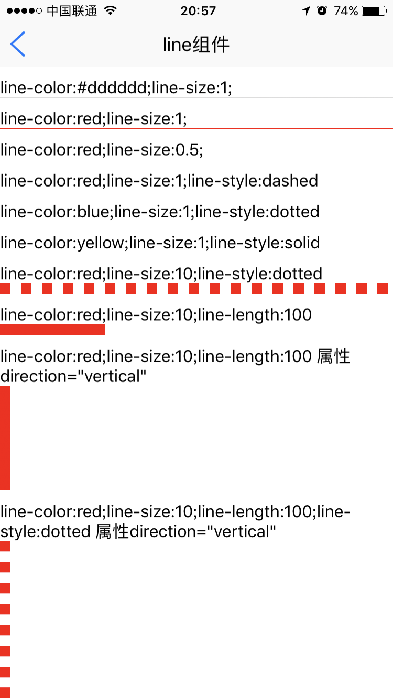

# line组件使用 

----------

line组件用于绘制直线，支持颜色，方向（横/竖），线型（实线，虚线）设置。  

<h2 id="cid_0">属性</h2> 


**公共属性**  

[参见公共属性章节](https://gitdocument.exmobi.cn/sprite-api/ggsx.html)，包括：id、style、class；


**direction**    

<code>线条绘制方向</code> 

线条绘制方向，【horizontal，vertical】 

> horizontal：横向；（默认）  
> 
> vertical：竖向； 


<h2 id="cid_1">样式</h2>

**公共样式**  

[参见公共样式章节](https://gitdocument.exmobi.cn/sprite-api/ggys.html)，包括：  
> 定位
> 
> 外边距


**line-color**  

<code>线条颜色</code>

默认值#333333； 


**line-size**  

<code>线条粗度</code>  

单位dp，默认为1dp 


**line-length**  

<code>线条长度</code>

对于横线来说，该值定义宽度，对于竖线来说，该值定义高度

注：在垂直布局中，交叉布局为stretch的时候，默认填充容器宽度。

<h2 id="cid_2">事件</h2>

无 


<h2 id="cid_3">js方法</h2>

**公共方法**  

[事件相关](https://gitdocument.exmobi.cn/sprite-api/ggff.html#cid_0)，包括：

> [on(messageName:string,callback:Function): void   组件注册事件的触发函数](https://gitdocument.exmobi.cn/sprite-api/ggff.html#jjxg_1)   
> 
> [fire(messageName:string,params:Array&lt;any&gt;): void  组件事件的触发函数](https://gitdocument.exmobi.cn/sprite-api/ggff.html#jjxg_2)   
> 
> [off(messageName:string,callback:Function): void  组件移除事件的触发函数](https://gitdocument.exmobi.cn/sprite-api/ggff.html#jjxg_3)  
>  
> [getOn(messageName:string): Array&lt;Function&gt;  获取已绑定的事件的触发函数](https://gitdocument.exmobi.cn/sprite-api/ggff.html#jjxg_4)   

[动画相关](https://gitdocument.exmobi.cn/sprite-api/ggff.html#cid_1)，包括： 
 
> [startAnimation(jsonData:Object,callback:Function): void  启动UI组件动画](https://gitdocument.exmobi.cn/sprite-api/ggff.html#dhxg_1)   
> 
> [startAnimator(jsonData:Object,callback:Function): void  启动UI组件属性动画](https://gitdocument.exmobi.cn/sprite-api/ggff.html#dhxg_2)   
> 
> [startKeyFrameAnimator(jsonData:Object,callback:Function): void  启动UI组件关键帧动画](https://gitdocument.exmobi.cn/sprite-api/ggff.html#dhxg_3)  
>  
> [ releaseAnimator(): void  结束控件动画](https://gitdocument.exmobi.cn/sprite-api/ggff.html#dhxg_4)   

[尺寸和位置](https://gitdocument.exmobi.cn/sprite-api/ggff.html#cid_2)，包括：  

> [getFrame(): Object  获取组件在父容器中的位置](https://gitdocument.exmobi.cn/sprite-api/ggff.html#cchwz_1)   
> 
> [setFrame(frame:Object): void  设置组件在父容器中的位置](https://gitdocument.exmobi.cn/sprite-api/ggff.html#cchwz_2)   
> 
> [getCenter(): Object  获取组件中心点在父容器中的位置](https://gitdocument.exmobi.cn/sprite-api/ggff.html#cchwz_3)  
>
> [getAbsoluteFrame(): Object  获取组件在绘制窗口中的位置](https://gitdocument.exmobi.cn/sprite-api/ggff.html#cchwz_4)   


[普通Dom节点操作](https://gitdocument.exmobi.cn/sprite-api/ggff.html#cid_3)，包括：  

> [getParent(): IElement  获取父节点](https://gitdocument.exmobi.cn/sprite-api/ggff.html#ptdom_1)   
> 
> [getNext(): IElement  获取同级下一个节点](https://gitdocument.exmobi.cn/sprite-api/ggff.html#ptdom_2)   
> 
> [getPrevious(): IElement  获取同级前一个节点](https://gitdocument.exmobi.cn/sprite-api/ggff.html#ptdom_3)  
> 
> [remove(): void  从父容器中移除自身](https://gitdocument.exmobi.cn/sprite-api/ggff.html#ptdom_4)  
> 
 
> [setAttr(attrName:string,attrValue:string): void  设置节点属性](https://gitdocument.exmobi.cn/sprite-api/ggff.html#ptdom_6)   
>
> [getAttr(attrName:string):string  获取节点属性值](https://gitdocument.exmobi.cn/sprite-api/ggff.html#ptdom_7) 
>
> [getAttrs(): Object  获取节点所有属性](https://gitdocument.exmobi.cn/sprite-api/ggff.html#ptdom_8) 
>
> [removeAttr(attrName:string): void  移除节点属性](https://gitdocument.exmobi.cn/sprite-api/ggff.html#ptdom_9) 
>
> [hasAttr(attrName:string): boolean  节点是否具有该属性](https://gitdocument.exmobi.cn/sprite-api/ggff.html#ptdom_10) 
> 
> [setStyle(styleName:string,styleValue:string): void  设置节点样式值](https://gitdocument.exmobi.cn/sprite-api/ggff.html#ptdom_13)  
>
> [getStyle(styleName:string):string  获取节点样式值](https://gitdocument.exmobi.cn/sprite-api/ggff.html#ptdom_14)   
>
> [clearStyle(styleName:string): void  移除节点样式值](https://gitdocument.exmobi.cn/sprite-api/ggff.html#ptdom_15)    
>
> [setClassStyle(className:string,domobj:IElement): void   设置节点对应Class样式](https://gitdocument.exmobi.cn/sprite-api/ggff.htm#ptdom_16) 
>  
> [getClassStyle(): string  获取节点已设置Class样式](https://gitdocument.exmobi.cn/sprite-api/ggff.html#ptdom_17)  
>  
> [getTag(): string  获取UI组件类型](https://gitdocument.exmobi.cn/sprite-api/ggff.html#ptdom_18)  
>  
> [getId(): string  获取UI组件Id标识](https://gitdocument.exmobi.cn/sprite-api/ggff.html#ptdom_19) 


<h2 id="cid_4">示例</h2>  


示例代码1，测试line布局样式，参考演示应用示例：apps\yuanhongqian\spriteui\line.uixml，代码中用到了官方封装的模板titlebar，模板的使用可参考[https://gitdocument.exmobi.cn/sprite-official-ui/index.html](https://gitdocument.exmobi.cn/sprite-official-ui/index.html "https://gitdocument.exmobi.cn/sprite-official-ui/index.html") 

```html

<page>
    <script>
        <![CDATA[
        var index = 1;
        var window = require("Window");
        var document = require("Document");
        var ui = require("UI");
        require("titlebarUI");
        function alert(msg) {
            var json = {};
            json.title = "提示";
            json.content = msg;
            ui.toast(json);
        }

        window.on("loaded", function () {
            //titlebar关闭页面
            var title = document.getElement("title");
            title.on("liconClick", function (e) {
                var json = {};
                window.close(json);
            });
        });
    ]]>
    </script>
    <style>
        @import url("spriteLayout");
        @import url("spriteColor");
        .br {
            width: 100;
            height: 10;
        }
        
        text {
            singleline: false;
        }
    </style>
    <ui>
        <box class="full" id="box">
            <titlebar title="line组件" id="title" licon="res:yuanhongqian/image/icon.png" style="licon-width:24;licon-height:24" class="titlebar-hasstatus"
            />
            <scroll class="flex1">
                <box class="br" />
                <text>line-color:#dddddd;line-size:1;</text>
                <line />
                <box class="br" />
                <text>line-color:red;line-size:1;</text>
                <line style="line-color:red" />
                <box class="br" />
                <text>line-color:red;line-size:0.5;</text>
                <line style="line-color:red;line-size:0.5" />
                <box class="br" />
                <text>line-color:red;line-size:1;line-style:dashed</text>
                <line style="line-color:red;line-style:dashed" />
                <box class="br" />
                <text>line-color:blue;line-size:1;line-style:dotted</text>
                <line style="line-color:blue;line-style:dotted" />
                <box class="br" />
                <text>line-color:yellow;line-size:1;line-style:solid</text>
                <line style="line-color:yellow;line-style:solid" />
                <box class="br" />
                <text>line-color:red;line-size:10;line-style:dotted</text>
                <line style="line-color:red;line-style:dotted;line-size:10" />
                <box class="br" />
                <text>line-color:red;line-size:10;line-length:100</text>
                <line style="line-color:red;line-size:10;line-length:100" />
                <box class="br" />
                <text>line-color:red;line-size:10;line-length:100 属性direction=&quot;vertical&quot;</text>
                <line style="line-color:red;line-size:10;line-length:100" direction="vertical" />
                <box class="br" />
                <text>line-color:red;line-size:10;line-length:100;line-style:dotted 属性direction=&quot;vertical&quot;</text>
                <line style="line-color:red;line-size:10;line-length:200;line-style:dotted" direction="vertical" />
            </scroll>
        </box>
    </ui>
</page>

```

代码效果：

  
 


