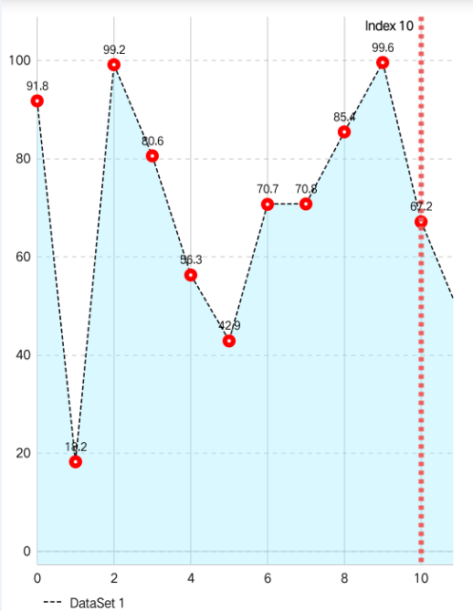
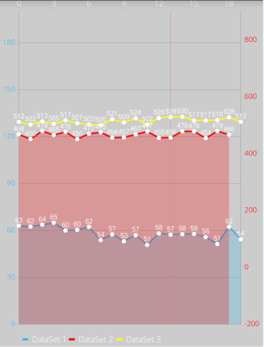
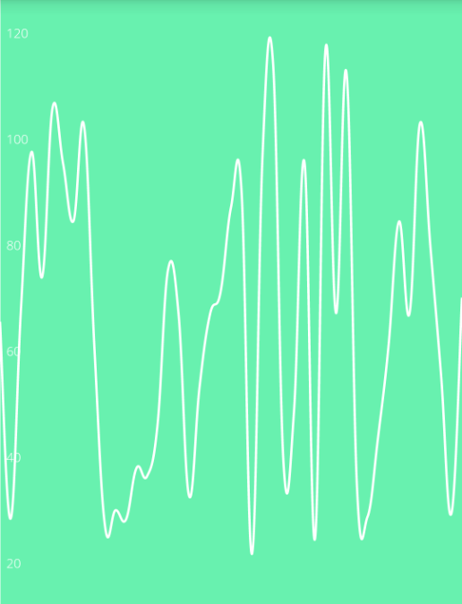
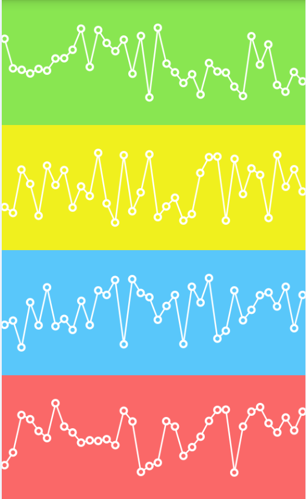

# linechart 组件使用   

------

linechart组件主要用于BI折线图表展现，如下图所示： 

  

   

linechart组件考虑支持以下功能：  

1：linechart组件需要在edn打包时勾选BI图表后方可正常使用；  

2：linechart组件包括折线图显示及区域说明两部分；  

3：折线图支持交互设置，包括：是否启用触摸交互，是否支持平移拖动，是否支持X轴/Y轴/XY轴手势缩放，是否设置比例缩放等；  

4：折线图区域支持设置背景色，网格展示，是否点击节点弹出pop窗口，pop窗显示文字格式等设置；   
 
5：折线图X轴支持设置，包括：是否展现，是否绘制网格线，网格线是否虚线，X轴绘制位置（顶部/底部），X轴描述文字色，X轴描述文字大小，X轴绘制坐标最大值，X轴绘制坐标最小值  

6：折线图Y轴包括两部分，左侧Y轴，右侧Y轴，均支持设置包括：是否展现，是否绘制网格线，网格线是否虚线， Y轴是否支持翻转，Y轴描述文字色，Y轴描述文字大小，Y轴绘制坐标最大值，Y轴绘制坐标最小值  

7：折线图支持添加多条折线，支持单独折线样式设置，包括：设置绘制线型（实线/虚线），线颜色，线宽度，节点文字是否展现，文字色值，文字大小，节点是否绘制圆弧，圆弧色，圆弧半径，是否填充圆孔，是否设置填充色，填充色值，填充色透明度，是否绘制高亮线，高亮线颜色，高亮线色值  

8：区域说明支持设置，包括：是否显示，描述样式（none/empty/default/square/circle/line）,样式尺寸，描述文字大小，描述文字尺寸  

9：图表支持展现动画，包括：X轴，Y轴，XY轴；  

10：考虑提供以下方法，包括：  

> setConfig(jsonData:object):void 设置折线图参数  
> setData(jsonData:object):void 设置折线图数据  
> addXLimitLine (data:object):string	添加X轴限制线  
> removeXLimitLine (id:string):void	移除指定X轴限制线  
> addLeftYLimitLine (data:object):string	添加左侧Y轴限制线  
> removeLeftYLimitLine (id:string):void	移除指定左侧Y轴限制线  
> removeAllLeftYLimitLine ():void	移除所有左侧Y轴限制线  
> addRightYLimitLine (data:object):string	添加右侧Y轴限制线  
> removeRightYLimitLine (id:string):void	移除指定右侧Y轴限制线  
> removeAllRightYLimitLine ():void	移除所有右侧Y轴限制线  
> invalidate():void 刷新折线图  
> setDrawValueEnabled(show:boolean):void	设置节点描述是否显示  
> setDrawHighlightEnabled(show:boolean):void	设置点击节点是否显示高亮标识线  
> setDrawFilledEnabled(show:boolean):void	设置是否绘制折线填充区域  
> setDrawCirclesEnabled(show:boolean):void	设置是否绘制节点圆  
> setPinchZoomEnabled(show:boolean):void	设置是否比例缩放，true：比例放大缩小；false：单轴放大缩小  
> setDrawLineMode(mode:string):void	设置折线绘制模式【LINEAR，STEPPED，CUBIC_BEZIER，HORIZONTAL_BEZIER】  

  

<h2 id="cid_0">属性</h2>

**公共属性**  

[参见公共属性章节](https://gitdocument.exmobi.cn/sprite-api/ggsx.html)，包括：id、style、class；

<h2 id="cid_1">样式</h2>

**公共样式**  

[参见公共样式章节](https://gitdocument.exmobi.cn/sprite-api/ggys.html)，包括：  

> 尺寸
> 
> 定位
>  
> 外边距
> 
>  
> flexbox布局：align-self,flex

<h2 id="cid_2">事件</h2>

本节目录：

> [valueSelected  指定饼图区域选中触发](#sj_1)
> 
> [nothingSelected   取消饼图区域选中触发](#sj_2)

**valueSelected**  

<code>指定折线图区域选中触发</code>  

event事件对象包括：   

> type：事件类型,字符串类型,固定值：valueSelected  
> 
> target：触发事件的目标组件,dom对象  
> 
> timestamp：事件触发的时间戳,单位毫秒,数字类型  

param对象为Json对象,定义如下：  

> index：节点索引，从0开始，数字类型 
> 
> xValue：节点X轴值，数字类型
> 
> yValue：节点Y轴值，数字类型

**注：**  折线highlightEnabled设置为true时触发

**nothingSelected**  

<code>取消折线图区域选中触发</code>   

 
event事件对象包括：   

> type：事件类型,字符串类型,固定值：nothingSelected  
> 
> target：触发事件的目标组件,dom对象  
> 
> timestamp：事件触发的时间戳,单位毫秒,数字类型   

**注：** 折线highlightEnabled设置为true时触发

<h2 id="cid_3">js方法</h2>

本节目录：

> [公共方法](#ff_1)  
> 
> [setConfig(jsonData:object):void 设置折线图参数  ](#ff_2)
> 
> [setData(jsonData:object):void 设置折线图数据](#ff_3)  

>[ invalidate():void 刷新折线图  ](#ff_4)
> 
> [addXLimitLine (data:object):string	添加X轴限制线 ](#ff_5) 
> 
> [removeXLimitLine (id:string):void	移除指定X轴限制线 ](#ff_6) 
> 
> [removeAllXLimitLine ():void  移除所有X轴限制线](#ff_7)
> 
> [addLeftYLimitLine (data:object):string	添加左侧Y轴限制线 ](#ff_8) 
> 
> [removeLeftYLimitLine (id:string):void	移除指定左侧Y轴限制线](#ff_9)  
> 
> [removeAllLeftYLimitLine ():void	移除所有左侧Y轴限制线](#ff_10)  
> 
> [addRightYLimitLine (data:object):string	添加右侧Y轴限制线](#ff_11)  
> 
> [removeRightYLimitLine (id:string):void	移除指定右侧Y轴限制线  ](#ff_12)
> 
>[ removeAllRightYLimitLine ():void	移除所有右侧Y轴限制线  ](#ff_13)
> 
>[ setDrawValueEnabled(show:boolean):void	设置节点描述是否显示 ](#ff_14) 
> 
>[ setDrawHighlightEnabled(show:boolean):void	设置点击节点是否显示高亮标识线 ](#ff_15) 
> 
> [setDrawCirclesEnabled(show:boolean):void	设置是否绘制节点圆  ](#ff_16)
> 
>[ setPinchZoomEnabled(show:boolean):void	设置是否比例缩放，true：比例放大缩小；false：单轴放大缩小  ](#ff_17)
> 
> [setDrawLineMode(mode:string):void	设置折线绘制模式【LINEAR，STEPPED，CUBIC_BEZIER，HORIZONTAL_BEZIER】 ](#ff_18)
> 
> [animateX(jsonData:object):void  启动折线图X轴动画](#ff_19)
> 
> [animateY(jsonData:object):void   启动折线图Y轴动画](#ff_20)
> 
> [animateXY(jsonData:object):void  启动折线图XY轴动画](#ff_21)
> 
> [snapshot(jsonData:Object): boolean  图表截屏,图片格式png](#22)
> 
> [combineWith(domObj:IElement):void  与 bar / candle / combined / line chart 联动](#ff_23)
> 

**公共方法**  

[事件相关](https://gitdocument.exmobi.cn/sprite-api/ggff.html#cid_0)，包括：

> [on(messageName:string,callback:Function): void   组件注册事件的触发函数](https://gitdocument.exmobi.cn/sprite-api/ggff.html#jjxg_1)   
> 
> [fire(messageName:string,params:Array&lt;any&gt;): void  组件事件的触发函数](https://gitdocument.exmobi.cn/sprite-api/ggff.html#jjxg_2)   
> 
> [off(messageName:string,callback:Function): void  组件移除事件的触发函数](https://gitdocument.exmobi.cn/sprite-api/ggff.html#jjxg_3)  
>  
> [getOn(messageName:string): Array&lt;Function&gt;  获取已绑定的事件的触发函数](https://gitdocument.exmobi.cn/sprite-api/ggff.html#jjxg_4)   

[动画相关](https://gitdocument.exmobi.cn/sprite-api/ggff.html#cid_1)，包括： 

> [startAnimation(jsonData:Object,callback:Function): void  启动UI组件动画](https://gitdocument.exmobi.cn/sprite-api/ggff.html#dhxg_1)   
> 
> [startAnimator(jsonData:Object,callback:Function): void  启动UI组件属性动画](https://gitdocument.exmobi.cn/sprite-api/ggff.html#dhxg_2)   
> 
> [startKeyFrameAnimator(jsonData:Object,callback:Function): void  启动UI组件关键帧动画](https://gitdocument.exmobi.cn/sprite-api/ggff.html#dhxg_3)  
>  
> [ releaseAnimator(): void  结束控件动画](https://gitdocument.exmobi.cn/sprite-api/ggff.html#dhxg_4)   

[尺寸和位置](https://gitdocument.exmobi.cn/sprite-api/ggff.html#cid_2)，包括：  

> [getFrame(): Object  获取组件在父容器中的位置](https://gitdocument.exmobi.cn/sprite-api/ggff.html#cchwz_1)   
> 
> [setFrame(frame:Object): void  设置组件在父容器中的位置](https://gitdocument.exmobi.cn/sprite-api/ggff.html#cchwz_2)   
> 
> [getCenter(): Object  获取组件中心点在父容器中的位置](https://gitdocument.exmobi.cn/sprite-api/ggff.html#cchwz_3)  
>  
> [getAbsoluteFrame(): Object  获取组件在绘制窗口中的位置](https://gitdocument.exmobi.cn/sprite-api/ggff.html#cchwz_4)   

[普通Dom节点操作](https://gitdocument.exmobi.cn/sprite-api/ggff.htmll#cid_3)，包括：  

> [getParent(): IElement  获取父节点](https://gitdocument.exmobi.cn/sprite-api/ggff.html#ptdom_1)   
> 
> [getNext(): IElement  获取同级下一个节点](https://gitdocument.exmobi.cn/sprite-api/ggff.html#ptdom_2)   
> 
> [getPrevious(): IElement  获取同级前一个节点](https://gitdocument.exmobi.cn/sprite-api/ggff.html#ptdom_3)  
> 
> [remove(): void  从父容器中移除自身](https://gitdocument.exmobi.cn/sprite-api/ggff.html#ptdom_4)  
> 
> [clone(isDeep:boolean):IElement  对当前Dom节点进行克隆](https://gitdocument.exmobi.cn/sprite-api/ggff.html#ptdom_5)  
>  
> [setAttr(attrName:string,attrValue:string): void  设置节点属性](https://gitdocument.exmobi.cn/sprite-api/ggff.html#ptdom_6)   
>
> [getAttr(attrName:string):string  获取节点属性值](https://gitdocument.exmobi.cn/sprite-api/ggff.html#ptdom_7) 
>
> [getAttrs(): Object  获取节点所有属性](https://gitdocument.exmobi.cn/sprite-api/ggff.html#ptdom_8) 
>
> [removeAttr(attrName:string): void  移除节点属性](https://gitdocument.exmobi.cn/sprite-api/ggff.html#ptdom_9) 
>
> [hasAttr(attrName:string): boolean  节点是否具有该属性](https://gitdocument.exmobi.cn/sprite-api/ggff.html#ptdom_10) 
>
> [setStyle(styleName:string,styleValue:string): void  设置节点样式值](https://gitdocument.exmobi.cn/sprite-api/ggff.html#ptdom_13)  
>
> [getStyle(styleName:string):string  获取节点样式值](https://gitdocument.exmobi.cn/sprite-api/ggff.html#ptdom_14)   
>
> [clearStyle(styleName:string): void  移除节点样式值](https://gitdocument.exmobi.cn/sprite-api/ggff.html#ptdom_15)    
>
> [setClassStyle(className:string,domobj:IElement): void   设置节点对应Class样式](https://gitdocument.exmobi.cn/sprite-api/ggff.html#ptdom_16) 
>  
> [getClassStyle(): string  获取节点已设置Class样式](https://gitdocument.exmobi.cn/sprite-api/ggff.html#ptdom_17)  
>  
> [getTag(): string  获取UI组件类型](https://gitdocument.exmobi.cn/sprite-api/ggff.html#ptdom_18)  
>  
> [getId(): string  获取UI组件Id标识](https://gitdocument.exmobi.cn/sprite-api/ggff.html#ptdom_19) 

**setConfig(jsonData:object):void **  

<code>设置折线图参数</code>   

参数：  

jsonData：参数，Json格式，格式定义如下：  

**基础设置**  

> extraOffsets：图表周边空白间距，上 右 下 左，字符类型，如 10 5 10 5 默认 0 0 0 0  
> popEnabled：点击折线点是否弹出pop窗口，boolean型，true：弹出；false：不弹出，默认true  

**拖动设置**  

> touchEnabled：是否启用图表触摸交互，boolean型，默认true  
> dragEnabled：是否启用图表拖动平移，boolean型，默认true  
> scaleEnabled：是否启用图表X轴及Y轴手势缩放，boolean型，默认true  
> scaleXEnabled：是否启用图表X轴手势缩放，boolean型，默认true  
> scaleYEnabled：是否启用图表Y轴手势缩放，boolean型，默认true  
> pinchZoom：是否XY轴比例缩放，boolean型，默认true  

**X轴样式**  

> xEnabled：X轴是否展现，boolean型，默认true  
> xDrawGridLines：X轴是否绘制网格线，boolean型，默认true  
> xGridLineWidth：X轴网格线size，数字类型，单位dp，默认1  
> xGridLineColor：X轴网格线颜色，字符串类型，支持RGB（rgb(255, 0, 0)）,十六进制（#rrggbb），默认#808080  
> xDrawAxisLines：X轴是否绘制线，boolean型，默认true  
> xPosition：X轴位置，字符串枚举型，【top，bottom，both_sided，top_inside,bottom_inside】默认bottom  
> xTextSize：文字大小，数字，单位dp，默认10  
> xTextColor：文字颜色，字符串类型，支持RGB（rgb(255, 0, 0)）,十六进制（#rrggbb），默认#000000  
> xTextCenter：文字是否绘制于坐标中心，boolean型，默认false  
> xCustomTexts: x 轴 label 值,字符串数组类型,可选项  
> xDrawLabels: 是否绘制 x 轴 label 值，默认值为 true，bool 类型  

**左侧Y轴样式 ** 

> yLeftEnabled：左侧Y轴是否展现，boolean型，默认true  
> yLeftInverted：左侧Y轴是否翻转显示，boolean型，默认false  
> yLeftDrawGridLines：左侧Y轴是否绘制网格线，boolean型，默认true  
> yLeftGridLineWidth：左侧Y轴网格线size，数字类型，单位dp，默认1  
> yLeftGridLineColor：左侧Y轴网格线颜色，字符串类型，支持RGB（rgb(255, 0, 0)）,十六进制（#rrggbb），默认#808080  
> yLeftGridLineMode：左侧Y轴网格线模式，字符串枚举型，【normal，dashed】，normal：实线，dashed：虚线，默认normal  
> yLeftDrawAxisLines：左侧Y轴是否绘制线，boolean型，默认true  
> yLeftPosition：左侧Y轴位置，字符串枚举型，【outside_chart，inside_chart】默认outside_chart  
> yLeftTextSize：描述区域文字大小，数字，单位dp，默认10  
> yLeftTextColor：描述区域文字颜色，字符串类型，支持RGB（rgb(255, 0, 0)）,十六进制（#rrggbb），默认#000000  
> yLeftDrawZeroLine：左侧Y轴是否绘制零轴线，boolean型，默认false  
> yLeftZeroLineWidth：左侧Y轴零轴线size，数字类型，单位dp，默认1  
> yLeftZeroLineColor：左侧Y轴零轴线颜色，字符串类型，支持RGB（rgb(255, 0, 0)）,十六进制（#rrggbb），默认#808080  
> yLeftCustomTexts: 左侧y 轴 label 值,字符串数组类型,可选项  
> yLeftDrawLabels: 是否绘制左侧 y 轴 label 值，默认值为 true，bool 类型  

**右侧Y轴样式  **  

> yRightEnabled：右侧Y轴是否展现，boolean型，默认false  
> yRightInverted：右侧Y轴是否翻转显示，boolean型，默认false  
> yRightDrawGridLines：右侧Y轴是否绘制网格线，boolean型，默认true  
> yRightGridLineWidth：右侧Y轴网格线size，数字类型，单位dp，默认1  
> yRightGridLineColor：右侧Y轴网格线颜色，字符串类型，支持RGB（rgb(255, 0, 0)）,十六进制（#rrggbb），默认#808080  
> yRightGridLineMode：右侧Y轴网格线模式，字符串枚举型，【normal，dashed】，normal：实线，dashed：虚线，默认normal  
> yRightDrawAxisLines：右侧Y轴是否绘制线，boolean型，默认true  
> yRightPosition：右侧Y轴位置，字符串枚举型，【outside_chart，inside_chart】默认outside_chart    
> yRightTextSize：描述区域文字大小，数字，单位dp，默认10  
> yRightTextColor：描述区域文字颜色，字符串类型，支持RGB（rgb(255, 0, 0)）,十六进制（#rrggbb），默认#000000  
> yRightDrawZeroLine：右侧Y轴是否绘制零轴线，boolean型，默认false  
> yRightZeroLineWidth：右侧Y轴零轴线size，数字类型，单位dp，默认1  
> yRightZeroLineColor：右侧Y轴零轴线颜色，字符串类型，支持RGB（rgb(255, 0, 0)）,十六进制（#rrggbb），默认#808080   
> yRightCustomTexts: 右侧 y 轴 label 值, 字符串数组类型,可选项  
> yRightDrawLabels: 是否绘制右侧 y 轴 label 值，默认值为 true，bool 类型，可选项  

**描述区域设置**   
 
> legendDrawInside：是否显示在图表区域内部，boolean型，默认false  
> legendVerticalAlignment：Y轴位置，字符串枚举型，【top, center, bottom】，默认bottom  
> legendHorizontalAlignment：X轴位置，字符串枚举型，【left, center, right】，默认left  
> legendOrientation：排序方向，字符串枚举型，【horizontal, vertical】，默认horizontal  
> legendXOffset：描述区域与图表X轴边缘间距，数字类型，默认5  
> legendYOffset：描述区域与图表Y轴边缘间距，数字类型，默认5  
> legendForm：描述区域形状，字符串枚举型，【none，empty，default，square，circle，line】，默认default  
> legendTextSize：描述区域文字大小，数字，单位dp，默认10  
> legendTextColor：描述区域文字颜色，字符串类型，支持RGB（rgb(255, 0, 0)）,十六进制（#rrggbb），默认#000000  

**Pop窗设置**  

> popWidth: pop 窗口的宽度, 数字类型, 可选项  
> popHeight: pop 窗口的高度, 数字类型, 可选项  
> popHorizontalOffset: pop 窗口的水平偏移量, 数字类型, 单位 dp, 默认值为 -popWidth / 2, 可选项  
> popVerticalOffset: pop 窗口的垂直偏移量, 数字类型, 单位 dp, 默认值为 -5, 可选项  
> popBackgroundColor: pop 窗口背景色, 字符串类型，支持RGB（rgb(255, 0, 0)）,十六进制（#rrggbb），默认#444444，可选项  
> popTextColor: pop 窗口文字颜色, 字符串类型，支持RGB（rgb(255, 0, 0)）,十六进制（#rrggbb），默认#FFFFFF，可选项   
> popTextPattern: pop 窗口文本自定义格式, 参照 java DecimalFormat 的模式符号格式，字符串类型, 可选项，靠 # 和 0 两种占位符号来指定数字长度，数字四舍五入。0 表示如果位数不足则以 0 填充，# 表示只要有可能就把数字拉上这个位置，如：数字3.1415927，格式为“0” 则实际显示为3， 格式为“0.00”则实际显示为 3.14，格式为“00.000”则实际显示为03.142,格式为“圆周率为0.00”则实际显示为 圆周率为3.14  
> popBorderColor: pop 窗口边框颜色, 字符串类型，支持RGB（rgb(255, 0, 0)）,十六进制（#rrggbb），默认#444444，可选项  
> popBorderWidth: pop 窗口边框宽度, 数字类型, 默认值为 1 dp，可选项  

返回值：无  

**setData(lineInfo:object):void **  

<code>设置折线图数据</code>   

参数：  

lineInfo：折线图数据，json类型，定义如下：  

> lineDatas：折线图数据，数组类型，数组成员为json格式，定义如下：  
> 
> - name：折线描述，字符串类型     
> 
> - datas：折线数据集，数组类型，数据成员为json格式，定义如下：    
>   - xValue：X轴数值，数字类型         
>   - yValue：Y轴数值，数字类型         
>   
> - axis：折线基准Y轴，字符串枚举型，【left，right】，默认left即左侧Y轴       
> 
> - style：折线样式，json格式定义如下：      
>   - **  //线  **
>   -  lineWidth：线size，数字类型，单位dp，默认1  
>   -  lineColor：线颜色，字符串类型，支持RGB（rgb(255, 0, 0)）,十六进制（#rrggbb），默认#000000  
>   -  lineMode：线模式，字符串枚举型，【normal，dashed】，normal：实线，dashed：虚线，默认normal  
>   -  lineDrawMode：线绘制连接模式，字符串枚举型，【linear，stepped,cubic_bezier,horizontal_bezier】，linear：线性模式，stepped：步进线模式，cubic_bezier：3D弧度线模式，horizontal_bezier：横向3D弧度线模式，默认linear  
>   -   **//高亮线  ** 
>   -  highlightEnabled：点击节点是否显示高亮线，boolean型，true：显示高亮线，false：不显示高亮线，默认true  
>   -  highlightLineWidth：高亮线size，数字类型，单位dp，默认1  
>   -  highlightLineColor：高亮线颜色，字符串类型，支持RGB（rgb(255, 0, 0)）,十六进制（#rrggbb），默认#ffbb73  
>   -  highlightLineMode：高亮线模式，字符串枚举型，【normal，dashed】，normal：实线，dashed：虚线，默认normal  
>   -   **//节点文字**  
>   -  drawValues：是否绘制节点值，boolean型，true：绘制（默认）；false：绘制  
>   -  valueTextSize：节点文字大小，数字，单位dp，默认10  
>   -  valueTextColor：节点文字颜色，字符串类型，支持RGB（rgb(255, 0, 0)）,十六进制（#rrggbb），默认#000000  
>   -  **//节点圆**  
>   -  drawCircles：节点处是否绘制圆，boolean，true：绘制圆，false：不绘制圆，默认true  
>   -  circleRadius：节点绘制圆半径，数字，单位dp，默认2  
>   - circleColor：节点绘制圆填充色，字符串类型，支持RGB（rgb(255, 0, 0)）,十六进制（#rrggbb），默认#ff0000    
>   -  drawCircleHole：节点处是否绘制中中心圆孔，boolean，true：绘制圆孔，false：不绘制圆孔，默认true  
>   -  circleHoleRadius：节点绘制圆孔半径，数字，单位dp，默认1  
>   - circleHoleColor：节点绘制圆孔填充色，字符串类型，支持RGB（rgb(255, 0, 0)）,十六进制（#rrggbb），默认#ffffff    
>   - ** //填充色 **  
>   -  drawFilled：是否绘制折线与X坐标值之间填充色，bool型，true：绘制；false：不绘制，默认false；  
>   - filledColor：折线与X坐标值之间填充色色值，字符串类型，支持RGB（rgb(255, 0, 0)）,十六进制（#rrggbb），默认#8ceaff  
>   -  filledAlpha：折线与X坐标值之间填充色透明度，数字类型，取值范围【0-255】，0透明，255不透明，默认85  

> xAxisMinimum：设置图表显示x轴最小值，数字类型，默认无
> 
> xAxisMaximum：设置图表显示x轴最大值，数字类型，默认无
> 
> yLeftAxisMinimum：设置图表显示左侧Y轴最小值，数字类型，默认无
> 
> yLeftAxisMaximum：设置图表显示左侧Y轴最大值，数字类型，默认无
> 
> yRightAxisMinimum：设置图表显示右侧Y轴最小值，数字类型，默认无
> 
> yRightAxisMaximum：设置图表显示右侧Y轴最大值，数字类型，默认无

返回值：无  

**注：** setData调用前需调用setConfig进行图表参数配置

**invalidate():void **  

<code>刷新折线图数据</code> 

参数：无  

返回值：无  

**注：** 数据改变或配置改变后，需调用该方法刷折线图展现  
 

**addXLimitLine (data:object):string**  

<code>添加X轴限制线</code>

参数：  

data：添加X轴限制线，json格式定义如下： 

> name：限制线描述，字符串类型  
> value：限制线X轴值，数字类型  
> style：限制样式，json格式定义如下：  
> - lineWidth：线size，数字类型，单位dp，默认1  
> - lineColor：线颜色，字符串类型，支持RGB（rgb(255, 0, 0)）,十六进制（#rrggbb），默认#ed5b5b  
> - lineMode：线模式，字符串枚举型，【normal，dashed】，normal：实线，dashed：虚线，默认normal  
> - labelPosition：描述文字绘制位置，字符串枚举型，【left_top,left_bottom,right_top,right_bottom】，默认right_top  
> - labelSize：描述文字大小，数字，单位dp，默认10  
> - labelColor：描述区域文字颜色，字符串类型，支持RGB（rgb(255, 0, 0)）,十六进制（#rrggbb），默认#000000  

返回值：添加限制线标识，字符串类型  

**注：**  需调用invalidate刷新方可生效

**removeXLimitLine (id:string):void	**  

<code>移除指定X轴限制线</code>
	
参数：  

> id：需要移除X轴限制线标识，字符串类型，必选项  

返回值：无  

**注：** 需调用invalidate刷新方可生效

	

**removeAllXLimitLine ():void**  

<code>移除所有X轴限制线</code>

参数：无  

返回值：无  

**注：** 需调用invalidate刷新方可生效

**addLeftYLimitLine (data:object):string**  

<code>添加左侧Y轴限制线</code>  

参数：  

data：添加左侧Y轴限制线，json格式定义如下：  

> name：限制线描述，字符串类型  
> value：限制线Y轴值，数字类型  
> style：限制样式，json格式定义如下：  
> - lineWidth：线size，数字类型，单位dp，默认1  
> - lineColor：线颜色，字符串类型，支持RGB（rgb(255, 0, 0)）,十六进制（#rrggbb），默认#ed5b5b  
> - lineMode：线模式，字符串枚举型，【normal，dashed】，normal：实线，dashed：虚线，默认normal  
> - labelPosition：描述文字绘制位置，字符串枚举型，【left_top,left_bottom,right_top,right_bottom】，默认right_top  
> - labelSize：描述文字大小，数字，单位dp，默认10  
> - labelColor：描述区域文字颜色，字符串类型，支持RGB（rgb(255, 0, 0)）,十六进制（#rrggbb），默认#000000  

返回值：添加限制线标识，字符串类型  

**注：** 需调用invalidate刷新方可生效  

**removeLeftYLimitLine (id:string):void**  

<code>移除指定左侧Y轴限制线</code>    

参数：  

> id：需要移除左侧Y轴限制线标识，字符串类型，必选项

返回值：无  

**注：** 需调用invalidate刷新方可生效  

**removeAllLeftYLimitLine ():void**  

<code>移除所有左侧Y轴限制线</code>    
	
参数：无  

返回值：无  

**注：** 需调用invalidate刷新方可生效  

** addRightYLimitLine (data:object):string**  

<code>添加右侧Y轴限制线</code>      

参数：  

data：添加右侧Y轴限制线，json格式定义如下：  

> name：限制线描述，字符串类型  
> value：限制线Y轴值，数字类型  
> style：限制样式，json格式定义如下：  
> - lineWidth：线size，数字类型，单位dp，默认1  
> - lineColor：线颜色，字符串类型，支持RGB（rgb(255, 0, 0)）,十六进制（#rrggbb），默认#ed5b5b  
> - lineMode：线模式，字符串枚举型，【normal，dashed】，normal：实线，dashed：虚线，默认normal  
> - labelPosition：描述文字绘制位置，字符串枚举型，【left_top,left_bottom,right_top,right_bottom】，默认right_top  
> - labelSize：描述文字大小，数字，单位dp，默认10  
> - labelColor：描述区域文字颜色，字符串类型，支持RGB（rgb(255, 0, 0)）,十六进制（#rrggbb），默认#000000  

返回值：添加限制线标识，字符串类型  

**注：** 需调用invalidate刷新方可生效

**removeRightYLimitLine (id:string):void**  

<code>移除指定右侧Y轴限制线</code>    

参数：  

> id：需要移除右侧Y轴限制线标识，字符串类型，必选项

返回值：无  

**注：** 需调用invalidate刷新方可生效

**removeAllRightYLimitLine ():void**  

<code>移除所有右侧Y轴限制线</code>  

参数：无  

返回值：无  

**注：** 需调用invalidate刷新方可生效  

**setDrawValueEnabled (show:boolean):void**  

<code>设置节点值是否显示</code>  

	
参数：  

> show：节点值是否显示，boolean型，true：显示；false：不显示，必选项  

返回值：无  

**注：** 需调用invalidate刷新方可生效  

**setDrawHighlightEnabled (show:boolean):void**  

<code>设置点击节点是否显示高亮标识线</code> 

参数：  

> show：点击节点是否显示高亮标识线，boolean型，true：显示；false：不显示，必选项  

返回值：无  

**注：** 需调用invalidate刷新方可生效  

**setDrawCirclesEnabled (show:boolean):void**  

<code>是否绘制节点圆</code>   

参数：  

> show：是否绘制节点圆，boolean型，true：绘制；false：不绘制，必选项  

返回值：无  

**注：**  需调用invalidate刷新方可生效

**setPinchZoomEnabled (show:boolean):void**  

<code>设置是否XY轴比例缩放</code>   

参数： 

> show：是否XY轴比例缩放，boolean型，true：比例缩放；false：单轴缩放，必选项  

返回值：无  

**注：** 需调用invalidate刷新方可生效  

**setLineDrawMode (lineDrawMode:string):void**  

<code>设置绘制折线连接模式</code>    
	
参数      

lineDrawMode：线绘制连接模式，字符串枚举型，【linear，stepped,cubic_bezier,horizontal_bezier】，linear：线性模式，stepped：步进线模式，cubic_bezier：3D弧度线模式，horizontal_bezier：横向3D弧度线模式  

返回值：无

**animateX(jsonData:object):void**  

<code>启动折线图X轴动画</code>    

	
参数： 

jsonData：动画参数，json格式，定义如下：  

>  durationMillis：动画执行时间，数字类型，必选项，单位毫秒  
>  easingOption：动画执行速率配置，字符枚举型，【ease_in, ease_out, ease_in_out, linear】,可选项，ease_in：动画启动的时候慢；ease_out：动画结束的时候慢；ease_in_out：动画启动时候慢,中间快,结束的时候慢；linear动画速度不变（默认）；  

返回值：无   

**animateY(jsonData:object):void**  

<code>启动折线图Y轴动画</code>    

参数：  

jsonData：动画参数，json格式，定义如下： 

> durationMillis：动画执行时间，数字类型，必选项，单位毫秒  
> easingOption：动画执行速率配置，字符枚举型，【ease_in, ease_out, ease_in_out, linear】,可选项，ease_in：动画启动的时候慢；ease_out：动画结束的时候慢；ease_in_out：动画启动时候慢,中间快,结束的时候慢；linear动画速度不变（默认）；

返回值：无  

**animateXY(jsonData:object):void**  

<code>启动折线图XY轴动画</code>  
	
参数： 

jsonData：动画参数，json格式，定义如下：  

> durationMillisX：x轴动画执行时间，数字类型，必选项，单位毫秒  
> easingOptionX：x轴动画执行速率配置，字符枚举型，【ease_in, ease_out, ease_in_out, linear】,可选项，ease_in：动画启动的时候慢；ease_out：动画结束的时候慢；ease_in_out：动画启动时候慢,中间快,结束的时候慢；linear动画速度不变（默认）；  
> durationMillisY：y轴动画执行时间，数字类型，必选项，单位毫秒  
> easingOptionY：y轴动画执行速率配置，字符枚举型，【ease_in, ease_out, ease_in_out, linear】,可选项，ease_in：动画启动的时候慢；ease_out：动画结束的时候慢；ease_in_out：动画启动时候慢,中间快,结束的时候慢；linear动画速度不变（默认）；  

**snapshot(jsonData:Object): boolean**  

<code>图表截屏,图片格式png</code> 

参数：  

jsonData：截屏参数,Json对象,定义如下：  

> path：截屏保存图片文件路径（包含文件名）,支持res: file:,字符串类型,必选项； 

返回值：截屏是否成功，成功返回true，失败返回false   

**combineWith(domObj:IElement):void	**  

<code>与 bar / candle / combined / line chart 联动</code> 

参数：  

domObj：需要联动的 chart 组件dom对象，IElement类型，必选项；  

返回值：无

