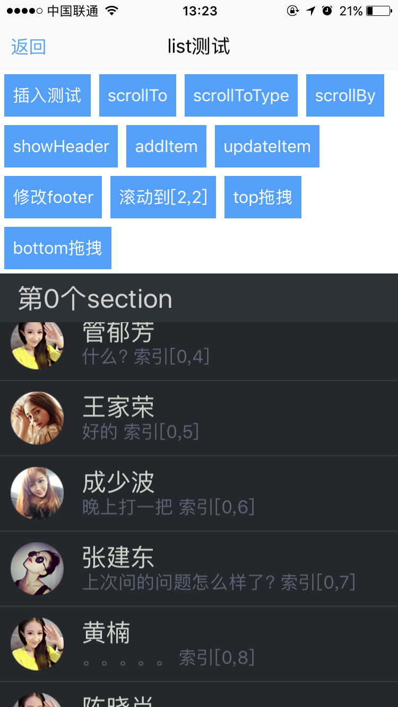

# list组件使用 

----------

list列表布局组件，用于展现大量重复列表类数据，list列表布局组件，包括：header，cell，footer，refresh几个子容器，组合使用于不同场景下。  

list最基本的使用方式是创建一个ListAdapter数据源，将该数据源与list容器绑定，并且定义数据源的getView()回调监听函数，这个函数会接受数组中的每个数据作为参数，返回一个可渲染的组件作为listview的每一行。  

list支持普通模式及Section分组模式，可根据实际使用场景使用不同模式。


**注：**   

- 使用list时需要设置其区域大小，一般情形下要设置高宽，也可以用flex来分割区域，如果不设置区域大小，其内容无非显示。
 
- 在list的cell内部不能做有关dom的容器操作，比如动态的添加一个dom或者隐藏一个dom（不过可以使用visibility来做控件的隐藏），总之在cell内部不允许有修改区域大小的操作。

<h2 id="cid_0">子节点</h2>   

**header**  

放置列表中固定于顶部显示的界面，采用flexbox模型布局，支持嵌套任意类型的UI组件或容器，使用和box容器一致。  

通过list对象getHeader()方法获取header对象后，可进行header容器内UI组件相关操作，操作完毕后调用list对象的refreshHeader()方法刷新。  


**cell**  

用于放置列表item模板布局文件，采用flexbox模型布局，支持嵌套任意类型的UI组件或容器，使用和box容器一致。  

某些复杂列表页面需要可能具有多个模板，支持放置多个cell容器用于区分，此时cell需要设置不同id属性用于区分。  


**footer**  

放置列表中固定于底部显示的界面，采用flexbox模型布局，支持嵌套任意类型的UI组件或容器，使用和box容器一致。  

通过list对象getFooter()方法获取footer对象后，可进行footer容器内UI组件相关操作，操作完毕后调用list对象的refreshFooter ()方法刷新。  

**refresh**  

list处于垂直滚动模式时，可以包裹refresh容器用于实现下拉刷新及上拉刷新效果，[详见refresh容器章节](https://gitdocument.exmobi.cn/sprite-api/refresh.html)。


<h2 id="cid_1">属性</h2> 


**公共属性**  

[参见公共属性章节](https://gitdocument.exmobi.cn/sprite-api/ggsx.html)，包括：id、style、class；


**bottomDistance**  

<code>拖动至底部多少距离时触发</code>    

设置scrollToBottom触发事件后，拖动至底部多少距离时触发，数字，单位dp，默认为0  


**scrollToTop**   

<code>点击系统状态栏是否滚动至顶部</code> 

取值[true，false]  

> true：点击系统状态栏滚动至顶部（默认）；  
> 
> false：点击系统状态栏不滚动至顶部；  

注：仅iOS支持


<h2 id="cid_2">样式</h2>

**公共样式**  

[参见公共样式章节](https://gitdocument.exmobi.cn/sprite-api/ggys.html)，包括：  
 
> 尺寸
> 
> 定位 
> 
> 内边距
> 
> 外边距
> 
> 边框
> 
> 背景
>
> 显影 
> 
> flexbox布局：align-self，flex


**section-background-color**  

<code>组背景色</code>

默认值：#f0f0f0

**section-color**  

<code>组文字颜色</code>

默认值： #00000


**section-font-size**  

<code>组文字大小</code> 

取值数字，单位dp，默认值：16  


**section-font-weight**  

<code>组文字粗细</code>  

取值 [normal,bold]  

> normal：正常字体（默认）；
> 
> bold：粗体；


**section-font-margin**  

<code>组文字margin</code>  

按照：上 右 下 左 ，默认：8 16 8 16，示例：section-font-margin:5 5 5 5 或 section-font-margin:5;


<h2 id="cid_3">事件</h2>

本节目录：

> [scrollToBottom  滚动条滚动至底部时触发 ](#sj_1) 
> 
> [scrollStart  滚动开始时触发 ](#sj_2)
> 
>[ scrollChange  滚动时多次触发  ](#sj_3)
> 
>[ scrollStop  滚动结束时触发](#sj_4)
>
>[ itemClick  列表项点击时触发](#sj_5)

<span id="sj_1">**scrollToBottom**</span>   

<code>滚动条滚动至底部时触发</code>    

event事件对象包括：  
  
> type：事件类型，字符串类型，固定值：scrollToBottom；
> 
> target：触发事件的目标组件，dom对象；
> 
> timestamp：事件触发的时间戳,单位毫秒，数字类型

**注：** 该事件一般与bottomDistance属性配合使用。


<span id="sj_2">**scrollStart**</span>  

<code>滚动开始时触发</code>    

event事件对象包括：   
 
> type：事件类型，字符串类型，固定值：scrollStart；
> 
> target：触发事件的目标组件，dom对象；
> 
> timestamp：事件触发的时间戳,单位毫秒，数字类型


<span id="sj_3">**scrollChange**</span>  

<code>滚动时多次触发</code>   


event事件对象包括：   

> type：事件类型，字符串类型，固定值：scrollChange；
> 
> target：触发事件的目标组件，dom对象；
> 
> timestamp：事件触发的时间戳,单位毫秒，数字类型
    
param对象为Json对象，定义如下：   

> x：x轴滚动位移坐标值，数字类型
> 
> y：y轴滚动位移坐标值，数字类型
> 
> oldX：上次x轴滚动位移坐标值，数字类型
> 
> oldY：上次y轴滚动位移坐标值，数字类型

示例：

```javascript   

 list.on("scrollChange", function (e, param) {         
        textid.setText("scrollChange x=" + param.x + " y=" + param.y + " oldX=" + param.oldX + " oldY=" + param.oldY);
 });

```


<span id="sj_4">**scrollStop**</span>

<code>滚动结束时触发</code>     

event事件对象包括：    

> type：事件类型，字符串类型，固定值：scrollStop；
> 
> target：触发事件的目标组件，dom对象；
> 
> timestamp：事件触发的时间戳,单位毫秒，数字类型


<span id="sj_5">**itemClick**</span>

<code>列表项点击时触发</code>    

event时间对象，包括：

> type：事件类型，字符串类型，固定值：itemClick；
> 
> target：点击item所在的cell对象，dom对象；
> 
> timestamp：事件触发的时间戳,单位毫秒，数字类型

index：点击item对应的Adapter数据索引，数字类型

sectionIndex：该item对应的section索引，数据类型，普通列表返回0；

示例：

```javascript

list = document.getElement("list");
list.on("itemClick", function (e, position, sectionPostion) {
    console.log("sectionPostion:"+sectionPostion);
    console.log("position:"+position);
});

```


<h2 id="cid_4">js方法</h2> 

本节目录：

[公共方法](#ff_1)

[setAdapter(adapter:Adapter): void  绑定List容器与ListAdapter对象关系](#ff_2)

[scrollTo(jsonData:Object): void   将容器内的当前内容滚动到指定位置](#ff_3)  

[scrollToType(jsonData:Object): void  将容器内的当前内容滚动到特定位置 ](#ff_4) 

[scrollToPosition(jsonData:Object): void  将容器内的当前内容滚动到特定索引位置  ](#ff_5) 


[scrollBy(jsonData:Object): void  容器基于相对位置滚动 ](#ff_6) 

[getScrollY(): number   获取滚动容器y轴动点坐标  ](#ff7)  

[hideHeader(): void  隐藏列表顶部区域  ](#ff_8)

[showHeader(): void  显示列表顶部区域](#ff_9)  


[getHeader():IElement   获取列表header区域 ](#ff_10)  

[refreshHeader(): void  刷新列表heade区域  ](#ff_11) 

[hideFooter(): void  隐藏列表底部区域 ](#ff_12) 

[showFooter(): void  显示列表底部区域  ](#ff_13)

[getFooter():IElement  获取列表Footer区域](#ff_14)  

[refreshFooter(): void  刷新列表footer区域](#ff_15)

[setCaptureTouchEvent (caputueTouchEvent:boolean): void  设置滚动容器是否拦截子组件touch事件](#ff_16)

[getCaptureTouchEvent(): boolean   获取滚动容器是否拦截子组件touch事件](#ff_17) 


<span id="ff_1"><code>**公共方法**</code></span> 


[事件相关](https://gitdocument.exmobi.cn/sprite-api/ggff.html#cid_0)，包括：

> [on(messageName:string,callback:Function): void   组件注册事件的触发函数](https://gitdocument.exmobi.cn/sprite-api/ggff.html#jjxg_1)   
> 
> [fire(messageName:string,params:Array&lt;any&gt;): void  组件事件的触发函数](https://gitdocument.exmobi.cn/sprite-api/ggff.html#jjxg_2)   
> 
> [off(messageName:string,callback:Function): void  组件移除事件的触发函数](https://gitdocument.exmobi.cn/sprite-api/ggff.html#jjxg_3)  
>  
> [getOn(messageName:string): Array&lt;Function&gt;  获取已绑定的事件的触发函数](https://gitdocument.exmobi.cn/sprite-api/ggff.html#jjxg_4)   

[动画相关](https://gitdocument.exmobi.cn/sprite-api/ggff.html#cid_1)，包括： 
 
> [startAnimation(jsonData:Object,callback:Function): void  启动UI组件动画](https://gitdocument.exmobi.cn/sprite-api/ggff.html#dhxg_1)   
> 
> [startAnimator(jsonData:Object,callback:Function): void  启动UI组件属性动画](https://gitdocument.exmobi.cn/sprite-api/ggff.html#dhxg_2)   
> 
> [startKeyFrameAnimator(jsonData:Object,callback:Function): void  启动UI组件关键帧动画](https://gitdocument.exmobi.cn/sprite-api/ggff.html#dhxg_3)  
>  
> [ releaseAnimator(): void  结束控件动画](https://gitdocument.exmobi.cn/sprite-api/ggff.html#dhxg_4)   

[尺寸和位置](https://gitdocument.exmobi.cn/sprite-api/ggff.html#cid_2)，包括：  

> [getFrame(): Object  获取组件在父容器中的位置](https://gitdocument.exmobi.cn/sprite-api/ggff.html#cchwz_1)   
> 
> [setFrame(frame:Object): void  设置组件在父容器中的位置](https://gitdocument.exmobi.cn/sprite-api/ggff.html#cchwz_2)   
> 
> [getCenter(): Object  获取组件中心点在父容器中的位置](https://gitdocument.exmobi.cn/sprite-api/ggff.html#cchwz_3)  
>
> [getAbsoluteFrame(): Object  获取组件在绘制窗口中的位置](https://gitdocument.exmobi.cn/sprite-api/ggff.html#cchwz_4)   


[普通Dom节点操作](https://gitdocument.exmobi.cn/sprite-api/ggff.html#cid_3)，包括：  

> [getParent(): IElement  获取父节点](https://gitdocument.exmobi.cn/sprite-api/ggff.html#ptdom_1)   
> 
> [getNext(): IElement  获取同级下一个节点](https://gitdocument.exmobi.cn/sprite-api/ggff.html#ptdom_2)   
> 
> [getPrevious(): IElement  获取同级前一个节点](https://gitdocument.exmobi.cn/sprite-api/ggff.html#ptdom_3)  
> 
> [remove(): void  从父容器中移除自身](https://gitdocument.exmobi.cn/sprite-api/ggff.html#ptdom_4)  
> 
> [clone(isDeep:boolean):IElement  对当前Dom节点进行克隆](https://gitdocument.exmobi.cn/sprite-api/ggff.html#ptdom_5)  
>  
> [setAttr(attrName:string,attrValue:string): void  设置节点属性](https://gitdocument.exmobi.cn/sprite-api/ggff.html#ptdom_6)   
>
> [getAttr(attrName:string):string  获取节点属性值](https://gitdocument.exmobi.cn/sprite-api/ggff.html#ptdom_7) 
>
> [getAttrs(): Object  获取节点所有属性](https://gitdocument.exmobi.cn/sprite-api/ggff.html#ptdom_8) 
>
> [removeAttr(attrName:string): void  移除节点属性](https://gitdocument.exmobi.cn/sprite-api/ggff.html#ptdom_9) 
>
> [hasAttr(attrName:string): boolean  节点是否具有该属性](https://gitdocument.exmobi.cn/sprite-api/ggff.html#ptdom_10) 
> 
> [setStyle(styleName:string,styleValue:string): void  设置节点样式值](https://gitdocument.exmobi.cn/sprite-api/ggff.html#ptdom_13)  
>
> [getStyle(styleName:string):string  获取节点样式值](https://gitdocument.exmobi.cn/sprite-api/ggff.html#ptdom_14)   
>
> [clearStyle(styleName:string): void  移除节点样式值](https://gitdocument.exmobi.cn/sprite-api/ggff.html#ptdom_15)    
>
> [setClassStyle(className:string,domobj:IElement): void   设置节点对应Class样式](https://gitdocument.exmobi.cn/sprite-api/ggff.htm#ptdom_16) 
>  
> [getClassStyle(): string  获取节点已设置Class样式](https://gitdocument.exmobi.cn/sprite-api/ggff.html#ptdom_17)  
>  
> [getTag(): string  获取UI组件类型](https://gitdocument.exmobi.cn/sprite-api/ggff.html#ptdom_18)  
>  
> [getId(): string  获取UI组件Id标识](https://gitdocument.exmobi.cn/sprite-api/ggff.html#ptdom_19) 


<span id="ff_2">**setAdapter(adapter:Adapter): void**</span>  

<code>绑定List容器与ListAdapter对象关系</code>  

参数：  

adapter：需要绑定的List显示数据，ListAdapter类型；

返回值：无  


<span id="ff_3">**scrollTo(jsonData:Object): void**</span>  

<code>将容器内的当前内容滚动到指定位置</code>  

参数：

jsonData：滚动参数，Json对象，定义如下：

> x：需要滚动x坐标，数字，横向滚动容器设置；
> 
> y：需要滚动y坐标，数字，竖向滚动容器设置；
> 
> animated：滚动时是否启用动画，bool型，true：启用动画；false：不启用动画（默认）；

返回值：无


<span id="ff_4">**scrollToType(jsonData:Object): void**</span>  

<code>将容器内的当前内容滚动到特定位置</code>    

参数：

jsonData：滚动参数，Json对象，定义如下：

> scrollType：滚动位置，字符串枚举型，[top,middle,bottom]
> 
> - top：跳转到容器顶部/左侧；
> 
> - middle：跳转到容器内容中间；
> 
> - bottom：跳转到容器底部/右侧。
> 
> animated：滚动时是否启用动画，bool型，true：启用动画；false：不启用动画（默认）；

返回值：无


<span id="ff_5">**scrollToPosition(jsonData:Object): void**</span>

<code>将容器内的当前内容滚动到特定索引位置</code>  

参数： 

jsonData：滚动参数，Json对象，定义如下：

> sectionIndex：需要滚动至section组索引，可选项，默认为0；
> 
> index：需要滚动至item索引，必选项；
> 
> animated：滚动时是否启用动画，
> 
> bool型，true：启用动画；false：不启用动画（默认）；

返回值：无


<span id="ff_6">**scrollBy(jsonData:Object): void**</span>

<code>容器基于相对位置滚动</code>  

参数：

jsonData：滚动参数，Json对象，定义如下：

> y：需要滚动y坐标方向上相对位移，数字，竖向滚动容器设置；
> 
> animated：滚动时是否启用动画，bool型，true：启用动画；false：不启用动画（默认）；

返回值：无


<span id="ff_7">**getScrollY(): number**</span>

<code>获取滚动容器y轴滚动点坐标</code>  

参数：无  

返回值：滚动容器y轴滚动点坐标，竖向滚动容器使用


<span id="ff_8">**hideHeader(): void**</span>

<code>隐藏列表顶部区域</code>

参数：无 

返回值：无


<span id="ff_9">**showHeader(): void**</span>

<code>显示列表顶部区域</code>   

参数：无 

返回值：无


<span id="ff_10">**getHeader():IElement**</span>

<code>获取列表header区域</code>  

获取列表header区域，返回dom对象后，可以利用该对象对header区域做布局修改。

参数：无

返回值：header区域dom对象


<span id="ff_11">**refreshHeader(): void**</span>

<code>刷新列表header区域</code>   

list的header区域可以像box一样操作，如果内部布局有变动必须使用refreshHeader()方法来刷新。

参数：无

返回值：无


<span id="ff_12">**hideFooter(): void**</span>

<code>隐藏列表底部区域</code>  

参数：无 

返回值：无


<span id="ff_13">**showFooter(): void**</span>

<code>显示列表底部区域</code>  

参数：无 

返回值：无

<span id="ff_14">**getFooter():IElement**</span>

<code>获取列表Footer区域</code>  

获取列表footer区域，返回dom对象后，可以利用该对象对footer区域做布局修改。

参数：无

返回值：footer区域dom对象


<span id="ff_15">**refreshFooter(): void**</span>

<code>刷新列表footer区域</code>  

list的footer区域可以像box一样操作，如果内部布局有变动必须使用refreshFooter()方法来刷新。 

参数：无

返回值：无 


<span id="ff_16">**setCaptureTouchEvent (caputueTouchEvent:boolean): void**</span>

<code>设置滚动容器是否拦截子组件touch事件</code>   

该方法一般用于当scroll内部需要处理拖动控件效果的时候，防止scroll滚动可以设置不拦截touch事件。  

参数：

caputueTouchEvent：滚动容器是否拦截子组件touch事件，bool型：

> true：拦截子组件touch事件（默认）；
> 
> false：不拦截子组件touch事件；

返回值：无


<span id="ff_17">**getCaptureTouchEvent(): boolean**</span>

<code>获取滚动容器是否拦截子组件touch事件</code>   
  
返回值：滚动容器是否拦截子组件touch事件，bool型  

> true：拦截子组件touch事件
> 
> false：不拦截子组件touch事件


<h2 id="cid_5">示例</h2>  


示例代码1，测试list事件和方法，参考演示应用示例：apps\yuanhongqian\spriteui\list.uixml，代码中用到了官方封装的模板titlebar，模板的使用可参考[https://gitdocument.exmobi.cn/sprite-official-ui/index.html](https://gitdocument.exmobi.cn/sprite-official-ui/index.html "https://gitdocument.exmobi.cn/sprite-official-ui/index.html") 

```html
<page>
    <script>
        <![CDATA[

        var window = require("Window");
        var document = require("Document");
        var ui = require("UI");
        var Time = require("Time");
        var console = require("Console");
        var Adapter = require("ListAdapter");

        require("titlebarUI");
        require("buttonUI");

        function MyObject() {
            this.image;
            this.name;
            this.message;
            this.type;
            this.id = "wjr";
        }

        var list = null
        var top = null;
        var bottom = null;
        var adapter = null;
        var index = 0;
        var topFreshTime = "";
        var bottomFreshTime = "";
        var datas = new Array();

        window.on("loaded", function () {
            top = document.getElement("top");
            bottom = document.getElement("bottom");
            list = document.getElement("list");

            var title = document.getElement("title");
            title.on("ltextClick", function (e) {
                var json = {};
                json.data = {};
                json.data.text = "动画页面关闭";
                json.animation = "slide_b2t";
                window.close(json);
            });

            var scrollTo = document.getElement("scrollTo");
            scrollTo.on("click", function (e) {
                var json = {};
                json.x = 0;
                json.y = 0;
                json.animated = true;
                list.scrollTo(json);
            });

            var scrollToType = document.getElement("scrollToType");
            scrollToType.on("click", function (e) {
                var json = {};
                json.scrollType = "bottom";
                json.animated = false;
                list.scrollToType(json);
            });
            var scrollBy = document.getElement("scrollBy");
            scrollBy.on("click", function (e) {
                var json = {};
                json.x = 0;
                json.y = 100;
                json.animated = true;
                list.scrollBy(json);
            });


            var showHeader = document.getElement("showHeader");
            var isShowHeader = true;
            showHeader.on("click", function (e) {
                if (isShowHeader) {
                    list.hideHeader();
                    isShowHeader = false;
                } else {
                    list.showHeader();
                    isShowHeader = true;
                }


            });

            var addItem = document.getElement("addItem");
            addItem.on("click", function (e) {
                addFunction();
            });

            var updateItem = document.getElement("updateItem");
            updateItem.on("click", function (e) {
                initAdapter();
                var section= datas[0];
                var json = sectionJson.cells[0];
                json.message = "更新item";
                adapter.refresh(): Object;
            });

            var testfooter = document.getElement("testfooter");
            testfooter.on("click", function (e) {
                initAdapter();
                var footer = list.getFooter();
                var header = list.getHeader();
                var text = footer.getElement("text");
                header.setStyle("height", 50);
                text.setText("footer文本内容被修改。一个核心组件，用于高效地显示一个可以垂直滚动的变化的数据列表，ListView还支持一些高级特性，譬如给每段/组(section)数据添加一个带有粘性的头部");
                list.refreshHeader();
                list.refreshFooter();
            });

            var testScrollToPos = document.getElement("testScrollToPos");
            testScrollToPos.on("click", function (e) {
                var json = {};
                json.index = 2;
                json.sectionIndex = 2;
                json.animated = true;
                list.scrollToPosition(json);
            });

            var dragtop = document.getElement("dragtop");
            dragtop.on("click", function (e) {
                var json = {};
                json.time = 1000;
                top.drag(json);
            });
            var dragbottom = document.getElement("dragbottom");
            dragbottom.on("click", function (e) {
                bottom.drag();
            });

            var insertBtn = document.getElement("insert");
            insertBtn.on("click", function (e) {
                insertFuncion();
            });

            list.on("scrollToBottom", function (e) {


            });
            list.on("scrollStart", function (e) {
                console.log("scrollStart");
            });
            list.on("scrollStop", function (e) {
                console.log("scrollStop");
            });
            list.on("scrollChange", function (e, param) {
                console.log("scrollChange x=" + param.x + " y=" + param.y + " oldX=" + param.oldX + " oldY=" + param.oldY);
            });

            list.on("itemClick", function (e, position, sectionindex) {
                alert("点击了item section:" + sectionindex + " position:" + position);
            });

           var disString = top.getAttr("distance");
            var dis = parseInt(disString);
            var topbutton = document.getElement("topbutton");
            var bottombutton = document.getElement("bottombutton");
            var bottomDis = parseInt(bottom.getAttr("distance"));
            top.on("drag", function (e, distance) {

                if (distance >= 0 && distance < dis) {
                    var text = "下拉刷新";
                    var n = distance / dis * 100;
                    n = parseInt(n);
                    text = text + " " + n + "%";
                    topbutton.setAttr("value",text);

                } else if (distance >= dis) {
                    var text = "释放刷新 100%";
                    topbutton.setAttr("value",text);
                }
            });
            top.on("refresh", function (e) {
                topbutton.setAttr("value","加载中");
                topFreshTime = Time.setTimeout(timeCallBack, 3000);
            });

            top.on("reset", function (e, param) {

            });

            bottom.on("drag", function (e, distance) {
                if (distance >= 0 && distance < dis) {
                    var text = "上拉刷新";
                    var n = distance / dis * 100;
                    n = parseInt(n);
                    text = text + " " + n + "%";
                    bottombutton.setAttr("value",text);
                } else if (distance >= dis) {
                    var text = "释放刷新 100%";
                    bottombutton.setAttr("value",text);
                }
            });
            bottom.on("refresh", function (e) {
                bottombutton.setAttr("value","加载中");
                bottomFreshTime = Time.setTimeout(timeCallBack, 3000);
            });
        });

        function addFunction() {
            initAdapter();
            if (datas.length <= 0) {
                var section= {};
                sectionJson.title = "第0个section";
                sectionJson.cells = new Array(): Object;

                var json = new MyObject();
                json.type = "cell";
                json.image = "res:spritetest/image/touxiang.png";
                json.name = "成少波";
                json.message = "插入数据";
                sectionJson.cells.push(json);
                datas.push(sectionJson);
            } else {
                var section= datas[0];
                var json = new MyObject(): Object;
                json.type = "cell";
                json.image = "res:spritetest/image/touxiang.png";
                json.name = "华文斌";
                json.message = "插入一条";
                sectionJson.cells.push(json);
                index = index + 1;
            }
            adapter.refresh();
        }

        function insertFuncion() {
            initAdapter();
            for (var i = 0; i < 4; i++) {
                var section= {};
                sectionJson.title = "第" + i + "个section";
                sectionJson.cells = new Array(): Object;

                var count = 0;
                for (var j = 0; j < 10; j++) {
                    var json = new MyObject();
                    json.type = "cell";
                    if (count == 0) {
                        json.image = "res:spritetest/image/touxiang.png";
                        json.name = "成少波";
                        json.message = "晚上打一把" + " 索引[" + i + "," + j + "]";
                        count++;
                    } else if (count == 1) {
                        json.image = "res:spritetest/image/touxiang2.png";
                        json.name = "张建东";
                        json.message = "上次问的问题怎么样了?" + " 索引[" + i + "," + j + "]";
                        count++;
                    } else if (count == 2) {
                        json.image = "res:spritetest/image/touxiang3.png";
                        json.name = "黄楠";
                        json.message = "。。。。。" + " 索引[" + i + "," + j + "]";
                        count++;
                    } else if (count == 3) {
                        json.image = "res:spritetest/image/touxiang3.png";
                        json.name = "陈晓肖";
                        json.message = "真的假的?" + " 索引[" + i + "," + j + "]";
                        count++;
                    } else if (count == 4) {
                        json.image = "res:spritetest/image/touxiang3.png";
                        json.name = "管郁芳";
                        json.message = "什么?" + " 索引[" + i + "," + j + "]";
                        count++;
                    } else {
                        json.image = "res:spritetest/image/touxiang4.png";
                        json.name = "王家荣";
                        json.message = "好的" + " 索引[" + i + "," + j + "]";
                        count = 0;
                    }
                    sectionJson.cells.push(json);
                    index = index + 1;
                }
                datas.push(sectionJson);
            };
            adapter.refresh();
        }

        function alert(msg) {
            var json = {};
            json.title = "提示";
            json.content = msg;
            json.buttonText = "确定";
            ui.alert(json);
        }

        function initAdapter() {
            if (adapter == null) {
                adapter = new Adapter();
                adapter.on("getCellId", function (e, position, sectionindex) {
                    var sectionJson = datas[sectionindex];
                    var data = sectionJson.cells[position];
                    return data.type;

                });
                adapter.on("getView", function (e, position, sectionindex) {
                    var sectionJson = datas[sectionindex];
                    var data = sectionJson.cells[position];
                    var name = e.target.getElement("name");
                    var message = e.target.getElement("message");
                    var image = e.target.getElement("img");
                    name.setText(data.name);
                    message.setText(data.message);
                    image.setAttr("src", data.image);
                    image.setAttr("testpos", position);

                    var funs = image.getOn("click");
                    if (funs.length <= 0) {
                        image.on("click", function (e) {
                            var text = this.getAttr("testpos");
                            alert("点击了图片" + text);
                        });
                    }
                });
                adapter.on("getCount", function (e, sectionindex) {
                    var sectionJson = datas[sectionindex];
                    return sectionJson.cells.length;
                });
              
                adapter.on("getSectionCount", function (e) {
                    return datas.length;
                });
                adapter.on("getSectionText", function (e, sectionindex) {
                    var text = "";
                    text = text + "第" + sectionindex + "个section";
                    return text;
                });


                list.setAdapter(adapter);
            }
        }

        function timeCallBack(id) {
            if (id == topFreshTime) {
                top.reset();
            } else {
                bottom.reset();
            }
        }

    ]]>
    </script>
    <style>
        @import url(res:spritetest/css/import.css);
        js-button {
            margin: 5;
            background-color: #88D038;
            background-click-color: #669D2A;
            width: 120;
            height: 45;
        }
        
        list {
            width: fill_screen;
            flex: 1;
            background-color: #24272C;
            section-background-color: #2c3338;
            section-color: #d4d1cf;
            section-font-size: 25;
        }
        
        refresh {
            background-color: green;
            justify-content: center;
            flex-direction: column;
            align-items: center;
            //height:60;
        }
        
        .box1 {
            flex-direction: row;
            justify-content: flex-start;
            flex-wrap: wrap;
            width: fill_screen;
        }
        
        .cell {
            flex-direction: column;
            justify-content: flex-start;
            flex-wrap: nowrap;
            background-color: #24272C;
        }
        
        .cellBox {
            flex-direction: row;
            justify-content: flex-start;
            flex-wrap: wrap;
            width: fill_screen;
        }
        
        line {
            line-color: #35383E;
        }
        
        .cellImage {
            width: 50;
            height: 50;
            cacheType: memory;
            fade: true;
            margin: 10 0 0 10;
        }
        
        .cellTextBox {
            flex-direction: column;
            justify-content: flex-start;
            flex-wrap: nowrap;
            padding: 10 10 10 17;
            height: 70;
        }
        
        .name {
            color: #d1d4ca;
            font-size: 23;
            singleline: true;
        }
        
        .message {
            color: #5b6473;
            font-size: 18 singleline: true;
        }

        .titlebar-hasstatus{
            padding:20 0 0 0; 
            height: 66;
        }
        button{
            margin:4;
        }
    </style>
    <ui>
        <box class="rootBox">
            <titlebar title="list测试" id="title" ltext="返回" class="titlebar-hasstatus" />
            <box class="box1">
                <button id="insert" value="插入测试" />
                <button id="scrollTo" value="scrollTo" />
                <button id="scrollToType" value="scrollToType" />
                <button id="scrollBy" value="scrollBy" />
                <button id="showHeader" value="showHeader" />
                <button id="addItem" value="addItem" />
                <button id="updateItem" value="updateItem" />
                <button id="testfooter" value="修改footer" />
                <button id="testScrollToPos" value="滚动到[2,2]" />
                <button id="dragtop" value="top拖拽" />
                <button id="dragbottom" value="bottom拖拽" />
            </box>
            <list id="list" scrollToTop="true" bottomDistance="300">
                <cell id="cell" class="cell">
                    <box class="cellBox">
                        <image id="img" class="cellImage" />
                        <box class="cellTextBox">
                            <text id="name" class="name"></text>
                            <text id="message" class="message"></text>
                        </box>
                    </box>
                    <line />
                </cell>
                <cell id="cell1" class="cell">
                    <text id="text" style="flex:1;color:blue">呵呵</text>
                    <image id="img" src="http://cdn.duitang.com/uploads/item/201205/14/20120514213552_NYXHG.jpeg" style="width:50;height:50;cacheType:memory;fade:true"
                    />
                </cell>
                <header style="flex-direction:row;justify-content:flex-start;flex-wrap:nowrap;">
                    <image id="img" src="res:spritetest/image/bg.jpg" style="flex:1;height:200;cacheType:memory;scaleType:cover" />
                </header>
                <footer style="flex-direction:row;justify-content:flex-start;flex-wrap:nowrap;background-image:url(res:spritetest/image/bg2.jpg);">
                    <text id="text" style="flex:1;color:red">修改前</text>
                </footer>
                <refresh type="top" distance="60" id="top">
                    <button value="我是广告图" style="height:70;width:100;background-color:blue" />
                    <button id="topbutton" value="测试" style="width:200" />
                </refresh>
                <refresh type="bottom" distance="60" id="bottom" style="height:60">
                    <button id="bottombutton" value="测试" style="width:200" />
                </refresh>
            </list>
        </box>
    </ui>
</page>

```

代码效果：

  
 


