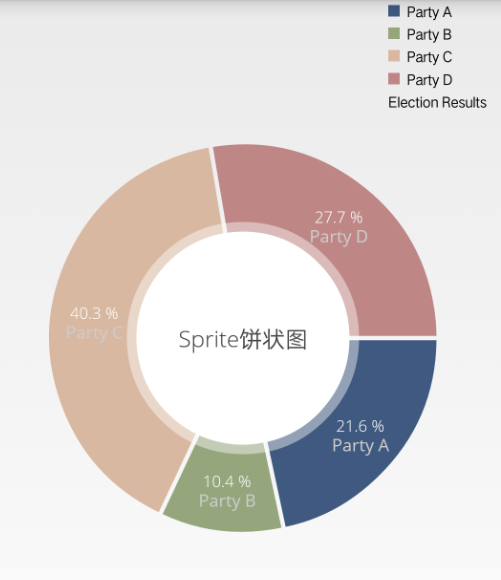
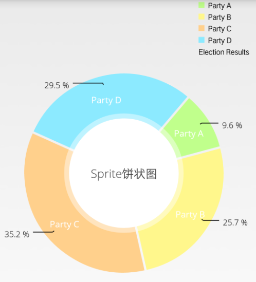

# piechart 组件使用   

------

piechart 组件主要用于BI饼状图表展现，如下图所示： 

piechart组件考虑支持以下功能：  

1：piechart组件需要在edn打包时勾选BI图表后方可正常使用；  

2：piechart组件包括饼图显示及区域说明两部分；  

3：饼图显示区域包括中心圆孔及外层扇形区域；  

   中心圆孔区域：支持设置圆孔区域大小，圆孔背景色，圆孔文字色，圆孔文字大小，修饰半透明圆区域大小，修饰半透明圆孔区域色等；  

   外层扇形区域：支持设置Entry描述文字，Entry数据文字，扇形区域背景色，扇形区域文字色等；  

4：区域说明区域，支持设置各区域描述，各区域背景色，图表描述等；  

5：图表支持设置手势拖动，点击突出展示，扇形区域点击监听等；  

6：图表支持展现动画，支持旋转等动态效果；

  

<h2 id="cid_0">属性</h2>

**公共属性**  

[参见公共属性章节](https://gitdocument.exmobi.cn/sprite-api/ggsx.html)，包括：id、style、class；

<h2 id="cid_1">样式</h2>

**公共样式**  

[参见公共样式章节](https://gitdocument.exmobi.cn/sprite-api/ggys.html)，包括：  

> 尺寸
> 
> 定位
>  
> 外边距
> 
>  
> flexbox布局：align-self,flex

<h2 id="cid_2">事件</h2>

本节目录：

> [valueSelected  指定饼图区域选中触发](#sj_1)
> 
> [nothingSelected   取消饼图区域选中触发](#sj_2)

**valueSelected**  

<code>指定饼图区域选中触发</code>  

event事件对象包括：   

> type：事件类型,字符串类型,固定值：valueSelected  
> 
> target：触发事件的目标组件,dom对象  
> 
> timestamp：事件触发的时间戳,单位毫秒,数字类型  

param对象为Json对象,定义如下：  

>  index：点击扇区索引，从0开始，数字类型  
>  
>  label：点击扇区Entry名称，字符串类型  
>  
>  value：点击扇区Entry数值，数字类型  

**注：**  highlightPerTapEnabled设置为true时触发

**nothingSelected**  

<code>取消饼图区域选中触发</code>   

 
event事件对象包括：   

> type：事件类型,字符串类型,固定值：nothingSelected  
> 
> target：触发事件的目标组件,dom对象  
> 
> timestamp：事件触发的时间戳,单位毫秒,数字类型   

**注：** highlightPerTapEnabled设置为true时触发

<h2 id="cid_3">js方法</h2>

本节目录：

> [公共方法](#ff_1)
> 
> [setConfig(jsonData:object):void   设置饼图参数](#ff_2)
> 
> [setData(jsonData:object):void   设置饼图数据](#ff_3)
> 
> [setCenterText(jsonData:object):void   设置饼图中间显示文字](#ff_4)
> 
> [invalidate():void   刷新饼图数据](#ff_5)
> 
> [setDrawHoleEnabled(show:boolean):void   设置饼图中心圆区域是否显示](#ff_6)
> 
> [setDrawNameEnabled(show:boolean):void   设置Entry名是否显示](#ff_7)
> 
> [setDrawValueEnabled(show:boolean):void   设置Entry值是否显示](#ff_8)
> 
> [setUsePercentValues(show:boolean):void   设置显示时是否使用百分比代替原始数据](#ff_9)
> 
> [setDrawCenterText(show:boolean):void   设置中间文本是否显示](#ff_10)
> 
> [animateX(jsonData:object):void  启动饼图X轴动画](#ff_11)
> 
> [animateY(jsonData:object):void   启动饼图Y轴动画](#ff_12)
> 
> [animateXY(jsonData:object):void  启动饼图XY轴动画](#ff_13)
> 
> [spin(jsonData:object):void   执行饼图旋转动画](#ff_15)
> 
> [snapshot(jsonData:Object): boolean   图表截屏,图片格式png](#ff_16)

**公共方法**  

[事件相关](https://gitdocument.exmobi.cn/sprite-api/ggff.html#cid_0)，包括：

> [on(messageName:string,callback:Function): void   组件注册事件的触发函数](https://gitdocument.exmobi.cn/sprite-api/ggff.html#jjxg_1)   
> 
> [fire(messageName:string,params:Array&lt;any&gt;): void  组件事件的触发函数](https://gitdocument.exmobi.cn/sprite-api/ggff.html#jjxg_2)   
> 
> [off(messageName:string,callback:Function): void  组件移除事件的触发函数](https://gitdocument.exmobi.cn/sprite-api/ggff.html#jjxg_3)  
>  
> [getOn(messageName:string): Array&lt;Function&gt;  获取已绑定的事件的触发函数](https://gitdocument.exmobi.cn/sprite-api/ggff.html#jjxg_4)   

[动画相关](https://gitdocument.exmobi.cn/sprite-api/ggff.html#cid_1)，包括： 

> [startAnimation(jsonData:Object,callback:Function): void  启动UI组件动画](https://gitdocument.exmobi.cn/sprite-api/ggff.html#dhxg_1)   
> 
> [startAnimator(jsonData:Object,callback:Function): void  启动UI组件属性动画](https://gitdocument.exmobi.cn/sprite-api/ggff.html#dhxg_2)   
> 
> [startKeyFrameAnimator(jsonData:Object,callback:Function): void  启动UI组件关键帧动画](https://gitdocument.exmobi.cn/sprite-api/ggff.html#dhxg_3)  
>  
> [ releaseAnimator(): void  结束控件动画](https://gitdocument.exmobi.cn/sprite-api/ggff.html#dhxg_4)   

[尺寸和位置](https://gitdocument.exmobi.cn/sprite-api/ggff.html#cid_2)，包括：  

> [getFrame(): Object  获取组件在父容器中的位置](https://gitdocument.exmobi.cn/sprite-api/ggff.html#cchwz_1)   
> 
> [setFrame(frame:Object): void  设置组件在父容器中的位置](https://gitdocument.exmobi.cn/sprite-api/ggff.html#cchwz_2)   
> 
> [getCenter(): Object  获取组件中心点在父容器中的位置](https://gitdocument.exmobi.cn/sprite-api/ggff.html#cchwz_3)  
>  
> [getAbsoluteFrame(): Object  获取组件在绘制窗口中的位置](https://gitdocument.exmobi.cn/sprite-api/ggff.html#cchwz_4)   

[普通Dom节点操作](https://gitdocument.exmobi.cn/sprite-api/ggff.htmll#cid_3)，包括：  

> [getParent(): IElement  获取父节点](https://gitdocument.exmobi.cn/sprite-api/ggff.html#ptdom_1)   
> 
> [getNext(): IElement  获取同级下一个节点](https://gitdocument.exmobi.cn/sprite-api/ggff.html#ptdom_2)   
> 
> [getPrevious(): IElement  获取同级前一个节点](https://gitdocument.exmobi.cn/sprite-api/ggff.html#ptdom_3)  
> 
> [remove(): void  从父容器中移除自身](https://gitdocument.exmobi.cn/sprite-api/ggff.html#ptdom_4)  
> 
> [clone(isDeep:boolean):IElement  对当前Dom节点进行克隆](https://gitdocument.exmobi.cn/sprite-api/ggff.html#ptdom_5)  
>  
> [setAttr(attrName:string,attrValue:string): void  设置节点属性](https://gitdocument.exmobi.cn/sprite-api/ggff.html#ptdom_6)   
>
> [getAttr(attrName:string):string  获取节点属性值](https://gitdocument.exmobi.cn/sprite-api/ggff.html#ptdom_7) 
>
> [getAttrs(): Object  获取节点所有属性](https://gitdocument.exmobi.cn/sprite-api/ggff.html#ptdom_8) 
>
> [removeAttr(attrName:string): void  移除节点属性](https://gitdocument.exmobi.cn/sprite-api/ggff.html#ptdom_9) 
>
> [hasAttr(attrName:string): boolean  节点是否具有该属性](https://gitdocument.exmobi.cn/sprite-api/ggff.html#ptdom_10) 
>
> [setStyle(styleName:string,styleValue:string): void  设置节点样式值](https://gitdocument.exmobi.cn/sprite-api/ggff.html#ptdom_13)  
>
> [getStyle(styleName:string):string  获取节点样式值](https://gitdocument.exmobi.cn/sprite-api/ggff.html#ptdom_14)   
>
> [clearStyle(styleName:string): void  移除节点样式值](https://gitdocument.exmobi.cn/sprite-api/ggff.html#ptdom_15)    
>
> [setClassStyle(className:string,domobj:IElement): void   设置节点对应Class样式](https://gitdocument.exmobi.cn/sprite-api/ggff.html#ptdom_16) 
>  
> [getClassStyle(): string  获取节点已设置Class样式](https://gitdocument.exmobi.cn/sprite-api/ggff.html#ptdom_17)  
>  
> [getTag(): string  获取UI组件类型](https://gitdocument.exmobi.cn/sprite-api/ggff.html#ptdom_18)  
>  
> [getId(): string  获取UI组件Id标识](https://gitdocument.exmobi.cn/sprite-api/ggff.html#ptdom_19) 

**setConfig(jsonData:object):void **  

<code>设置饼图参数</code>   

参数： 

jsonData：参数，Json格式，格式定义如下： 

**基础设置**  

> usePercentValues：显示时是否使用百分比代替原始数据，boolean型，默认false
> highlightPerTapEnabled：是否点击扇区突出显示，boolean型，默认为true
> extraOffsets：图表周边空白间距，上 右 下 左，字符类型，如 10 5 10 5 默认 0 0 0 0  

**中间圆区域设置 **  

> drawHoleEnabled：是否绘制绘制中心圆孔，boolean型，默认true
> drawCenterText：是否绘制中心文字，boolean型，默认为true
> centerTextSize：中心文字字体大小，数字类型，默认16
> centerTextColor：中心文字色值，字符串类型，支持RGB（rgb(255, 0, 0)）,十六进制（#rrggbb），默认#000000
> holeColor：中心圆孔色值，字符串类型，支持RGB（rgb(255, 0, 0)）,十六进制（#rrggbb），默认#ffffff
> holeRadius：中间圆孔所占总区域百分比，【0-1】，默认0.5
> transparentCircleColor：中心圆孔外部遮罩色值，字符串类型，支持RGB（rgb(255, 0, 0)）,十六进制（#rrggbb），默认#ffffff
> transparentCircleRadius：中间圆孔外部遮罩所占总区域百分比，，取值范围【0-1】，默认0.55
> transparentCircleAlpha：中间圆孔外部遮罩透明度，数字类型，取值范围【0-255】，0透明，255不透明，默认100

**拖动设置**  

> rotationEnabled：是否允许手动拖动旋转，boolean型，默认true
> rotationAngle：图表初始旋转角度，数字类型，取值范围 【0-360】， 默认270，
> dragCoef：拖送释放后摩擦减速系数，数字类型，取值范围【0-1】，0：最大摩擦 1：无摩擦，默认0.8

**Entry值设置 **  

> entryLabelColor：图表Entry 文字颜色，字符串类型，支持RGB（rgb(255, 0, 0)）,十六进制（#rrggbb），默认#ffffff
> entryLabelTextSize：图表Entry文字字体大小，数字类型，默认12

**描述区域设置 **

> legendDrawInside：是否显示在图表区域内部，boolean型，默认false  
> legendVerticalAlignment：Y轴位置，字符串枚举型，【top, center, bottom】，默认top  
> legendHorizontalAlignment：X轴位置，字符串枚举型，【left, center, right】，默认right  
> legendOrientation：排序方向，字符串枚举型，【horizontal, vertical】，默认vertical  
> legendXEntrySpace：描述区域X轴间隔，数字类型，默认6  
> legendYEntrySpace：描述区域Y轴间隔，数字类型，默认0  
> legendXOffset：描述区域与图表X轴边缘间距，数字类型，默认5  
> legendYOffset：描述区域与图表Y轴边缘间距，数字类型，默认5  

**扇区设置 **

> sliceSpace：每个扇区之间间距，数字类型，取值【0-20】，默认0  

**文字样式** 

> valueTextColor：图表值文字颜色，字符串类型，支持RGB（rgb(255, 0, 0)）,十六进制（#rrggbb），默认#ffffff  
> valueTextSize：图表值文字字体大小，数字类型，默认11  

**文字绘制区域样式 **

> xValuePosition：图表Entry文字绘制位置，字符串枚举型，【inside_slice, outside_slice】，默认inside_slice  
> yValuePosition：图表值文字绘制位置，字符串枚举型，【inside_slice, outside_slice】，默认inside_slice  

**绘制线样式** 

> linePart1OffsetPercentage：扇区内部线起点距扇区内环比例，数字类型，取值范围【0-1】，0标识线距离扇区内环无偏移，1标识线距离扇区内环最大偏移，默认为0.75  
> linePart1Length：扇区内部线长度比例，数字类型，取值范围【0-1】，0最短，1标识最长，默认为0.3  
> linePart2Length：扇区外部线长度比例，数字类型，取值范围【0-1】，0最短，1标识最长，默认为0.4  

返回值：无

