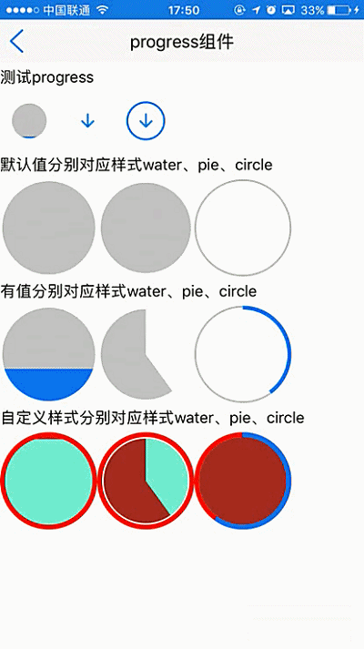

# progress组件使用 

----------

progress组件用于展现圆形进度条效果，支持环状 ，饼状样式 ，水波样式 。

<h2 id="cid_0">属性</h2> 


**公共属性**  

[参见公共属性章节](https://gitdocument.exmobi.cn/sprite-api/ggsx.html)，包括：id、style、class；


**type**    

<code>进度条类型</code>  

可选项，【circle，pie，water】  

> circle：环状，有状态；（默认） 
> 
> pie：饼状，有状态；  
> 
> water：水波，有状态； 
 

**progress**  

<code>进度百分比</code>   

进度百分比，数字，可选项，取值【0-1】，默认为0  

**注：** 通过js动态设置该值可以改变进度条状态  


<h2 id="cid_1">样式</h2>

**公共样式**  

[参见公共样式章节](https://gitdocument.exmobi.cn/sprite-api/ggys.html)，包括：  
 
> 尺寸
> 
> 定位 
> 
> 内边距
> 
> 外边距
> 
> 背景
>
> 显影
> 
> flexbox布局：align-self，flex


**line-color**  

<code>初始线条颜色</code>

> 当type是环状时，默认值#c6c6c6；
> 
> 当type是饼状时，默认值#ffffff；
> 
> 当type是水波状时，默认值#ffffff；  


**line-progress-color**  

<code>进度线条颜色</code>  

> 当type是环状时，默认值#0a7fff；
> 
> 当type是饼状时，默认值#ffffff；
> 
> 当type是水波状时，默认值#0a7fff；  


**solid-color**  

<code>填充色</code>

> 当type是环状时，默认值#ffffff；
> 
> 当type是饼状时，默认值#c6c6c6；
> 
> 当type是水波状时，默认值#c6c6c6；  


**line-size**  

<code>线条粗度</code>

> 当type是环状时，数字，单位dp，默认为2；
> 
> 当type是饼状时，数字，单位dp，默认为2；
> 
> 当type是水波状时，数字，单位dp，默认为2；

**line-progress-size**

<code>进度线条宽度</code>

> 当type是环状时，默认值4；


**solid-progress-color**

<code>进度填充色</code>

> 当type是饼状时，默认值#ffffff；
> 
> 当type是水波状时，默认值#0a7fff；


<h2 id="cid_2">事件</h2>

无 


<h2 id="cid_3">js方法</h2>

**公共方法**  

[事件相关](https://gitdocument.exmobi.cn/sprite-api/ggff.html#cid_0)，包括：

> [on(messageName:string,callback:Function): void   组件注册事件的触发函数](https://gitdocument.exmobi.cn/sprite-api/ggff.html#jjxg_1)   
> 
> [fire(messageName:string,params:Array&lt;any&gt;): void  组件事件的触发函数](https://gitdocument.exmobi.cn/sprite-api/ggff.html#jjxg_2)   
> 
> [off(messageName:string,callback:Function): void  组件移除事件的触发函数](https://gitdocument.exmobi.cn/sprite-api/ggff.html#jjxg_3)  
>  
> [getOn(messageName:string): Array&lt;Function&gt;  获取已绑定的事件的触发函数](https://gitdocument.exmobi.cn/sprite-api/ggff.html#jjxg_4)   

[动画相关](https://gitdocument.exmobi.cn/sprite-api/ggff.html#cid_1)，包括： 
 
> [startAnimation(jsonData:Object,callback:Function): void  启动UI组件动画](https://gitdocument.exmobi.cn/sprite-api/ggff.html#dhxg_1)   
> 
> [startAnimator(jsonData:Object,callback:Function): void  启动UI组件属性动画](https://gitdocument.exmobi.cn/sprite-api/ggff.html#dhxg_2)   
> 
> [startKeyFrameAnimator(jsonData:Object,callback:Function): void  启动UI组件关键帧动画](https://gitdocument.exmobi.cn/sprite-api/ggff.html#dhxg_3)  
>  
> [ releaseAnimator(): void  结束控件动画](https://gitdocument.exmobi.cn/sprite-api/ggff.html#dhxg_4)   

[尺寸和位置](https://gitdocument.exmobi.cn/sprite-api/ggff.html#cid_2)，包括：  

> [getFrame(): Object  获取组件在父容器中的位置](https://gitdocument.exmobi.cn/sprite-api/ggff.html#cchwz_1)   
> 
> [setFrame(frame:Object): void  设置组件在父容器中的位置](https://gitdocument.exmobi.cn/sprite-api/ggff.html#cchwz_2)   
> 
> [getCenter(): Object  获取组件中心点在父容器中的位置](https://gitdocument.exmobi.cn/sprite-api/ggff.html#cchwz_3)  
>
> [getAbsoluteFrame(): Object  获取组件在绘制窗口中的位置](https://gitdocument.exmobi.cn/sprite-api/ggff.html#cchwz_4)   


[普通Dom节点操作](https://gitdocument.exmobi.cn/sprite-api/ggff.html#cid_3)，包括：  

> [getParent(): IElement  获取父节点](https://gitdocument.exmobi.cn/sprite-api/ggff.html#ptdom_1)   
> 
> [getNext(): IElement  获取同级下一个节点](https://gitdocument.exmobi.cn/sprite-api/ggff.html#ptdom_2)   
> 
> [getPrevious(): IElement  获取同级前一个节点](https://gitdocument.exmobi.cn/sprite-api/ggff.html#ptdom_3)  
> 
> [remove(): void  从父容器中移除自身](https://gitdocument.exmobi.cn/sprite-api/ggff.html#ptdom_4)  
> 
> [clone(isDeep:boolean):IElement  对当前Dom节点进行克隆](https://gitdocument.exmobi.cn/sprite-api/ggff.html#ptdom_5)
>  
> [setAttr(attrName:string,attrValue:string): void  设置节点属性](https://gitdocument.exmobi.cn/sprite-api/ggff.html#ptdom_6)   
>
> [getAttr(attrName:string):string  获取节点属性值](https://gitdocument.exmobi.cn/sprite-api/ggff.html#ptdom_7) 
>
> [getAttrs(): Object  获取节点所有属性](https://gitdocument.exmobi.cn/sprite-api/ggff.html#ptdom_8) 
>
> [removeAttr(attrName:string): void  移除节点属性](https://gitdocument.exmobi.cn/sprite-api/ggff.html#ptdom_9) 
>
> [hasAttr(attrName:string): boolean  节点是否具有该属性](https://gitdocument.exmobi.cn/sprite-api/ggff.html#ptdom_10) 
> 
> [setStyle(styleName:string,styleValue:string): void  设置节点样式值](https://gitdocument.exmobi.cn/sprite-api/ggff.html#ptdom_13)  
>
> [getStyle(styleName:string):string  获取节点样式值](https://gitdocument.exmobi.cn/sprite-api/ggff.html#ptdom_14)   
>
> [clearStyle(styleName:string): void  移除节点样式值](https://gitdocument.exmobi.cn/sprite-api/ggff.html#ptdom_15)    
>
> [setClassStyle(className:string,domobj:IElement): void   设置节点对应Class样式](https://gitdocument.exmobi.cn/sprite-api/ggff.htm#ptdom_16) 
>  
> [getClassStyle(): string  获取节点已设置Class样式](https://gitdocument.exmobi.cn/sprite-api/ggff.html#ptdom_17)  
>  
> [getTag(): string  获取UI组件类型](https://gitdocument.exmobi.cn/sprite-api/ggff.html#ptdom_18)  
>  
> [getId(): string  获取UI组件Id标识](https://gitdocument.exmobi.cn/sprite-api/ggff.html#ptdom_19) 


<h2 id="cid_4">示例</h2>  


示例代码，测试progress布局样式和功能，参考演示应用示例：apps\yuanhongqian\spriteui\progress.uixml，代码中用到了官方封装的模板titlebar，模板的使用可参考[https://gitdocument.exmobi.cn/sprite-official-ui/index.html](https://gitdocument.exmobi.cn/sprite-official-ui/index.html "https://gitdocument.exmobi.cn/sprite-official-ui/index.html") 

```html

<page>
    <script>
        <![CDATA[
        var window = require("Window");
        var document = require("Document");
        var Time = require("Time");
        var ui = require("UI");
        var Console = require("Console");
        var File = require("File");

        require("titlebarUI");
        require("buttonUI");

        function alert(msg) {
            var json = {};
            json.title = "提示";
            json.content = msg;
            json.buttonText = "确定";
            ui.alert(json);
        }
        window.on("loaded", function () {
            //titlebar关闭页面
            var title = document.getElement("title");
            title.on("liconClick", function (e) {
                var json = {};
                window.close(json);

            });

            //仿照mplus进度条
            var myBox = document.getElement("mybox");
            var myBox2 = document.getElement("mybox2");
            var myBox3 = document.getElement("mybox3");
            var myProgress = document.getElement("myProgress");
            var myProgress2 = document.getElement("myProgress2");
            var myProgress3 = document.getElement("myProgress3");
            var myImage = document.getElement("myImage");
            var myImage2 = document.getElement("myImage2");
            var myImage3 = document.getElement("myImage3");
            //初始设置状态 0 1 2   0:初始未下载  1：下载中  2 已安装

            myBox3.setAttr("status", "0");
            myBox.setAttr("status", "0");
            myBox2.setAttr("status", "0");
            //点击启动进度
            myBox.on("click", function () {
                var status = this.getAttr("status");
                if (status == "0") {
                    //启动下载 通过定时器模拟
                    var rate = 0;
                    var timeId = Time.setInterval(function () {
                        if (rate <= 1) {
                            myProgress.setAttr("progress", rate);
                            rate += 0.05;
                        } else {
                            //进度条到达100
                            Time.clearInterval(timeId);
                            myBox.setAttr("status", "2");
                            myImage.setAttr("src", "res:spritetest/image/mobark_work_unload.png");
                            myProgress.setAttr("progress", 100);
                            toast("应用安装成功");
                        }
                    }, 100);
                    myImage.setAttr("src", "res:spritetest/image/mobark_work_stop.png");
                    myBox.setAttr("status", "1");
                    myProgress.setAttr("progress", rate);

                } else if (status == "1") {


                } else if (status == "2") {
                    myBox.setAttr("status", "0");
                    myImage.setAttr("src", "res:spritetest/image/mobark_work_download.png");
                    toast("应用卸载成功");
                }
            });

            myBox2.on("click", function () {
                var status = this.getAttr("status");

                if (status == "0") {
                    //启动下载 通过定时器模拟
                    var rate = 0;
                    var timeId = Time.setInterval(function () {
                        if (rate <= 1) {
                            myProgress2.setAttr("progress", rate);
                            rate += 0.05;
                        } else {
                            //进度条到达100
                            Time.clearInterval(timeId);
                            myBox2.setAttr("status", "2");
                            myImage2.setAttr("src", "res:spritetest/image/mobark_work_unload.png");
                            myProgress2.setAttr("progress", 100);
                            toast("应用安装成功");
                        }
                    }, 100);
                    myImage2.setAttr("src", "res:spritetest/image/mobark_work_stop.png");
                    myBox2.setAttr("status", "1");
                    myProgress2.setAttr("progress", rate);

                } else if (status == "1") {


                } else if (status == "2") {
                    myBox2.setAttr("status", "0");
                    myImage2.setAttr("src", "res:spritetest/image/mobark_work_download.png");
                    toast("应用卸载成功");
                }

            });


            myBox3.on("click", function () {
                var status = this.getAttr("status");

                if (status == "0") {
                    //启动下载 通过定时器模拟
                    var rate = 0;
                    var timeId = Time.setInterval(function () {
                        if (rate <= 1) {
                            myProgress3.setAttr("progress", rate);
                            rate += 0.05;
                        } else {
                            //进度条到达100
                            Time.clearInterval(timeId);
                            myBox3.setAttr("status", "2");
                            myImage3.setAttr("src", "res:spritetest/image/mobark_work_unload.png");
                            myProgress3.setAttr("progress", 100);
                            toast("应用安装成功");
                        }
                    }, 100);
                    myImage3.setAttr("src", "res:spritetest/image/mobark_work_stop.png");
                    myBox3.setAttr("status", "1");
                    myProgress3.setAttr("progress", rate);

                } else if (status == "1") {


                } else if (status == "2") {
                    myBox3.setAttr("status", "0");
                    myImage3.setAttr("src", "res:spritetest/image/mobark_work_download.png");
                    toast("应用卸载成功");
                }

            });
        });


        function toast(content) {
            var json = {};
            json.content = content;
            ui.toast(json);
        }
    ]]>
    </script>
    <style>
        @import url("spriteLayout");
        @import url("spriteColor");
        button {
            margin: 5 5 5 5;
            width: 120;
            background-color: #88D038;
            height: 40;
        }
        
        .box {
            flex-direction: row;
            justify-content: flex-start;
            flex-wrap: wrap;
            flex: 1;
        }
        
        .progress1 {
            line-color: red;
            line-progress-color: green;
            line-progress-size: 5;
            line-size: 5;
            solid-color: #A52A2A;
            solid-progress-color: #7FFFD4;
        }
        
        .mybox {
            margin: 10 10 10 10;
            width: 40;
            height: 40;
            justify-content: center;
            align-items: center;
        }
        
        .myProgress {
            line-progress-size: 2;
            position: absolute;
            top: 0;
            bottom: 0;
            left: 0;
            right: 0;
        }
        
        .myImage {
            width: 20;
            height: 20;
        }
    </style>
    <ui>
        <box class="full" id="box">
            <titlebar title="progress组件" id="title" licon="res:yuanhongqian/image/icon.png" style="licon-width:24;licon-height:24" class="titlebar-hasstatus"
            />

            <scroll class="box">
                <text style="width:fill_screen;height:30">测试progress</text>
                <box id="mybox3" class="mybox">
                    <progress id="myProgress3" type="water" class="myProgress" progress="100" />
                    <image id="myImage3" class="myImage" src="res:yuanhongqian/image/mobark_work_download.png" />
                </box>
                <box id="mybox2" class="mybox">
                    <progress id="myProgress2" type="pie" class="myProgress" progress="100" />
                    <image id="myImage2" class="myImage" src="res:yuanhongqian/image/mobark_work_download.png" />
                </box>
                <box id="mybox" class="mybox">
                    <progress id="myProgress" type="circle" class="myProgress" progress="100" />
                    <image id="myImage" class="myImage" src="res:yuanhongqian/image/mobark_work_download.png" />
                </box>

                <text style="width:fill_screen;height:30">默认值分别对应样式water、pie、circle</text>
                <progress type="water" style="width: 100;height: 100" />
                <progress type="pie" style="width: 100;height: 100" />
                <progress style="width: 100;height: 100" />
                <text style="width:fill_screen;height:30">有值分别对应样式water、pie、circle</text>
                <progress type="water" progress="0.4" style="width: 100;height: 100" />
                <progress type="pie" progress="0.4" style="width: 100;height: 100" />
                <progress progress="0.4" style="width: 100;height: 100" />

                <text style="width:fill_screen;height:30">自定义样式分别对应样式water、pie、circle</text>
                <progress progress="0.9" type="water" class="progress1" style="width: 100;height: 100" />
                <progress type="pie" progress="0.4" class="progress1" style="width: 100;height: 100" />
                <progress progress="0.6" class="progress1" style="width: 100;height: 100" />

            </scroll>
        </box>
    </ui>
</page>

```

代码效果：

   
 


