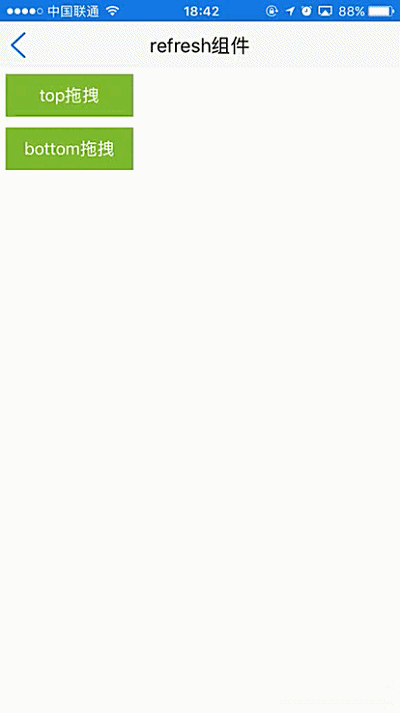
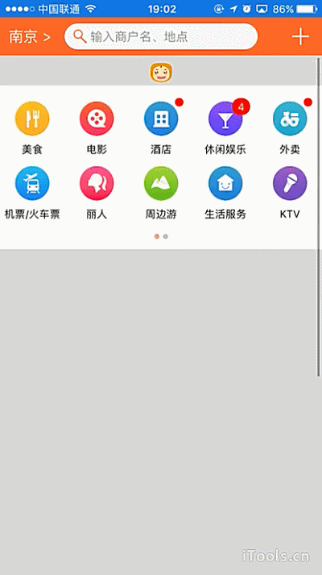

#  refresh组件使用 

----------

 refresh容器放置于scroll或list容器中，用于实现下拉刷新及上拉刷新效果，refresh容器内可包裹其他子容器或者控件。  

 refresh容器拖动包括三种状态，通过drag事件会多次回调，分别对应不同UI更新，包括：  

>  1：初始拖动状态至未超过临界点，更新UI；
>  
>  2：超过临界点继续拖动未释放，更新UI；
>  
>  3：超过临界点后释放，更新UI；


<h2 id="cid_0">属性</h2> 


**公共属性**  

[参见公共属性章节](https://gitdocument.exmobi.cn/sprite-api/ggsx.html)，包括：id、style、class；


**type**    

<code>拖动方向</code>  

拖动方向，[top，bottom]  

> top：放置于顶部，用于实现下拉刷新（默认）；
> 
> bottom：放置于底部，用于实现上拉刷新；

 
**distance**  

<code>触发refresh释放事件的临界距离</code>   

取值数字，单位dp


<h2 id="cid_1">样式</h2>

**公共样式**  

[参见公共样式章节](https://gitdocument.exmobi.cn/sprite-api/ggys.html)，包括：  
 
> 尺寸，仅支持height，宽度随scroll或者list组件的宽度。
> 
> 定位 
> 
> 内边距
> 
> 外边距
> 
> 边框
> 
> 背景
> 
> flexbox布局：align-self，flex


 

<h2 id="cid_2">事件</h2>


<span id="sj_1">**drag**</span>   

<code>下拉拖动过程中多次触发</code>    

event事件对象包括：    

> type：事件类型，字符串类型，固定值：drag；
> 
> target：触发事件的目标组件，dom对象；
> 
> timestamp：事件触发的时间戳,单位毫秒，数字类型

param：拖动位移，数字，单位dp；


<span id="sj_2">**refresh**</span>  

<code>释放拖动区域超出设置distance触发</code>    

event事件对象包括：  

> type：事件类型，字符串类型，固定值：drag；
> 
> target：触发事件的目标组件，dom对象；
> 
> timestamp：事件触发的时间戳,单位毫秒，数字类型


<span id="sj_3">**reset**</span>  

<code>释放容器动画完毕后触发</code>   

event事件对象包括：    

> type：事件类型，字符串类型，固定值：reset；
> 
> target：触发事件的目标组件，dom对象；
> 
> timestamp：事件触发的时间戳,单位毫秒，数字类型


<h2 id="cid_3">js方法</h2> 


<span id="ff_1">**公共方法**</span>  


[事件相关](https://gitdocument.exmobi.cn/sprite-api/ggff.html#cid_0)，包括：

> [on(messageName:string,callback:Function): void   组件注册事件的触发函数](https://gitdocument.exmobi.cn/sprite-api/ggff.html#jjxg_1)   
> 
> [fire(messageName:string,params:Array&lt;any&gt;): void  组件事件的触发函数](https://gitdocument.exmobi.cn/sprite-api/ggff.html#jjxg_2)   
> 
> [off(messageName:string,callback:Function): void  组件移除事件的触发函数](https://gitdocument.exmobi.cn/sprite-api/ggff.html#jjxg_3)  
>  
> [getOn(messageName:string): Array&lt;Function&gt;  获取已绑定的事件的触发函数](https://gitdocument.exmobi.cn/sprite-api/ggff.html#jjxg_4)   


[普通Dom节点操作](https://gitdocument.exmobi.cn/sprite-api/ggff.html#cid_3)，包括：  

> [getParent(): IElement  获取父节点](https://gitdocument.exmobi.cn/sprite-api/ggff.html#ptdom_1)   
> 
> [getNext(): IElement  获取同级下一个节点](https://gitdocument.exmobi.cn/sprite-api/ggff.html#ptdom_2)   
> 
> [getPrevious(): IElement  获取同级前一个节点](https://gitdocument.exmobi.cn/sprite-api/ggff.html#ptdom_3)  
> 
> [remove(): void  从父容器中移除自身](https://gitdocument.exmobi.cn/sprite-api/ggff.html#ptdom_4)  
> 
 
> [setAttr(attrName:string,attrValue:string): void  设置节点属性](https://gitdocument.exmobi.cn/sprite-api/ggff.html#ptdom_6)   
>
> [getAttr(attrName:string):string  获取节点属性值](https://gitdocument.exmobi.cn/sprite-api/ggff.html#ptdom_7) 
>
> [getAttrs(): Object  获取节点所有属性](https://gitdocument.exmobi.cn/sprite-api/ggff.html#ptdom_8) 
>
> [removeAttr(attrName:string): void  移除节点属性](https://gitdocument.exmobi.cn/sprite-api/ggff.html#ptdom_9) 
>
> [hasAttr(attrName:string): boolean  节点是否具有该属性](https://gitdocument.exmobi.cn/sprite-api/ggff.html#ptdom_10) 
> 
> [setStyle(styleName:string,styleValue:string): void  设置节点样式值](https://gitdocument.exmobi.cn/sprite-api/ggff.html#ptdom_13)  
>
> [getStyle(styleName:string):string  获取节点样式值](https://gitdocument.exmobi.cn/sprite-api/ggff.html#ptdom_14)   
>
> [clearStyle(styleName:string): void  移除节点样式值](https://gitdocument.exmobi.cn/sprite-api/ggff.html#ptdom_15)    
>
> [setClassStyle(className:string,domobj:IElement): void   设置节点对应Class样式](https://gitdocument.exmobi.cn/sprite-api/ggff.htm#ptdom_16) 
>  
> [getClassStyle(): string  获取节点已设置Class样式](https://gitdocument.exmobi.cn/sprite-api/ggff.html#ptdom_17)  
>  
> [getTag(): string  获取UI组件类型](https://gitdocument.exmobi.cn/sprite-api/ggff.html#ptdom_18)  
>  
> [getId(): string  获取UI组件Id标识](https://gitdocument.exmobi.cn/sprite-api/ggff.html#ptdom_19) 


[容器类Dom节点操作](https://gitdocument.exmobi.cn/sprite-api/ggff.html#cid_4)：包括：

> [getElement(id:string): IElement  根据Id获取容器内UI控件对象](https://gitdocument.exmobi.cn/sprite-api/ggff.html#rqczdom_1)   
> 
> [getElements(rule:string): Array&lt;IElement&gt;  根据特定规则获取容器内UI控件对象集](https://gitdocument.exmobi.cn/sprite-api/ggff.html#rqczdom_2)   
> 
> [getChildren():Array&lt;IElement&gt;  容器获取子节点集](https://gitdocument.exmobi.cn/sprite-api/ggff.html#rqczdom_3)  
>  
> [getFirstChild(): IElement  容器获取首子节点](https://gitdocument.exmobi.cn/sprite-api/ggff.html#rqczdom_4) 
>  
> [getLastChild(): IElement  容器获取尾节点](https://gitdocument.exmobi.cn/sprite-api/ggff.html#rqczdom_5) 
>  
> [appendChild(Obj:IElement): void  容器添加子节点至尾部](https://gitdocument.exmobi.cn/sprite-api/ggff.html#rqczdom_6) 
>  
> [insertBefore(domObj:IElement,beforeDomObj:IElement): void  容器在指定的已有的子节点之前插入新节点](https://gitdocument.exmobi.cn/sprite-api/ggff.html#rqczdom_7) 
>  
> [insertAfter (domObj:IElement,afterDomObj:IElement): void  容器在指定的已有的子节点之后插入新节点](https://gitdocument.exmobi.cn/sprite-api/ggff.html#rqczdom_8) 
>  
> [replaceChild(newDomObj:IElement,oldDomObj:IElement): void  容器替换子节点](https://gitdocument.exmobi.cn/sprite-api/ggff.html#rqczdom_9) 
>  
> [clear(): void  清空容器内所有子节点](https://gitdocument.exmobi.cn/sprite-api/ggff.html#rqczdom_10) 
>  
> [getInnerHTML(): string  动态获取容器内子节点xml](https://gitdocument.exmobi.cn/sprite-api/ggff.html#rqczdom_11)   


<span id="ff_2">**drag(jsonData:Object): void**</span>  

<code>模拟用户拖动触发</code>  

执行该方法后，类似用户向上/向下拖动refresh容器效果  

参数: 

jsonData：模拟触发配置参数，Json对象，可选参数，定义如下：

> time：弹出/恢复 refresh区域动画时间，数字类型，单位毫秒；

返回值：无

示例：

```javascript
var dragtop = document.getElement("dragtop"); 
dragtop.on("click", function(e) {
    top.drag();
});

```


<span id="ff_3">**reset(jsonData:Object): void**</span>  

<code>容器复位隐藏</code>    

refresh容器复位隐藏，一般刷新完毕后调用该方法  

参数：

jsonData：模拟触发配置参数，Json对象，可选参数，定义如下：

> time：弹出/恢复 refresh区域动画时间，数字类型，单位毫秒；

返回值：无

返回值：无


<h2 id="cid_4">示例</h2>  

示例代码1，测试refresl事件和方法，参考演示应用示例：apps\yuanhongqian\spriteui\scroll+refresh.uixml，代码中用到了官方封装的组件titlebar，封装组件的使用可参考[https://gitdocument.exmobi.cn/sprite-official-ui/index.html](https://gitdocument.exmobi.cn/sprite-official-ui/index.html "https://gitdocument.exmobi.cn/sprite-official-ui/index.html") 

```html 

<page>
    <script>
        <![CDATA[
        var window = require("Window");
        var document = require("Document");
        var ui = require("UI");
        var Time = require("Time");
        require("titlebarUI");
        require("buttonUI");

        var topFreshTime = "";
        var bottomFreshTime = "";
        window.on("loaded", function () {
            var title = document.getElement("title");
            title.on("liconClick", function (e) {
                var json = {};
                json.data = {};
                window.close(json);

            });

            var scroll = document.getElement("scroll");
            scroll.on("scrollToBottom", function (e) {

            });

            var top = document.getElement("top");
            var bottom = document.getElement("bottom");
           var disString = top.getAttr("distance");
            var dis = parseInt(disString);
            var topbutton = document.getElement("topbutton");
            var bottombutton = document.getElement("bottombutton");
            var bottomDis = parseInt(bottom.getAttr("distance")); top.on("drag", function (e, distance) {
                if (distance >= 0 && distance < dis) {
                    var text = "下拉刷新";
                    var n = distance / dis * 100;
                    n = parseInt(n);
                    text = text + " " + n + "%";
                    topbutton.setText(text);
                } else if (distance >= dis) {
                    var text = "释放刷新 100%";
                    topbutton.setText(text);
                }
            }); top.on("refresh", function (e) {
                topbutton.setText("加载中");
                topFreshTime = Time.setTimeout(timeCallBack, 3000);
            }); top.on("reset", function (e, param) {

            });

            bottom.on("drag", function (e, distance) {
                if (distance >= 0 && distance < dis) {
                    var text = "上拉刷新";
                    var n = distance / dis * 100;
                    n = parseInt(n);
                    text = text + " " + n + "%";
                    bottombutton.setText(text);
                } else if (distance >= dis) {
                    var text = "释放刷新 100%";
                    bottombutton.setText(text);
                }
            });
            bottom.on("refresh", function (e) {
                bottombutton.setText("加载中");
                bottomFreshTime = Time.setTimeout(timeCallBack, 3000);
            });

            function timeCallBack(id) {
                if (id == topFreshTime) {
                    top.reset();
                } else {
                    bottom.reset();
                }

            }

            var dragtop = document.getElement("dragtop");
            dragtop.on("click", function (e) {
                top.drag();
            });
            var dragbottom = document.getElement("dragbottom");
            dragbottom.on("click", function (e) {
                bottom.drag();
            });
        });

    ]]>
    </script>
    <style>
        @import url("spriteLayout");
        @import url("spriteColor");
        button {
            margin: 5;
            background-color: #88D038;
            background-click-color: #669D2A;
            width: 120;
        }
        
        scroll {
            border-radius: 0 0 0 0;
            background-color: #FFFFFF;
        }
        
        .scroll1 {
            width: fill_screen;
            flex: 1;
            flex-direction: column;
            justify-content: flex-start;
            flex-wrap: nowrap;
            background-image: url(bundle:bg.png);
        }
        
        refresh {
            background-color: green;
            justify-content: center;
            flex-direction: column;
            align-items: center;
        }
    </style>
    <ui>
        <box class="full" id="box">
            <titlebar title="refresh组件" id="title" licon="res:yuanhongqian/image/icon.png" style="licon-width:24;licon-height:24" class="titlebar-hasstatus"
            />
            <scroll class="scroll1" scrollToTop="true" id="scroll">
                <refresh type="top" distance="60" id="top">
                    <image src="res:spritetest/image/ad.jpg" style="height:100;width:300" />
                    <text id="topbutton" style="singleline:true;text-align:center;color:blue;width:300;height:50"></text>
                </refresh>
                <button id="dragtop" value="top拖拽" />
                <button id="dragbottom" value="bottom拖拽" />
                <box style="height:900" />

                <refresh type="bottom" distance="60" id="bottom" style="height:60">
                    <text id="bottombutton" style="singleline:true;text-align:center;color:blue;width:300"></text>
                </refresh>
            </scroll>
        </box>
    </ui>
</page>

```

代码效果：

  
 

示例代码2，实现自定义刷新效果，仿大众点评下拉图片切换，，参考演示示例apps\yuanhongqian\sprite_xiaoguo\dzdprefresh.uixml，代码中用到了官方封装的模板titlebar、popmenu、gridmenu，封装组件的使用可参考[https://gitdocument.exmobi.cn/sprite-official-ui/index.html](https://gitdocument.exmobi.cn/sprite-official-ui/index.html "https://gitdocument.exmobi.cn/sprite-official-ui/index.html") ，代码如下：

```html

<page>
  <script>
    <![CDATA[

    var window = require("Window");
    var document = require("Document");
    var ui = require("UI");
    var time = require("Time");

    var console = require("Console");
    var screenWidth = window.getScreenWidth();


    //引用自定义UI模板库
    require("componentUI");
    /* require("titlebarUI");
     require("gridmenuUI");
      require("popmenuUI"); */


    var topFreshTime = "";
    var bottomFreshTime = "";


    var searchAbsoluteFrame;
    var search;
    var searchwidth = screenWidth * 0.6;

    window.on("animator", function () {


      var title = document.getElement("title");
      var gridmenu1 = document.getElement("gridmenu1");

      var top = document.getElement("top");
      var bottom = document.getElement("bottom");
     var disString = top.getAttr("distance");
      var dis = parseInt(disString);
      var topbutton = document.getElement("topbutton");
      var bottombutton = document.getElement("bottombutton");
      var bottomDis = parseInt(bottom.getAttr("distance"));
      var topimage = document.getElement("topimage");
      var refreshbox = document.getElement("refreshbox");
      var jsonframe = topimage.getFrame();
      var jsonframe_y = jsonframe.y;
      var jsonframe_x = jsonframe.x;


      title.on("ltextClick", function (e) {
        var json = {};
        json.data = {};
        json.data.text = "动画页面关闭";
        json.animation = "slide_b2t";
        window.close(json);
      });


      var popjson = {};
      var popmenu = document.createElement("popmenu");
      popjson.height = 210;
      popjson.width = 150;
      popjson.fontColor = "#0e0e0e";
      popjson.= title.riconsndObj;

      popjson.datas = [];

      var json = {};
      json.text = "写点评";
      json.icon = "res:yuanhongqian/image/main_home_navibar_tips_icon_comment.png";
      json.handler = function(e:string): IElement {
        popmenu.hide();

      };
      popjson.datas.push(json);

      var json = {};
      json.text = "添加商户";
      json.icon = "res:yuanhongqian/image/main_home_navibar_tips_icon_store.png";
      json.handler = function (e) {
        popmenu.hide();

      };
      popjson.datas.push(json);

      var json = {};
      json.text = "扫一扫";
      json.icon = "res:yuanhongqian/image/main_home_navibar_tips_icon_scan.png";
      json.handler = function (e) {
        popmenu.hide();

      };
      popjson.datas.push(json);

      var json = {};
      json.text = "付款码";
      json.icon = "res:yuanhongqian/image/main_home_add_icon_pay.png";
      json.handler = function (e) {
        popmenu.hide();

      };
      popjson.datas.push(json);

      popmenu.popinit(popjson);

      
      title.on("riconsndClick", function (e) {
        
        popmenu.show();
      });

      var xmlstr = '<box id="search"   class="row-flex-start align-items-center " style="height:30dp;border-radius:15;background-color:#f9f9f9;width:' + searchwidth + ';padding:0 0 0 10;" >'
        + '<image style="width:16;height:16"  src="res:yuanhongqian/image/ic_web_search.png" />'
        + '<text class="margin4" style="font-size:14dp;color:#999999">输入商户名、地点</text>'
        + '</box>';

      title.setTitleContent(xmlstr);

      search = title.getDomById("search");

     

      // console.log(search);
      //android在动态加载控件后不能，马上得到绝对定位，需要定时

      time.setTimeout(function () {
        searchAbsoluteFrame = search.getAbsoluteFrame();
        title.titlebarbox.appendChild(search);
        search.setStyle("position", "absolute");
        search.setStyle("left", searchAbsoluteFrame.x);
        search.setStyle("top", searchAbsoluteFrame.y);

        title.titlebarbox.refresh();

      }, 10);

      
      //  console.log(search);


      var json = {};
      var arr = new Array();


      var item= {};
      itemJson.icon = "res:yuanhongqian/image/20160126194705meishi.png";
      itemJson.text = "美食";
      arr.push(itemJson:string): Object;


      var item= {};
      itemJson.icon = "res:yuanhongqian/image/20160126202805dianying.png";
      itemJson.iconClick = "res:yuanhongqian/image/napp-active.png";
      itemJson.text = "电影";
      arr.push(itemJson:string): Object;


      var item= {};
      itemJson.icon = "res:yuanhongqian/image/20160126203337jiudian.png";
      itemJson.iconClick = "res:yuanhongqian/image/nme-active.png";
      itemJson.isSmallTip = true;
      itemJson.text = "酒店";
      arr.push(itemJson:string): Object;

      var item= {};
      itemJson.icon = "res:yuanhongqian/image/20160126202841xiuxianyule.png";
      itemJson.text = "休闲娱乐";
      itemJson.tip = "4";
      arr.push(itemJson:string): Object;


      var item= {};
      itemJson.icon = "res:yuanhongqian/image/20160126203251waimai.png";
      itemJson.text = "外卖";
      itemJson.isSmallTip = true;
      arr.push(itemJson:string): Object;

      var item= {};
      itemJson.icon = "res:yuanhongqian/image/2016101111034420161011huochejipiao.png";
      itemJson.text = "机票/火车票";
      arr.push(itemJson:string): Object;

      var item= {};
      itemJson.icon = "res:yuanhongqian/image/20160126202946liren.png";
      itemJson.text = "丽人";
      arr.push(itemJson:string): Object;

      var item= {};
      itemJson.icon = "res:yuanhongqian/image/20160126203440zhoubianyou.png";
      itemJson.text = "周边游";
      arr.push(itemJson:string): Object;

      var item= {};
      itemJson.icon = "res:yuanhongqian/image/20160126205426shenghuofuwu.png";
      itemJson.text = "生活服务";
      arr.push(itemJson:string): Object;

      var item= {};
      itemJson.icon = "res:yuanhongqian/image/20160126203542ktv.png";
      itemJson.text = "KTV";
      arr.push(itemJson:string): Object;

      json.datas = arr;

     gridmenu1.loadData(json);

      var scroll = document.getElement("scroll");

      var bdw = screenWidth - 20;
      var suofangtag = true;
      var xbl = 0;

      var searchjson = search.getFrame();
      scroll.on("scrollChange", function (e, param) {


        if (param.y >= 100) {

          if (param.y - param.oldY > 1) {
            if (suofangtag == true) {
              search.setStyle("width", searchwidth + (bdw - searchwidth));
              search.setStyle("left", searchAbsoluteFrame.x - (bdw - searchwidth) / 2);

              //比例
              xbl = searchwidth / (searchwidth + (bdw - searchwidth));

              title.titlebarbox.refresh();
              var = {};
              jsonData.fillAfter = 1;
              var animationSet = new Array(): Object;
              //缩放动画
              var scaleAni = {};
              scaleAni.type = "scale";
              scaleAni.duration = 100;
              scaleAni.curve = "linear";
              scaleAni.scaleFromX = xbl;
              scaleAni.scaleToX = 1;

              animationSet.push(scaleAni);
              jsonData.animationSet = animationSet;
              //启动动画
              search.startAnimation(jsonData, function () {

              });

              suofangtag = false;

            }
          }

        }
        else if (param.y > 0 && param.y < 100) {
          // console.log("进来1");

          if (param.y - param.oldY < -1) {
            // console.log("进来2");

            if (suofangtag == false) {
              // console.log("进来3");                                                         
              search.setStyle("width", searchwidth);
              search.setStyle("left", searchAbsoluteFrame.x);
        
              title.titlebarbox.refresh();

              var = {};
              jsonData.fillAfter = 1;
              var animationSet = new Array(): Object;
              //缩放动画
              var scaleAni = {};
              scaleAni.type = "scale";
              scaleAni.duration = 100;
              scaleAni.curve = "linear";

              scaleAni.scaleFromX = (1 + xbl);
              scaleAni.scaleToX = 1;

              // console.log("缩放比例"+(1+xbl));

              animationSet.push(scaleAni);
              jsonData.animationSet = animationSet;
              //启动动画
              search.startAnimation(jsonData, function () {

              });

              suofangtag = true;

            }
          }
        }
      });


      top.on("drag", function (e, distance) {
        if (distance >= 0 && distance < dis) {
          var text = "下拉刷新";
          var n = distance / dis * 100;
          var m = distance / dis * 10;

          m = Math.floor(m) < 10 ? "0" + Math.floor(m) : Math.floor(m);

          topimage.setAttr("src", "res:yuanhongqian/image/dropdown_anim_" + m + ".png");

          var w = 10 + 50 * (distance / dis);
          var h = 10 + 50 * (distance / dis);
          topimage.setStyle("width", w);
          topimage.setStyle("height", h);
           refreshbox.refresh();

        }
        else if (distance >= dis) {
          topimage.setAttr("src", "res:yuanhongqian/image/dropdown_anim_10.png");

        }


      });
      top.on("refresh", function (e) {

        var jsonData = {};
        var images = [];
        images.push("res:yuanhongqian/image/dropdown_loading_00.png");
        images.push("res:yuanhongqian/image/dropdown_loading_01.png");
        images.push("res:yuanhongqian/image/dropdown_loading_02.png");

        jsonData.images = images;
        jsonData.duration = 0.5;
        jsonData.repeat = true;

        topimage.setFrameAnimation(jsonData);
        topimage.startFrameAnimation();


        // topbutton.setText("加载中");   
        topFreshTime = Time.setTimeout(timeCallBack, 3000);
      });
      top.on("reset", function (e, param) {

      });

      bottom.on("drag", function (e, distance) {
        if (distance >= 0 && distance < dis) {
          var text = "上拉刷新";
          var n = distance / dis * 100;
          n = parseInt(n);
          text = text + " " + n + "%";
          bottombutton.setText(text);
        }
        else if (distance >= dis) {
          var text = "释放刷新 100%";
          bottombutton.setText(text);
        }
      });
      bottom.on("refresh", function (e) {
        bottombutton.setText("加载中");
        bottomFreshTime = Time.setTimeout(timeCallBack, 3000);
      });

      function timeCallBack(id) {
        if (id == topFreshTime) {

          top.reset();
          if (topimage.isFrameAnimation()) {
            topimage.stopFrameAnimation();

          }

          topimage.setAttr("src", "res:yuanhongqian/image/dropdown_anim_00.png");
          topimage.setStyle("width", "10");
          topimage.setStyle("height", "10");
          refreshbox.refresh();
        }
        else {
          bottom.reset();
        }

      }
        
    });

    ]]>
  </script>
  <style>
    @import url(res:spritetest/css/import.css);
    @import url("spriteLayout");
    @import url("spriteColor");
    scroll {
      border-radius: 0 0 0 0;
      background-color: #dddddd;
    }
    
    .scroll1 {
      width: fill_screen;
      flex: 1;
      flex-direction: column;
      justify-content: flex-start;
      flex-wrap: nowrap;
    }
    
    refresh {
        height: 80;
       
    }

    .refresh {
      justify-content: flex-end;
      flex-direction: column;
      align-items: center;
      height: 80;
      width: fill_screen;
     
     
      
    }
  </style>
  <ui>
    <box class="rootBox" id="box" style="background-color:#dddddd">
      <titlebar id="title" ltext="南京 &gt;" riconsnd="res:yuanhongqian/image/feedback_plus.png" style="background-color:#FF6633;licon-width:38;licon-height:38;riconsnd-width:20;riconsnd-height:20;left-color:#ffffff"
        class="titlebar-hasstatus" />

      <scroll class="scroll1" scrollToTop="true" id="scroll">
        <refresh type="top" distance="80" id="top">
          <box class="refresh" id="refreshbox"> 
            <image id="topimage" src="res:yuanhongqian/image/dropdown_anim_00.png" style="height:0;width:0" />
          </box>
        </refresh>
        <box style="padding: 0;background-color:#ffffff;">
          <slider style="height:170;margin:10 0 10 0">
            <gridmenu id="gridmenu1" style=";icon-width:40;icon-height:40;font-size:12" col="5" />
            <box>
              <text>1</text>
            </box>


          </slider>
          <box class="slider-bottom-notext-mark-box">
            <box id="markbox2_1" style="background-color:#FF4600" class="markbox" />
            <box id="markbox2_2" class="markbox" style="background-color:#909090" />
          </box>
        </box>

        <box style="height:700" />

        <refresh type="bottom" distance="60" id="bottom" style="height:60">
          <text id="bottombutton" style="singleline:true;text-align:center"></text>
        </refresh>
      </scroll>
    </box>
  </ui>

</page>

```

代码效果：  

  


