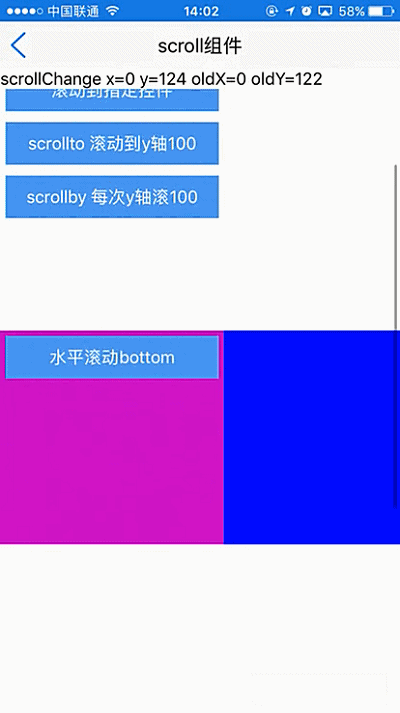
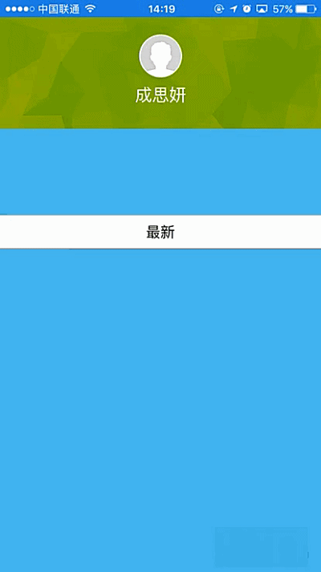
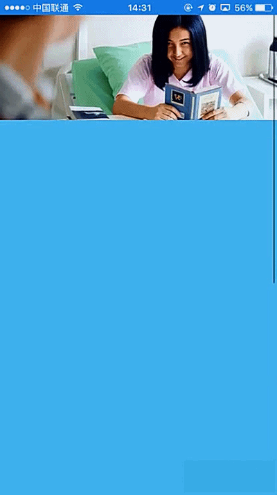

# scroll组件使用 

----------

scroll是用于包裹其他UI组件的基础布局容器，采用flexbox模型布局，支持嵌套任意类型的UI组件或容器并支持滚动，其不仅可以垂直滚动，还能水平滚动（通过direction属性来设置）  。

scroll处于垂直滚动模式时，可以包裹refresh容器用于实现下拉刷新及上拉刷新效果，详见refresh容器章节。

**注：**  使用scroll时需要设置其区域大小，一般情形下要设置高宽，也可以用flex来分割区域，如果不设置区域大小，其内容无非显示。

<h2 id="cid_0">属性</h2> 


**公共属性**  

[参见公共属性章节](https://gitdocument.exmobi.cn/sprite-api/ggsx.html)，包括：id、style、class；


**direction**    

<code>滚动方向</code>  

滚动方向，[horizontal，vertical]  

> horizontal：横向滚动；
> 
> vertical：纵向滚动；（默认）

 
**scrollbar**  

<code>是否显示滚动条</code>   

是否显示滚动条， [true，false]  

> true：显示滚动条（默认）；
> 
> false：隐藏滚动条；


**bottomDistance**  

<code>拖动至底部多少距离时触发</code>    

设置scrollToBottom触发事件后，拖动至底部多少距离时触发，数字，单位dp，默认为0  


**scrollToTop**   

<code>点击系统状态栏是否滚动至顶部</code> 

取值[true，false]  

> true：点击系统状态栏滚动至顶部（默认）；  
> 
> false：点击系统状态栏不滚动至顶部；  

注：仅iOS支持


**bounces**   

<code>是否支持弹动</code>  

滑动到顶部或者底部的时候，是否支持有弹性效果

可选项， [true，false] 

> true：支持弹动（默认）
> 
> false：不支持弹动 

**注：** 仅iOS支持


<h2 id="cid_1">样式</h2>

**公共样式**  

[参见公共样式章节](https://gitdocument.exmobi.cn/sprite-api/ggys.html)，包括：  
 
> 尺寸
> 
> 定位 
> 
> 内边距
> 
> 外边距
> 
> 边框
> 
> 背景
>
> 显影 
> 
> flexbox布局：align-self，flex


**background-image**  

<code>背景图片</code>

支持本地图/网络图，当同时设置背景图及背景色时，背景图优先级别高于背景色。  

格式：background-image:url (url)
 


<h2 id="cid_2">事件</h2>

本节目录：

> [公共事件 ](#sj_0) 
> 
> [scrollToBottom  滚动条滚动至底部时触发 ](#sj_1) 
> 
> [scrollStart  滚动开始时触发 ](#sj_2)
> 
>[ scrollChange  滚动时多次触发  ](#sj_3)
> 
>[ scrollStop  滚动结束时触发](#sj_4)
  


<span id="sj_0">**公共事件**</span>

[参见公共事件章节](https://gitdocument.exmobi.cn/sprite-api/ggsj.html)，包括：  

> click事件
> 
> longTouch事件   


  
<span id="sj_1">**scrollToBottom**</span>   

<code>滚动条滚动至底部时触发</code>    

event事件对象包括：  
  
> type：事件类型，字符串类型，固定值：scrollToBottom；
> 
> target：触发事件的目标组件，dom对象；
> 
> timestamp：事件触发的时间戳,单位毫秒，数字类型

**注：** 该事件一般与bottomDistance属性配合使用。


<span id="sj_2">**scrollStart**</span>  

<code>滚动开始时触发</code>    

event事件对象包括：   
 
> type：事件类型，字符串类型，固定值：scrollStart；
> 
> target：触发事件的目标组件，dom对象；
> 
> timestamp：事件触发的时间戳,单位毫秒，数字类型


<span id="sj_3">**scrollChange**</span>  

<code>滚动时多次触发</code>   


event事件对象包括：   

> type：事件类型，字符串类型，固定值：scrollChange；
> 
> target：触发事件的目标组件，dom对象；
> 
> timestamp：事件触发的时间戳,单位毫秒，数字类型
    
param对象为Json对象，定义如下：   

> x：x轴滚动位移坐标值，数字类型
> 
> y：y轴滚动位移坐标值，数字类型
> 
> oldX：上次x轴滚动位移坐标值，数字类型
> 
> oldY：上次y轴滚动位移坐标值，数字类型

示例：

```javascript   

 scroll.on("scrollChange", function (e, param) {         
        textid.setText("scrollChange x=" + param.x + " y=" + param.y + " oldX=" + param.oldX + " oldY=" + param.oldY);
 });

```


<span id="sj_4">**scrollStop**</span>

<code>滚动结束时触发</code>     

event事件对象包括：    

> type：事件类型，字符串类型，固定值：scrollStop；
> 
> target：触发事件的目标组件，dom对象；
> 
> timestamp：事件触发的时间戳,单位毫秒，数字类型


<h2 id="cid_3">js方法</h2> 

本节目录：

> [公共方法](#ff_1)
> 
> [scrollTo(jsonData:Object): void   将容器内的当前内容滚动到指定位置](#ff_2)  
> 
> [scrollToType(jsonData:Object): void  将容器内的当前内容滚动到特定位置 ](#ff_3) 
> 
> [scrollToCtrl(jsonData:Object): void   将滚动条滚动至指定控所在位置  ](#ff_4)
> 
> [scrollToCtrlById(jsonData:Object): void  将滚动条滚动至指定id的控件所在位置](#ff_5)
> 
> [scrollBy(jsonData:Object): void  容器基于相对位置滚动 ](#ff_6) 
> 
> [getScrollX(): number  获取滚动容器x轴滚动点坐标  ](#ff_7)
> 
> [getScrollY(): number   获取滚动容器y轴动点坐标  ](#ff_8)
> 
> [getContentWidth(): number  获取滚动容器所包裹内容宽度](#ff_9)  
> 
> [getContentHeight(): number  获取滚动容器所包裹内容高度  ](#ff_10)
> 
> [setCaptureTouchEvent (caputueTouchEvent:boolean): void  设置滚动容器是否拦截子组件touch事件](#ff_11)
> 
> [getCaptureTouchEvent(): boolean   获取滚动容器是否拦截子组件touch事件](#ff_12) 
> 
> [refresh(): void   刷新组件内布局 ](#ff_13) 

<span id="ff_1"><code>**公共方法**</code></span> 


[事件相关](https://gitdocument.exmobi.cn/sprite-api/ggff.html#cid_0)，包括：

> [on(messageName:string,callback:Function): void   组件注册事件的触发函数](https://gitdocument.exmobi.cn/sprite-api/ggff.html#jjxg_1)   
> 
> [fire(messageName:string,params:Array&lt;any&gt;): void  组件事件的触发函数](https://gitdocument.exmobi.cn/sprite-api/ggff.html#jjxg_2)   
> 
> [off(messageName:string,callback:Function): void  组件移除事件的触发函数](https://gitdocument.exmobi.cn/sprite-api/ggff.html#jjxg_3)  
>  
> [getOn(messageName:string): Array&lt;Function&gt;  获取已绑定的事件的触发函数](https://gitdocument.exmobi.cn/sprite-api/ggff.html#jjxg_4)   

[动画相关](https://gitdocument.exmobi.cn/sprite-api/ggff.html#cid_1)，包括： 
 
> [startAnimation(jsonData:Object,callback:Function): void  启动UI组件动画](https://gitdocument.exmobi.cn/sprite-api/ggff.html#dhxg_1)   
> 
> [startAnimator(jsonData:Object,callback:Function): void  启动UI组件属性动画](https://gitdocument.exmobi.cn/sprite-api/ggff.html#dhxg_2)   
> 
> [startKeyFrameAnimator(jsonData:Object,callback:Function): void  启动UI组件关键帧动画](https://gitdocument.exmobi.cn/sprite-api/ggff.html#dhxg_3)  
>  
> [ releaseAnimator(): void  结束控件动画](https://gitdocument.exmobi.cn/sprite-api/ggff.html#dhxg_4)   

[尺寸和位置](https://gitdocument.exmobi.cn/sprite-api/ggff.html#cid_2)，包括：  

> [getFrame(): Object  获取组件在父容器中的位置](https://gitdocument.exmobi.cn/sprite-api/ggff.html#cchwz_1)   
> 
> [setFrame(frame:Object): void  设置组件在父容器中的位置](https://gitdocument.exmobi.cn/sprite-api/ggff.html#cchwz_2)   
> 
> [getCenter(): Object  获取组件中心点在父容器中的位置](https://gitdocument.exmobi.cn/sprite-api/ggff.html#cchwz_3)  
>
> [getAbsoluteFrame(): Object  获取组件在绘制窗口中的位置](https://gitdocument.exmobi.cn/sprite-api/ggff.html#cchwz_4)   


[普通Dom节点操作](https://gitdocument.exmobi.cn/sprite-api/ggff.html#cid_3)，包括：  

> [getParent(): IElement  获取父节点](https://gitdocument.exmobi.cn/sprite-api/ggff.html#ptdom_1)   
> 
> [getNext(): IElement  获取同级下一个节点](https://gitdocument.exmobi.cn/sprite-api/ggff.html#ptdom_2)   
> 
> [getPrevious(): IElement  获取同级前一个节点](https://gitdocument.exmobi.cn/sprite-api/ggff.html#ptdom_3)  
> 
> [remove(): void  从父容器中移除自身](https://gitdocument.exmobi.cn/sprite-api/ggff.html#ptdom_4)  
> 
> [clone(isDeep:boolean):IElement  对当前Dom节点进行克隆](https://gitdocument.exmobi.cn/sprite-api/ggff.html#ptdom_5)  
> 
> [setAttr(attrName:string,attrValue:string): void  设置节点属性](https://gitdocument.exmobi.cn/sprite-api/ggff.html#ptdom_6)   
>
> [getAttr(attrName:string):string  获取节点属性值](https://gitdocument.exmobi.cn/sprite-api/ggff.html#ptdom_7) 
>
> [getAttrs(): Object  获取节点所有属性](https://gitdocument.exmobi.cn/sprite-api/ggff.html#ptdom_8) 
>
> [removeAttr(attrName:string): void  移除节点属性](https://gitdocument.exmobi.cn/sprite-api/ggff.html#ptdom_9) 
>
> [hasAttr(attrName:string): boolean  节点是否具有该属性](https://gitdocument.exmobi.cn/sprite-api/ggff.html#ptdom_10) 
> 
> [setStyle(styleName:string,styleValue:string): void  设置节点样式值](https://gitdocument.exmobi.cn/sprite-api/ggff.html#ptdom_13)  
>
> [getStyle(styleName:string):string  获取节点样式值](https://gitdocument.exmobi.cn/sprite-api/ggff.html#ptdom_14)   
>
> [clearStyle(styleName:string): void  移除节点样式值](https://gitdocument.exmobi.cn/sprite-api/ggff.html#ptdom_15)    
>
> [setClassStyle(className:string,domobj:IElement): void   设置节点对应Class样式](https://gitdocument.exmobi.cn/sprite-api/ggff.htm#ptdom_16) 
>  
> [getClassStyle(): string  获取节点已设置Class样式](https://gitdocument.exmobi.cn/sprite-api/ggff.html#ptdom_17)  
>  
> [getTag(): string  获取UI组件类型](https://gitdocument.exmobi.cn/sprite-api/ggff.html#ptdom_18)  
>  
> [getId(): string  获取UI组件Id标识](https://gitdocument.exmobi.cn/sprite-api/ggff.html#ptdom_19) 


[容器类Dom节点操作](https://gitdocument.exmobi.cn/sprite-api/ggff.html#cid_4)：包括：

> [getElement(id:string): IElement  根据Id获取容器内UI控件对象](https://gitdocument.exmobi.cn/sprite-api/ggff.html#rqczdom_1)   
> 
> [getElements(rule:string): Array&lt;IElement&gt;  根据特定规则获取容器内UI控件对象集](https://gitdocument.exmobi.cn/sprite-api/ggff.html#rqczdom_2)   
> 
> [getChildren():Array&lt;IElement&gt;  容器获取子节点集](https://gitdocument.exmobi.cn/sprite-api/ggff.html#rqczdom_3)  
>  
> [getFirstChild(): IElement  容器获取首子节点](https://gitdocument.exmobi.cn/sprite-api/ggff.html#rqczdom_4) 
>  
> [getLastChild(): IElement  容器获取尾节点](https://gitdocument.exmobi.cn/sprite-api/ggff.html#rqczdom_5) 
>  
> [appendChild(Obj:IElement): void  容器添加子节点至尾部](https://gitdocument.exmobi.cn/sprite-api/ggff.html#rqczdom_6) 
>  
> [insertBefore(domObj:IElement,beforeDomObj:IElement): void  容器在指定的已有的子节点之前插入新节点](https://gitdocument.exmobi.cn/sprite-api/ggff.html#rqczdom_7) 
>  
> [insertAfter (domObj:IElement,afterDomObj:IElement): void  容器在指定的已有的子节点之后插入新节点](https://gitdocument.exmobi.cn/sprite-api/ggff.html#rqczdom_8) 
>  
> [replaceChild(newDomObj:IElement,oldDomObj:IElement): void  容器替换子节点](https://gitdocument.exmobi.cn/sprite-api/ggff.html#rqczdom_9) 
>  
> [clear(): void  清空容器内所有子节点](https://gitdocument.exmobi.cn/sprite-api/ggff.html#rqczdom_10) 
>  
> [getInnerHTML(): string  动态获取容器内子节点xml](https://gitdocument.exmobi.cn/sprite-api/ggff.html#rqczdom_11)   


<span id="ff_2">**scrollTo(jsonData:Object): void**</span>  

<code>将容器内的当前内容滚动到指定位置</code>  

参数：

jsonData：滚动参数，Json对象，定义如下：

> x：需要滚动x坐标，数字，横向滚动容器设置；
> 
> y：需要滚动y坐标，数字，竖向滚动容器设置；
> 
> animated：滚动时是否启用动画，bool型，true：启用动画；false：不启用动画；

返回值：无


<span id="ff_3">**scrollToType(jsonData:Object): void**</span>  

<code>将容器内的当前内容滚动到特定位置</code>    

参数：

jsonData：滚动参数，Json对象，定义如下：

> scrollType：滚动位置，字符串枚举型，[top,middle,bottom]
> 
> - top：跳转到容器顶部/左侧；
> 
> - middle：跳转到容器内容中间；
> 
> - bottom：跳转到容器底部/右侧。
> 
> animated：滚动时是否启用动画，bool型，true：启用动画；false：不启用动画；

返回值：无


<span id="ff_4">**scrollToCtrl(jsonData:Object): void**</span>

<code>将滚动条滚动至指定控件所在位置</code>  

参数：  

jsonData：滚动参数，Json对象，定义如下： 

> domObj：需要滚动显示的控件对象
> 
> animated：滚动时是否启用动画，bool型，true：启用动画；false：不启用动画；

返回值：无


<span id="ff_5">**scrollToCtrlById(jsonData:Object): void**</span>

<code>将滚动条滚动至指定id的控件所在位置</code>  

参数：

jsonData：滚动参数，Json对象，定义如下：

> id：需要滚动显示的控件id标识，字符串
> 
> animated：滚动时是否启用动画，bool型，true：启用动画；false：不启用动画；

返回值：无


<span id="ff_6">**scrollBy(jsonData:Object): void**</span>

<code>容器基于相对位置滚动</code>  

参数：

jsonData：滚动参数，Json对象，定义如下：

> x：需要滚动x坐标方向上相对位移，数字，横向滚动容器设置；
> 
> y：需要滚动y坐标方向上相对位移，数字，竖向滚动容器设置；
> 
> animated：滚动时是否启用动画，bool型，true：启用动画；false：不启用动画；

返回值：无


<span id="ff_7">**getScrollX(): number**</span>

<code>获取滚动容器x轴滚动点坐标</code>  

参数：无  

返回值：滚动容器x轴滚动点坐标，横向滚动容器使用


<span id="ff_8">**getScrollY(): number**</span>

<code>获取滚动容器y轴滚动点坐标</code>  

参数：无  

返回值：滚动容器y轴滚动点坐标，竖向滚动容器使用


<span id="ff_9">**getContentWidth(): number**</span>

<code>获取滚动容器所包裹内容宽度</code>   

参数：无  

返回值：滚动容器所包裹内容宽度，数字，单位dp


<span id="ff_10">**getContentHeight(): number**</span>

<code>获取滚动容器所包裹内容高度</code>   

参数：无  

返回值：滚动容器所包裹内容高度，数字，单位dp


<span id="ff_11">**setCaptureTouchEvent (caputueTouchEvent:boolean): void**</span>

<code>设置滚动容器是否拦截子组件touch事件</code>   

该方法一般用于当scroll内部需要处理拖动控件效果的时候，防止scroll滚动可以设置不拦截touch事件。  

参数：

caputueTouchEvent：滚动容器是否拦截子组件touch事件，bool型：

> true：拦截子组件touch事件（默认）；
> 
> false：不拦截子组件touch事件；

返回值：无


<span id="ff_12">**getCaptureTouchEvent(): boolean**</span>

<code>获取滚动容器是否拦截子组件touch事件</code>   
  
返回值：滚动容器是否拦截子组件touch事件，bool型  

> true：拦截子组件touch事件
> 
> false：不拦截子组件touch事件


<span id="ff_13">**refresh(): void**</span>  

<code>刷新组件内布局</code>  

参数：无

返回值：无

**注：** 刷新后组件区域不变，某些场景下可代替document.refresh()获得更好的刷新效果  


<h2 id="cid_4">示例</h2>  


示例代码1，测试scroll事件和方法，参考演示应用示例：apps\yuanhongqian\spriteui\scroll.uixml，代码中用到了官方封装的模板titlebar，模板的使用可参考[https://gitdocument.exmobi.cn/sprite-official-ui/index.html](https://gitdocument.exmobi.cn/sprite-official-ui/index.html "https://gitdocument.exmobi.cn/sprite-official-ui/index.html") 

```html
<page>
    <script>
        <![CDATA[
        var window = require("Window");
        var document = require("Document");
        var ui = require("UI");

        require("titlebarUI");
        require("buttonUI");
        var console = require("Console");

        window.on("loaded", function () {

            var title = document.getElement("title");
            var testbtn = document.getElement("testbtn");
            var textid = document.getElement("textid");
            title.on("liconClick", function (e) {
                var json = {};
                json.data = {};
                window.close(json);

            });

            var scroll = document.getElement("scroll");
            scroll.on("scrollToBottom", function (e) {
                textid.setText("scrollToBottom");

            });

            scroll.on("scrollStart", function (e) {
                // console.log("scrollStart");
                textid.setText("scrollStart");
            }); scroll.on("scrollStop", function (e) {
                //console.log("scrollStop");
                textid.setText("scrollStop");
            });
            scroll.on("scrollChange", function (e, param) {
                // console.log("scrollChange x=" + param.x + " y=" + param.y + " oldX=" + param.oldX + " oldY=" + param.oldY);
                textid.setText("scrollChange x=" + param.x + " y=" + param.y + " oldX=" + param.oldX + " oldY=" + param.oldY);
            });

            var scrollto00 = document.getElement("scrollto00");
            scrollto00.on("click", function (e) {
                var json = {};
                json.x = 0;
                json.y = 100;
                json.animated = true;
                scroll.scrollTo(json);
            });

            var scrollby = document.getElement("scrollby");
            scrollby.on("click", function (e) {
                var json = {};
                json.x = 0;
                json.y = 100;
                json.animated = true;
                scroll.scrollBy(json);
            });

            var scrollToTop = document.getElement("scrollToTop");
            scrollToTop.on("click", function (e) {
                var json = {};
                json.scrollType = "top";
                json.animated = true;
                scroll.scrollToType(json);
            });

            var scrollToBottom = document.getElement("scrollToBottom");
            scrollToBottom.on("click", function (e) {
                var json = {};
                json.scrollType = "bottom";
                json.animated = false;
                scroll.scrollToType(json);
            });

            var scrollToCenter = document.getElement("scrollToCenter");
            scrollToCenter.on("click", function (e) {
                var json = {};
                json.scrollType = "middle";
                json.animated = true;
                scroll.scrollToType(json);
            });

            var scrolltobtnInBox = document.getElement("scrolltobtnInBox");
            scrolltobtnInBox.on("click", function (e) {
                var dom = document.getElement("testbtn");
                var json = {};
                json.domObj = dom;
                json.animated = true;
                scroll.scrollToCtrl(json);
            });

            var scroll3 = document.getElement("scroll3");
            var scrolltotop_v1 = document.getElement("scrolltotop_v1");
            scrolltotop_v1.on("click", function (e) {
                var json = {};
                json.scrollType = "top";
                json.animated = true;
                scroll3.scrollToType(json);

            });

            var scrolltotop_v = document.getElement("scrolltotop_v");
            scrolltotop_v.on("click", function (e) {
                var json = {};
                json.scrollType = "bottom";
                json.animated = true;
                scroll3.scrollToType(json);
            });
        });

    ]]>
    </script>
    <style>
        @import url("spriteLayout");
        @import url("spriteColor");
        .rootScroll {
            width: fill_screen;
            flex: 1;
            flex-direction: column;
            justify-content: flex-start;
            flex-wrap: nowrap;
            border-radius: 0 0 0 0;
            background-color: #FFFFFF;
        }
        
        .scroll2 {
            width: fill_screen;
            height: 200;
            background-color: #CC00CC;
            margin: 10 0 0 0;
        }
        
        .scroll3 {
            width: fill_screen;
            height: 200;
            background-color: #CC00CC;
            flex-direction: row;
            margin: 100 0 0 0;
            flex-wrap: nowrap;
        }
        
        .box {
            background-color: red;
            width: 300;
            height: 300;
        }
        
        button {
            margin: 5 5 5 5;
            width: 200;
        }
    </style>
    <ui>
        <box class="full" id="box">
            <titlebar title="scroll组件" id="title" licon="res:yuanhongqian/image/icon.png" style="licon-width:24;licon-height:24" class="titlebar-hasstatus"
            />
            <text id="textid"></text>
            <scroll class="rootScroll" scrollToTop="true" id="scroll">

                <button value="滚动到bottom" id="scrollToBottom" />
                <button value="滚动到Center" id="scrollToCenter" />
                <button value="滚动到指定控件" id="scrolltobtnInBox" />
                <button value="scrollto 滚动到y轴100" id="scrollto00" />
                <button value="scrollby 每次y轴滚100" id="scrollby" />

                <scroll id="scroll3" class="scroll3" direction="horizontal" scrollbar="false">
                    <button value="水平滚动bottom" id="scrolltotop_v" />
                    <box style="background-color:blue;width:400;" />
                    <box style="background-color:green;" />
                    <button value="水平滚动到top" id="scrolltotop_v1" />
                </scroll>
                <box style="height: 300"></box>
                <button id="testbtn" value="滚动到这里"></button>
                <box style="height: 100"></box>
                <button value="滚动到top" id="scrollToTop" />

            </scroll>
        </box>
    </ui>
</page>

```

代码效果：

    
 

示例代码2，实现scroll拖动，内容顶部悬浮效果，参考演示示例apps\yuanhongqian\sprite_xiaoguo\scroll2.uixml，代码如下：

```html
<page>
    <script>
        <![CDATA[

        var window = require("Window");
        var document = require("Document");
        var ui = require("UI");
        var console = require("Console");


        var cloneclassBox = null;

        window.on("loaded", function () {
            var headImage = document.getElement("headImage");
            var rootBox = document.getElement("rootBox");
            var scroll = document.getElement("scroll");
            var title = document.getElement("title");
            var classBox = document.getElement("classBox");
            headImage.on("click", function (e) {
                window.close();
            });

            cloneclassBox = classBox.clone(true);         
            //初始设置状态 fix：固定 normal:正常布局
            classBox.setAttr("status", "normal");
            //初始设置状态 用于顶级弹出关闭pop
            classBox.setAttr("pop", "false");
            var popBox = document.getElement("pop");
            var contentBox = document.getElement("contentBox");
            scroll.on("scrollStart", function (e) {
                console.log("scrollStart");
            });

            scroll.on("scrollStop", function (e) {
                console.log("scrollStop");
            });

            scroll.on("scrollChange", function (e, param) {
                //console.log("scrollChange x=" + param.x + " y=" + param.y + " oldX=" + param.oldX + " oldY=" + param.oldY);
                if (param.y >= 0 && param.y < 100) {
                    //当scroll滚动y值为0时 titlebar 透明度为0 为 100(该值根据需要自设置)时，透明度为1
                    var opacity = param.y / 100;
                    title.setStyle("opacity", opacity);
                } else if ((param.y - 180) > 0) {
                    title.setStyle("opacity", "1");
                    //固定布局
                    var status = classBox.getAttr("status");
                    if (status == "normal") {

                        cloneclassBox.setClassStyle("classBoxFix");
                        title.setStyle("height", title.getFrame().height + 40);
                        title.appendChild(cloneclassBox);
                        document.refresh();
                        classBox.setAttr("status", "fix");
                    }

                } else if ((param.y - 180) < 0) {
                    //正常布局
                    var status = classBox.getAttr("status");
                    if (status == "fix") {
                        /* classBox.setClassStyle("classBox");
                         contentBox.appendChild(classBox);*/


                        cloneclassBox.remove();


                        title.setStyle("height", title.getFrame().height - 40);
                        document.refresh();
                        classBox.setAttr("status", "normal");
                    }
                }
            });

            //创建pop弹出背景
            var bgClass = {};
            bgClass.class = "popBg";
            var bgObj = document.createElement("box", bgClass);
            //bgObj.setClassStyle("popBg");
            bgObj.on("click", function (e) {
                popBox.setStyle("top", 0);
                popBox.setStyle("height", 0);
                document.refresh();
                //移除pop背景
                bgObj.remove();
                //收缩pop
                classBox.setAttr("pop", "false");
            });

        });
    ]]>
    </script>
    <style>
        .scroll {
            width: fill_screen;
            flex: 1;
            flex-wrap: nowrap;
            border-radius: 0 0 0 0;
            background-color: #FFFFFF;
        }
        
        .bgBox {
            height: 150;
            align-items: center;
        }
        
        .bgImage {
            position: absolute;
            top: 0;
            bottom: 0;
            left: 0;
            right: 0;
            scaleType: cover;
        }
        
        .headImage {
            margin: 40 0 8 0;
            width: 50;
            height: 50;
            scaleType: cover;
        }
        
        .headText {
            font-size: 20;
            color: #ffffff;
            text-align: center;
        }
        
        .title {
            position: absolute;
            top: 0;
            left: 0;
            right: 0;
            height: 70;
            background-color: #22292c;
            opacity: 0;
        }
        
        .titleBar {
            height: 20;
        }
        
        .titleBox {
            flex: 1;
            flex-direction: row;
            justify-content: center;
            align-items: center;
        }
        
        .titleText {
            font-size: 18;
            font-weight: bold;
            color: #ffffff;
            text-align: center;
        }
        
        .classBox {
            height: 40;
            background-color: rgba(255, 255, 255, 1);
            margin: 100 0 0 0;
            flex-direction: row;
            justify-content: center;
            align-items: center;
        }
        
        .classBoxFix {
            /* position: absolute;
        top:70;
        left: 0;
        right:0;  */
            height: 40;
            background-color: rgba(255, 255, 255, 1);
            flex-direction: row;
            justify-content: center;
            align-items: center;
        }
        
        .popBg {
            position: absolute;
            top: 0;
            left: 0;
            right: 0;
            bottom: 0;
            background-color: rgba(255, 255, 255, 0);
        }
    </style>
    <ui>
        <box style="height:fill_screen;width:fill_screen" id="rootBox">
            <scroll class="scroll" scrollToTop="true" id="scroll" scrollbar="true">
                <box class="bgBox">
                    <image id="bgImage" class="bgImage" src="res:spritetest/image/newmy_topbj.png" />
                    <image id="headImage" class="headImage" src="res:spritetest/image/newmy_headunlogin.png" />
                    <text class="headText">成思妍</text>
                </box>
                <box id="contentBox" style="height: 1000;background-color:#4ebef0;">
                    <box id="classBox" class="classBox">
                        <line style="line-color:#9a9a9a;line-size:0.8;position: absolute;top:0;left: 0;right: 0;" />
                        <text>最新</text>
                        <line style="line-color:#9a9a9a;line-size:0.8;position: absolute;bottom:0;left: 0;right: 0;" />
                    </box>

                </box>
                <box>
                    <text>到底部了</text>
                </box>
            </scroll>

            <box id="title" class="title">
                <box class="titleBar"></box>
                <box class="titleBox">
                    <text class="titleText">我的家园</text>
                </box>
            </box>
        </box>
    </ui>
</page>

```

代码效果：  

  


示例代码3，利用scrollChange事件和滚动弹性效果实现图片拉动放大效果(仅ios支持)，参考演示示例apps\yuanhongqian\sprite_xiaoguo\scroll3.uixml，代码如下：

```html

<page>
    <script>
        <![CDATA[

        var window = require("Window");
        var document = require("Document");
        var ui = require("UI");
        var console = require("Console");
        window.on("loaded", function () {
            var scroll = document.getElement("scroll");
            var bgImage = document.getElement("bgImage");
            bgImage.on("click", function (e) {
                window.close();
            });
            var imageWidth = 0;
            var imageHeight = 0;
            var x = 0;
            var y = 0; scroll.on("scrollStart", function (e) {
                console.log("scrollStart");
                //获取初始图片位置
                if (imageWidth == 0) {
                    var imageFrame = bgImage.getFrame();
                    imageWidth = imageFrame.width;
                    imageHeight = imageFrame.height;
                    x = imageFrame.x;
                    y = imageFrame.y;
                }
            });

            scroll.on("scrollStop", function (e) {
                console.log("scrollStop");
            });

            scroll.on("scrollChange", function (e, param) {
              
                if (param.y < 0) {
                    //scroll已位于顶部，向下拖拽 放大图片  0为图片原始尺寸  通过调整rate 比例基数来调整拖动时候图片放大比例
                    var rate = Math.abs(param.y) / 300;
                    var frame = {};
                    frame.x = x - (imageWidth * rate) / 2;
                    frame.y = y + param.y;
                    frame.width = (1 + rate) * imageWidth;
                    frame.height = imageHeight + Math.abs(param.y);
                    bgImage.setFrame(frame);
                }
            });
        }); 

    ]]>
    </script>
    <style>
        @import url(res:spritetest/css/import.css);
        .scroll {
            width: fill_screen;
            flex: 1;
            flex-wrap: nowrap;
            border-radius: 0 0 0 0;
            background-color: #FFFFFF;
        }
        
        .bgImage {
            height: 160;
            scaleType: cover;
        }
        
        .contentBox {
            height: 1000;
            background-color: #4ebef0;
        }
    </style>
    <ui>
        <box class="rootBox" id="rootBox">
            <scroll class="scroll" scrollToTop="true" id="scroll" scrollbar="true">
                <image id="bgImage" class="bgImage" src="res:spritetest/image/photo.jpg" />
                <box id="contentBox" class="contentBox">
                </box>
            </scroll>
        </box>
    </ui>
</page>

```

代码效果： 

  


