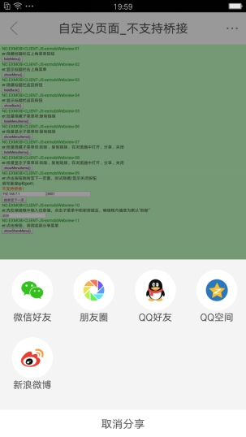

# Share 一键分享功能组件

----------

Share功能组件实现Sprite提供的一键分享功能，外置组件。
 
** 注 ：** 一键分享需要勾选支持分享平台SDK，如微博，微信，QQ；


使用时需要在js中引入 ：

```javascript
var share = require("Share"); 
```

**注：** 该组件为外置组件能组件，需在打包的时候勾选。

<h2 id="cid_1">js方法</h2>  

<span id="ff_0">**oneKeyShare (dataJson:Object,callFunction:Function):void**</span>  

<code>一键分享，目前支持Qq好友，Qq空间，微信好友，微信朋友圈，新浪微博</code>  

参数：

dataJson：分享内容，json格式，定义如下，支持纯文本，图片，新闻三种分享模式，分别定义如下：

**文本：**

> type: 分享类型，字符串枚举型，[text,image,news],文本类型固定为text
> 
> text：需分享文本内容，字符串类型，必选项；
> 
** 注：**QQ不支持纯文本类型分享

**图片：**

> type: 分享类型，字符串枚举型，[text,image,news],图片类型固定为image
> 
> imgPath：支持本地图片，字符串类型，必选项，支持res: 及 file: 字符串；

**新闻：**

> type: 分享类型，字符串枚举型，[text,image,news],新闻类型固定为news
> 
>   title： 分享标题，字符串类型 注：新浪微博不支持，必选项；
>   
>   url:分享链接地址，字符串类型，必选项；
>   
>   description：  分享文本，字符串类型，可选项；
>   
>   imgPath：分享图片，字符串类型，只支持本地图片，res:及file:前缀，可选项；


callFunction：一键分享回调函数，该回调函数具有json格式入参，定义如下：

>    code：数字 0：分享成功；   其他值：分享失败

返回值：无

示例：

```javascript
//注册Share分享组件
var share = require("Share");
//设置分享内容 新闻类
var dataJson = {};
dataJson.type="news";
dataJson.title="分享标题";
dataJson.description = "一键分享测试"
dataJson.url="http://www.exmobi.cn";
//启动一键分享 
share.oneKeyShare (dataJson,onBind);

//回调函数
function onBind(jsonData){
var code = jsonData.code;
if(code == 0){
  //分享成功
  }
}

```




