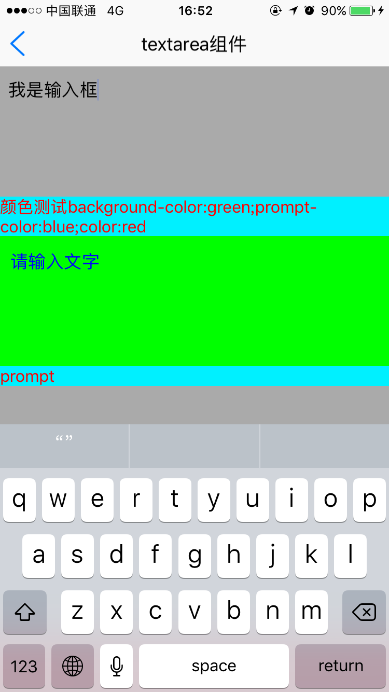
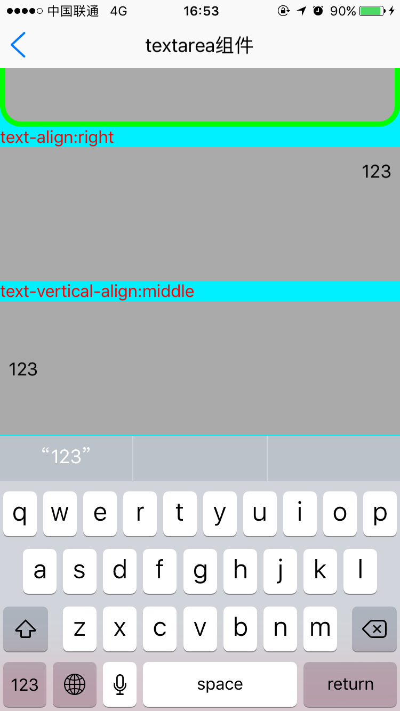

# textarea组件使用 

----------

textarea多行文本输入组件允许用户通过键盘输入文本的基本组件，多行输入。   


<h2 id="cid_0">属性</h2> 

本节目录：  

> [公共属性](#sx_1)
> 
>[ name  控件名称](#sx_2)
> 
>[ rows  输入类型](#sx_3)
>  
> [keyboardType  弹出输入法键盘类型](#sx_4)
>   
> [capitalize  是否要自动将特定字符切换为大写](#sx_5)
>   
> [autoCorrect  是否进行拼写纠错](#sx_6)
>   
> [prompt  提示语](#sx_7)
>   
> [value  文本内容](#sx_8)
>   
> [maxLength  输入字符的最大长度](#sx_9)
>   
> [returnKeyType   设置弹出输入法return键显示样式](#sx_10)
>   
> [disabled  是否禁用该控件](#sx_11)


<span id="sx_1">**公共属性**</span>  

[参见公共属性章节](https://gitdocument.exmobi.cn/sprite-api/ggsx.html)，包括：id、style、class；


<span id="sx_2">**name**</span>    

<code>控件名</code>  

用于表单提交，字符串类型
 
 

<span id="sx_3">**rows**</span>  

<code>多行输入框行数</code>   

数字，默认5


<span id="sx_4">**keyboardType**</span>  

<code>弹出输入法键盘类型</code>    

字符串枚举型，【default，number, phone ,decimal,phone,email,url】  

> default：默认输入法键盘；（默认）
> 
> number：数字输入法键盘；
> 
> decimal：带小数点的浮点数字输入法键盘；
> 
> phone：电话输入法键盘；
> 
> email：电子邮件输入法键盘；
> 
> url：url输入法键盘；


<span id="sx_5">**capitalize**</span>  

<code>是否要自动将特定字符切换为大写</code>    

字符串枚举型，【none ,characters，words, sentences】 

> none：不自动切换；（默认）
> 
> words：单词首字母大写；
> 
> sentences：句子的首字母大写；
> 
> characters：所有字母都大写；


<span id="sx_6">**autoCorrect**</span>  

<code>是否进行拼写纠错</code>     

bool型，【true，false】  

> true：启用拼写纠正；
> 
> false：不启用拼写纠正；(默认)  


<span id="sx_7">**prompt**</span>  

<code>提示语</code>   

字符串类型，用户没有输入任何内容时，显示的字符串，用户点击输入时，自动置空。  


<span id="sx_8">**value**</span>  

<code>默认文本内容</code>    

字符串类型


<span id="sx_9">**maxLength**</span>  

<code>输入字符的最大长度</code>    

数字类型


<span id="sx_10">**returnKeyType**</span>  

<code>设置弹出输入法return键显示样式</code>    

return键显示样式，取值为【default，go，search，next，send】
  
> default：换行；（默认）
> 
> go：前往；
> 
> search：搜索；
> 
> next：下一项；
> 
> send： 发送

  
<span id="sx_11">**disabled**</span>  

<code>是否禁用该控件</code>     

是否禁用该控件，不可编辑【true，false】  

> true：控件为禁用状态；
> 
> fasle：控件为普通状态；（默认）


<span id="sx_12">**clearButtonMode**</span>  

<code>文本框右侧“清除”按钮显示模式</code>   

取值【never，whileEditing，unlessEditing，always】

> never：从不出现；（默认）
> 
> whileEditing：编辑状态时出现；
> 
> unlessEditing：除了编辑状态外都出现；
> 
> always：一直出现；

**注：** 仅iOS系统支持


<h2 id="cid_1">样式</h2>

**公共样式**  

[参见公共样式章节](https://gitdocument.exmobi.cn/sprite-api/ggys.html)，包括：  
 
> 尺寸
> 
> 定位 
> 
> 内边距：padding:12 8 12 18
> 
> 外边距：border-radius默认为4
> 
> 背景
>
>文本样式 
> 
> flexbox布局：align-self，flex


**text-vertical-align**  

<code>文字垂直方向对齐方式</code>  

文字垂直方向对齐方式，【top,middle,bottom】  

> top：文本垂直方向顶对齐；（默认）
> 
> middle：文本垂直方向居中对齐；
> 
> bottom：文本垂直方向底对齐；


**prompt-color**  

<code>提示文字颜色</code>

默认值：#aaaaaa
  


**border-color-focus**  

<code>编辑框激活状态下border边框色</code>  

默认值：#aaaaaa


<h2 id="cid_2">事件</h2>


**focus**  

<code>获取焦点，进入编辑状态时触发</code>    

进入编辑状态时触发，event事件对象包括：  

> type：事件类型，字符串类型，固定值：focus；
> 
> target：触发事件的目标组件，dom对象；
> 
> timestamp：事件触发的时间戳,单位毫秒，数字类型


**blur**  

<code>失去焦点，退出编辑状态时触发</code>    

退出编辑状态时触发，event事件对象包括：  

> type：事件类型，字符串类型，固定值：blur；  
> 
> target：触发事件的目标组件，dom对象；  
> 
> timestamp：事件触发的时间戳,单位毫秒，数字类型


**textChanged**

<code>文本框激活状态下，输入值改变时触发</code>   

文本框激活状态下，输入值改变时触发，event事件对象包括：  

> type：事件类型，字符串类型，固定值：blur；
> 
> target：触发事件的目标组件，dom对象；
> 
> timestamp：事件触发的时间戳,单位毫秒，数字类型

value：改变后的输入值，字符串类型


**return**  

<code>点击输入法return键时触发</code>

vent事件对象包括：  

> type：事件类型，字符串类型，固定值：blur；
> 
> target：触发事件的目标组件，dom对象；
> 
> timestamp：事件触发的时间戳,单位毫秒，数字类型

returnKeyType：弹出输入法return键显示样式，取值为【default，go，search，next，send】


<h2 id="cid_3">js方法</h2>

> [公共方法](#ff_0)
> 
> [setFocus(): void  设置当前编辑框获取焦点](#ff_1)
> 
> [isFocus(): boolean  当前编辑框是否获取焦点](#ff_2)
> 
> [isFocus(): boolean 当前编辑框是否获取焦点](#ff_3)
> 
> [clear(): void clear(): void](#ff_4)

<span id="ff_0"><code>**公共方法**</code></span>     

[事件相关](https://gitdocument.exmobi.cn/sprite-api/ggff.html#cid_0)，包括：

> [on(messageName:string,callback:Function): void   组件注册事件的触发函数](https://gitdocument.exmobi.cn/sprite-api/ggff.html#jjxg_1)   
> 
> [fire(messageName:string,params:Array&lt;any&gt;): void  组件事件的触发函数](https://gitdocument.exmobi.cn/sprite-api/ggff.html#jjxg_2)   
> 
> [off(messageName:string,callback:Function): void  组件移除事件的触发函数](https://gitdocument.exmobi.cn/sprite-api/ggff.html#jjxg_3)  
>  
> [getOn(messageName:string): Array&lt;Function&gt;  获取已绑定的事件的触发函数](https://gitdocument.exmobi.cn/sprite-api/ggff.html#jjxg_4)   

[动画相关](https://gitdocument.exmobi.cn/sprite-api/ggff.html#cid_1)，包括： 
 
> [startAnimation(jsonData:Object,callback:Function): void  启动UI组件动画](https://gitdocument.exmobi.cn/sprite-api/ggff.html#dhxg_1)   
> 
> [startAnimator(jsonData:Object,callback:Function): void  启动UI组件属性动画](https://gitdocument.exmobi.cn/sprite-api/ggff.html#dhxg_2)   
> 
> [startKeyFrameAnimator(jsonData:Object,callback:Function): void  启动UI组件关键帧动画](https://gitdocument.exmobi.cn/sprite-api/ggff.html#dhxg_3)  
>  
> [ releaseAnimator(): void  结束控件动画](https://gitdocument.exmobi.cn/sprite-api/ggff.html#dhxg_4)   

[尺寸和位置](https://gitdocument.exmobi.cn/sprite-api/ggff.html#cid_2)，包括：  

> [getFrame(): Object  获取组件在父容器中的位置](https://gitdocument.exmobi.cn/sprite-api/ggff.html#cchwz_1)   
> 
> [setFrame(frame:Object): void  设置组件在父容器中的位置](https://gitdocument.exmobi.cn/sprite-api/ggff.html#cchwz_2)   
> 
> [getCenter(): Object  获取组件中心点在父容器中的位置](https://gitdocument.exmobi.cn/sprite-api/ggff.html#cchwz_3)  
>
> [getAbsoluteFrame(): Object  获取组件在绘制窗口中的位置](https://gitdocument.exmobi.cn/sprite-api/ggff.html#cchwz_4)   


[普通Dom节点操作](https://gitdocument.exmobi.cn/sprite-api/ggff.html#cid_3)，包括：  

> [getParent(): IElement  获取父节点](https://gitdocument.exmobi.cn/sprite-api/ggff.html#ptdom_1)   
> 
> [getNext(): IElement  获取同级下一个节点](https://gitdocument.exmobi.cn/sprite-api/ggff.html#ptdom_2)   
> 
> [getPrevious(): IElement  获取同级前一个节点](https://gitdocument.exmobi.cn/sprite-api/ggff.html#ptdom_3)  
> 
> [remove(): void  从父容器中移除自身](https://gitdocument.exmobi.cn/sprite-api/ggff.html#ptdom_4)  
> 
> [clone(isDeep:boolean):IElement  对当前Dom节点进行克隆](https://gitdocument.exmobi.cn/sprite-api/ggff.html#ptdom_5)  
> 
> [setAttr(attrName:string,attrValue:string): void  设置节点属性](https://gitdocument.exmobi.cn/sprite-api/ggff.html#ptdom_6)   
>
> [getAttr(attrName:string):string  获取节点属性值](https://gitdocument.exmobi.cn/sprite-api/ggff.html#ptdom_7) 
>
> [getAttrs(): Object  获取节点所有属性](https://gitdocument.exmobi.cn/sprite-api/ggff.html#ptdom_8) 
>
> [removeAttr(attrName:string): void  移除节点属性](https://gitdocument.exmobi.cn/sprite-api/ggff.html#ptdom_9) 
>
> [hasAttr(attrName:string): boolean  节点是否具有该属性](https://gitdocument.exmobi.cn/sprite-api/ggff.html#ptdom_10) 
> 
> [setStyle(styleName:string,styleValue:string): void  设置节点样式值](https://gitdocument.exmobi.cn/sprite-api/ggff.html#ptdom_13)  
>
> [getStyle(styleName:string):string  获取节点样式值](https://gitdocument.exmobi.cn/sprite-api/ggff.html#ptdom_14)   
>
> [clearStyle(styleName:string): void  移除节点样式值](https://gitdocument.exmobi.cn/sprite-api/ggff.html#ptdom_15)    
>
> [setClassStyle(className:string,domobj:IElement): void   设置节点对应Class样式](https://gitdocument.exmobi.cn/sprite-api/ggff.htm#ptdom_16) 
>  
> [getClassStyle(): string  获取节点已设置Class样式](https://gitdocument.exmobi.cn/sprite-api/ggff.html#ptdom_17)  
>  
> [getTag(): string  获取UI组件类型](https://gitdocument.exmobi.cn/sprite-api/ggff.html#ptdom_18)  
>  
> [getId(): string  获取UI组件Id标识](https://gitdocument.exmobi.cn/sprite-api/ggff.html#ptdom_19) 


<span id="ff_1">**setFocus(): void**</span>  

<code>设置当前编辑框获取焦点</code>  

参数：无   

返回：无


<span id="ff_2">**isFocus(): boolean**</span>  

<code>当前编辑框是否获取焦点</code>    

参数：无  

返回值：是否获取焦点，bool型  

> true：编辑框已获取焦点
> 
> false：编辑框未获取焦点


<span id="ff_3">**clear(): void**</span>  

<code>清空输入框内容</code>    

参数：无  

返回值：无  


<h2 id="cid_4">示例</h2>  

示例代码，测试textarea布局样式和功能，参考演示应用示例：apps\yuanhongqian\spriteui\textarea.uixml，代码中用到了官方封装的模板组件titlebar，模板的使用可参考[https://gitdocument.exmobi.cn/sprite-official-ui/index.html](https://gitdocument.exmobi.cn/sprite-official-ui/index.html "https://gitdocument.exmobi.cn/sprite-official-ui/index.html") 

```html

<page>
    <script>
        <![CDATA[

        var window = require("Window");
        var document = require("Document");
        var Time = require("Time");
        var ui = require("UI");
        require("titlebarUI");
        require("buttonUI");
        var console = require("Console");
        window.on("loaded", function () {
            var scroll = document.getElement("scroll");
            var rootBox = document.getElement("rootBox");
            rootBox.on("click", function (e, json) {
                window.hideSip();
            });
            var title = document.getElement("title");
            title.on("liconClick", function (e) {
                closePage();
            });


            var scroll = document.getElement("scroll"); scroll.on("scrollToBottom", function (e) {
                //alert("滚动到底了");

            });
            var result = document.getElement("result");
            var fireEventTest = document.getElement("fireEventTest"); fireEventTest.on("textChanged", function (e, text) {
                result.setAttr("value", text);

            }); fireEventTest.on("focus", function (e) {
                console.log("text focus");

            }); fireEventTest.on("blur", function (e) {
                console.log("text blur");

            }); fireEventTest.on("return", function (e) {
                console.log("text return");

            });

            var btnClick = document.getElement("btnClick"); btnClick.on("click", function (e) {
                fireEventTest.setFocus();
                var res = fireEventTest.isFocus();
                console.log("是否是焦点:" + res);

            });
            var btnClick1 = document.getElement("btnClick1"); btnClick1.on("click", function (e) {
                fireEventTest.clear();

            });


        });

        function alert(msg) {
            var json = {};
            json.title = "提示";
            json.content = msg;
            json.buttonText = "确定";
            ui.alert(json);
        }

        function closePage() {
            var json = {};
            json.data = {};
            json.data.text = "页面关闭";
            json.animation = "slide_b2t";
            window.close(json);
        }
        

    ]]>
    </script>
    <style>
        @import url("spriteLayout");
        @import url("spriteColor");
        image {
            width: 100;
            height: 100;
            margin: 5 5 5 5;
        }
        
        button {
            width: 120;
            height: 50;
            margin: 5 5 5 5;
            color: #ffffff;
            background-color: #88D038;
            background-click-color: #669D2A;
        }
        
        text {
            color: red;
        }
        
        textarea {
            background-color: #AAAAAA;
        }
        
        .box {
            background-color: #A52A2A;
            width: fill_screen;
            height: 50;
        }
    </style>
    <ui>
        <box class="full" id="rootBox">
            <titlebar title="textarea组件" id="title" licon="res:yuanhongqian/image/icon.png" style="licon-width:24;licon-height:24" class="titlebar-hasstatus"
            />
            <scroll id="scroll" style="width:fill_screen;flex:1;background-color:#00F0FF">
                <box>
                    <textarea value="我是输入框" />
                    <text>颜色测试background-color:green;prompt-color:blue;color:red</text>
                    <textarea style="background-color:green;prompt-color:blue;color:red" prompt="请输入文字" />
                    <text>prompt</text>
                    <textarea prompt="请输入文字" />
                    <text>returnKeyType</text>
                    <textarea returnKeyType="search" />
                    <text>keyboardType:number</text>
                    <textarea keyboardType="number" />
                    <text>keyboardType:email</text>
                    <textarea keyboardType="email" />
                    <text>capitalize:characters</text>
                    <textarea capitalize="characters" />
                    <text>autoCorrect:true</text>
                    <textarea autoCorrect="true" />
                    <text>maxLength:5</text>
                    <textarea maxLength="5" />
                    <text>rows:2</text>
                    <textarea rows="2" />
                    <text>border-color:green;border-width:5;border-radius:20;border-color-focus:red</text>
                    <textarea style="border-color:green;border-width:5;border-radius:20;border-color-focus:red" />
                    <text>text-align:right</text>
                    <textarea style="text-align:right" value="123" />
                    <text>text-vertical-align:middle</text>
                    <textarea style="text-vertical-align:middle" value="123" />
                    <text>text-vertical-align:bottom</text>
                    <textarea style="text-vertical-align:bottom" value="123" />
                    <text>font-size:30dp;font-style:italic;font-weight:bold</text>
                    <textarea style="font-size:30dp;font-style:italic;font-weight:bold" />
                    <text>fireEventTest</text>
                    <textarea id="fireEventTest" />
                    <text>输出结果</text>
                    <textarea id="result" />
                    <button value="点击事件" id="btnClick" />
                    <button value="清空输入" id="btnClick1" />
                    <text style="margin:300 0 0 0">弹出框移动测试,移动scroll坐标，覆盖title</text>
                    <textarea returnKeyType="search" id="scrollSetFrame" />
                    <text>弹出框移动测试,移动scrol contentoffset,不覆盖title</text>
                    <textarea returnKeyType="search" id="scrollContextOffset" />
                </box>
            </scroll>
            <text class="box">测试占位2</text>
        </box>
    </ui>
</page>

```

代码效果：

    