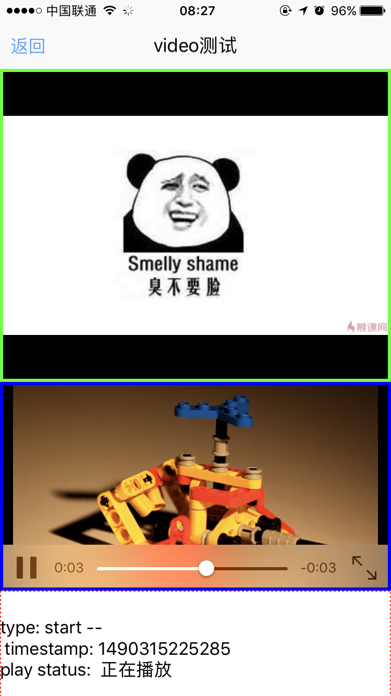

# video组件使用 

----------

视频播放组件，用于实现本地视频及网络视频播放。


<h2 id="cid_1">属性</h2>   


**公共属性**  

[参见公共属性章节](https://gitdocument.exmobi.cn/sprite-api/ggsx.html)，包括：id、style、class；  


**src**  

<code>播放视频文件源路径</code>

支持本地及网络视频文件播放  

> 本地文件：res:前缀，file:前缀  
> 
> 网络文件：http:// https://


**defaultSrc**  

<code>加载失败后需要显示图片</code> 

当网络视频加载过程中及网络或本地视频加载失败后需要显示图片，保持图片比例填充控件区域，只支持本地图片：res:前缀，file:前缀


<h2 id="cid_2">样式</h2>  

**公共样式**  

[参见公共样式章节](https://gitdocument.exmobi.cn/sprite-api/ggys.html)，包括：  
 
> 尺寸
> 
> 定位 
>  
> 外边距
> 
> 背景
> 
> flexbox布局：align-self，flex


<h2 id="cid_3">事件</h2>

**prepared**  

<code>视频控件加载完成后触发</code>

event事件对象包括：  

> type：事件类型，字符串类型，固定值：prepared；
> 
> target：触发事件的目标组件，dom对象；
> 
> timestamp：事件触发的时间戳,单位毫秒，数字类型


**start**  

<code>视频控件开始播放时触发</code>  

vent事件对象包括：   

> type：事件类型，字符串类型，固定值：start；
> 
> target：触发事件的目标组件，dom对象；
> 
> timestamp：事件触发的时间戳,单位毫秒，数字类型


**pause**  

<code>视频控件暂停播放时触发</code>    

event事件对象包括：    

> type：事件类型，字符串类型，固定值：pause；
> 
> target：触发事件的目标组件，dom对象；
> 
> timestamp：事件触发的时间戳,单位毫秒，数字类型


**finish**  

<code>视频控件结束播放时触发</code>  

event事件对象包括：    

> type：事件类型，字符串类型，固定值：finish；
> 
> target：触发事件的目标组件，dom对象；
> 
> timestamp：事件触发的时间戳,单位毫秒，数字类型


**fail**  

<code>视频控件播放异常时触发</code>  

event事件对象包括：    

> type：事件类型，字符串类型，固定值：fail；
> 
> target：触发事件的目标组件，dom对象；
> 
> timestamp：事件触发的时间戳,单位毫秒，数字类型


<h2 id="cid_4">js方法</h2>   


<span id="ff_1">**公共方法**</span>  

[事件相关](https://gitdocument.exmobi.cn/sprite-api/ggff.html#cid_0)，包括：

> [on(messageName:string,callback:Function): void   组件注册事件的触发函数](https://gitdocument.exmobi.cn/sprite-api/ggff.html#jjxg_1)   
> 
> [fire(messageName:string,params:Array&lt;any&gt;): void  组件事件的触发函数](https://gitdocument.exmobi.cn/sprite-api/ggff.html#jjxg_2)   
> 
> [off(messageName:string,callback:Function): void  组件移除事件的触发函数](https://gitdocument.exmobi.cn/sprite-api/ggff.html#jjxg_3)  
>  
> [getOn(messageName:string): Array&lt;Function&gt;  获取已绑定的事件的触发函数](https://gitdocument.exmobi.cn/sprite-api/ggff.html#jjxg_4)   

[动画相关](https://gitdocument.exmobi.cn/sprite-api/ggff.html#cid_1)，包括： 


> [startAnimation(jsonData:Object,callback:Function): void  启动UI组件动画](https://gitdocument.exmobi.cn/sprite-api/ggff.html#dhxg_1)  
> 
> [startAnimator(jsonData:Object,callback:Function): void  启动UI组件属性动画](https://gitdocument.exmobi.cn/sprite-api/ggff.html#dhxg_2)   
> 
> [startKeyFrameAnimator(jsonData:Object,callback:Function): void  启动UI组件关键帧动画](https://gitdocument.exmobi.cn/sprite-api/ggff.html#dhxg_3)  
>  
> [ releaseAnimator(): void  结束控件动画](https://gitdocument.exmobi.cn/sprite-api/ggff.html#dhxg_4)   

[尺寸和位置](https://gitdocument.exmobi.cn/sprite-api/ggff.html#cid_2)，包括：  

> [getFrame(): Object  获取组件在父容器中的位置](https://gitdocument.exmobi.cn/sprite-api/ggff.html#cchwz_1)   
> 
> [setFrame(frame:Object): void  设置组件在父容器中的位置](https://gitdocument.exmobi.cn/sprite-api/ggff.html#cchwz_2)   
> 
> [getCenter(): Object  获取组件中心点在父容器中的位置](https://gitdocument.exmobi.cn/sprite-api/ggff.html#cchwz_3)  
>
> [getAbsoluteFrame(): Object  获取组件在绘制窗口中的位置](https://gitdocument.exmobi.cn/sprite-api/ggff.html#cchwz_4)   


[普通Dom节点操作](https://gitdocument.exmobi.cn/sprite-api/ggff.html#cid_3)，包括：  

> [getParent(): IElement  获取父节点](https://gitdocument.exmobi.cn/sprite-api/ggff.html#ptdom_1)   
> 
> [getNext(): IElement  获取同级下一个节点](https://gitdocument.exmobi.cn/sprite-api/ggff.html#ptdom_2)   
> 
> [getPrevious(): IElement  获取同级前一个节点](https://gitdocument.exmobi.cn/sprite-api/ggff.html#ptdom_3)  
> 
> [remove(): void  从父容器中移除自身](https://gitdocument.exmobi.cn/sprite-api/ggff.html#ptdom_4)  
> 
 
> [setAttr(attrName:string,attrValue:string): void  设置节点属性](https://gitdocument.exmobi.cn/sprite-api/ggff.html#ptdom_6)   
>
> [getAttr(attrName:string):string  获取节点属性值](https://gitdocument.exmobi.cn/sprite-api/ggff.html#ptdom_7) 
>
> [getAttrs(): Object  获取节点所有属性](https://gitdocument.exmobi.cn/sprite-api/ggff.html#ptdom_8) 
>
> [removeAttr(attrName:string): void  移除节点属性](https://gitdocument.exmobi.cn/sprite-api/ggff.html#ptdom_9) 
>
> [hasAttr(attrName:string): boolean  节点是否具有该属性](https://gitdocument.exmobi.cn/sprite-api/ggff.html#ptdom_10) 
> 
> [setStyle(styleName:string,styleValue:string): void  设置节点样式值](https://gitdocument.exmobi.cn/sprite-api/ggff.html#ptdom_13)  
>
> [getStyle(styleName:string):string  获取节点样式值](https://gitdocument.exmobi.cn/sprite-api/ggff.html#ptdom_14)   
>
> [clearStyle(styleName:string): void  移除节点样式值](https://gitdocument.exmobi.cn/sprite-api/ggff.html#ptdom_15)    
>
> [setClassStyle(className:string,domobj:IElement): void   设置节点对应Class样式](https://gitdocument.exmobi.cn/sprite-api/ggff.html#ptdom_16) 
>  
> [getClassStyle(): string  获取节点已设置Class样式](https://gitdocument.exmobi.cn/sprite-api/ggff.htm#ptdom_17)  
>  
> [getTag(): string  获取UI组件类型](https://gitdocument.exmobi.cn/sprite-api/ggff.html#ptdom_18)  
>  
> [getId(): string  获取UI组件Id标识](https://gitdocument.exmobi.cn/sprite-api/ggff.html#ptdom_19) 


**play(): void**  

<code>开始播放</code>  

参数：无  

返回值：无


**pause(): void**  

<code>暂停播放</code> 

参数：无 

返回值：无


**stop(): void**  

<code>停止播放</code>   

参数：无  

返回值：无


**isPlaying(): void**  

<code>是否正在播放视频</code>    

参数：无  

返回值：bool型   

> true：正在播放  
> 
> false：未播放


<h2 id="cid_5">示例</h2>  


示例代码，测试video基本功能，参考演示应用示例：apps\yuanhongqian\spriteui\video.uixml，代码中用到了官方封装的模板titlebar，模板的使用可参考[https://gitdocument.exmobi.cn/sprite-official-ui/index.html](https://gitdocument.exmobi.cn/sprite-official-ui/index.html "https://gitdocument.exmobi.cn/sprite-official-ui/index.html") 

```html
<page>
    <script>
        <![CDATA[
      
        var window = require("Window");
        var document = require("Document");
        var console = require("Console");
        var ui = require("UI");
        require("titlebarUI");
        require("buttonUI");

        var video = null;
        var displaytext = null;
        var box = null;

        window.on("loaded", function () {
          
            video = document.getElement("video");
            displaytext = document.getElement("resultArray");
            video.on("prepared", callback);
            video.on("start", callback);
            video.on("pause", callback);
            video.on("finish", callback);
            video.on("fail", callback);
            setResult("window.on loaded callback");
            //触发回调 监听顶层box 根据id区分
            box = document.getElement("box");
            box.on("click", function (e) {
                var id = e.target.getId();
                //onclick()函数测试触发
                if (id == "stop") {
                    stop();
                } else if (id == "play") {
                    play();
                } else if (id == "pause") {
                    pause();
                } else if (id == "resume") {
                    resume();
                } else if (id == "isPlay") {
                    isPlay();
                }

            });
            //titlebar关闭页面
            var title = document.getElement("title");
            title.on("ltextClick", function (e) {
                var json = {};
                window.close(json);

            });

            function play() {
                video.play();
            }

            function resume() {

                video.resume();
            }

            function stop() {

                video.stop();
            }

            function pause() {

                video.pause();
            }

            function isPlay() {

                var text = video.isPlaying() ? "正在播放" : "未播放";
                setResult(text);
            }

            function setResult(text) {
              
                displaytext.setText(text);
                var count = text.split("\n").length + 1;
                var singleLineHeight = "22";
                displaytext.setStyle("height", (count * parseInt(singleLineHeight)).toString());
                document.refresh();
            }


            function callback(e) {
                var text = "type: " + e.type + " -- " + "\n timestamp: " + e.timestamp;
                text += "\n";
                var z = video.isPlaying() ? "正在播放" : "未播放";
                text += "play status:  " + z;
                text += "\n";
                setResult(text);
            }

        });
    ]]>
    </script>
    <style>
        @import url(res:spritetest/css/import.css);
        button {
            margin: 5 5 5 5;
        }
    </style>
    <ui>
        <box class="rootBox" id="box">
            <titlebar title="video测试" id="title" ltext="返回" style="height: 66;padding:20 0 0 0" />
            <scroll style="flex:1">
                <video id="video1" src="http://v1.mukewang.com/57de8272-38a2-4cae-b734-ac55ab528aa8/L.mp4" style="width:fill_screen;height:300;border-color:green;border-width:3;background-color:red"
                />
                <video id="video" src="http://g.tbcdn.cn/ali-wireless-h5/res/0.0.6/toy.mp4" style="width:fill_screen;height:200;border-color:blue;border-width:3;background-color:red"
                />
                <text id="resultArray" style="width:fill_screen;height:100;border-color:red;border-width:2;border-style:dotted">结果数据区域</text>
                <button id="play" value="play" style="width:105;border-radius:8 8 8 8;border-width:2;border-style:dotted;" />
                <button id="stop" value="stop" style="width:105;border-radius:8 8 8 8;border-width:2;border-style:dotted;" />
                <button id="pause" value="pause" style="width:105;border-radius:8 8 8 8;border-width:2;border-style:dotted;" />
                <button id="resume" value="resume" style="width:105;border-radius:8 8 8 8;border-width:2;border-style:dotted;" />
                <button id="isPlay" value="isPlay" style="width:105;border-radius:8 8 8 8;border-width:2;border-style:dotted;" />
            </scroll>
        </box>
    </ui>
</page>

```

代码效果：

  
 

