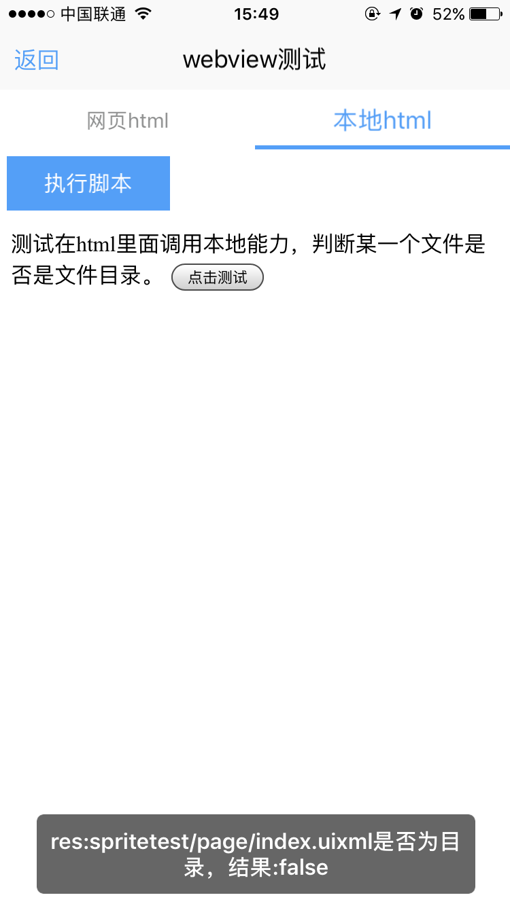

# webview组件使用 

----------

webview组件，用于标识html页面展示。一般用于图文混排的页面使用，比如新闻详情页。也可以用于嵌套一个webapp应用。

**注：**  uixml相对html来说是窗口的概念，html页面内部跳转都将在窗口内部跳转，如果窗口关闭则整个html页面全部关闭。


<h2 id="cid_1">属性</h2>   


**公共属性**  

[参见公共属性章节](https://gitdocument.exmobi.cn/sprite-api/ggsx.html)，包括：id、style、class；  


**url**  

<code>浏览器控件需加载页面地址</code>

支持本地页面方式加载（res:  , file:）,也支持网络页面方式加载(http://，https://) 


**bridge**  

<code>是否注入桥接Api</code>   

注入后可在浏览器中使用本地能力Js函数，[true，false]

> true：注入桥接Api  
> 
> false：不注入（默认）


**zoom**  

<code>浏览器加载页面是否支持缩放</code>   

取值 [true，false ]  

> true：支持缩放  
> 
> false：不支持缩放（默认）


**checkSsl**  

<code>访问https网站时是否校验ssl证书</code> 

取值 [true，false]  

> true：校验ssl证书 （默认）
> 
> false：不校验ssl证书  

**注：** 仅Android支持，iOS固定校验ssl证书 


**progress**  

<code>网络url加载时顶部进度条是否显示</code>  

取值  [true，false] 

> tue：网络url加载时显示顶部进度条（默认）
> 
> false：网络url加载时不显示顶部进度条


**bounces**  

<code>浏览器是否支持弹动</code>  

取值 [true，false] 

> true：支持弹动  
> 
> false：不支持弹动

**注：**  仅iOS支持


<h2 id="cid_2">样式</h2>  

**公共样式**  

[参见公共样式章节](https://gitdocument.exmobi.cn/sprite-api/ggys.html)，包括：  
 
> 尺寸
> 
> 定位 
>  
> 外边距
> 
> 背景
> 
> flexbox布局：align-self，flex


**progress-color**  

<code>进度条颜色</code>  

默认值：#00bf12


<h2 id="cid_3">事件</h2>

webview中的事件在uixml中通过webview组件对象来监听，如果在html页面中，可以通过document.addEventListener("事件名",function(){},false); 来监听。

**plusready**  

<code>页面加载完成后触发</code>

event事件对象包括：   

> type：事件类型，字符串类型，固定值：plusready
> 
> target：触发事件的目标组件，dom对象
> 
> timestamp：事件触发的时间戳,单位毫秒，数字类型


**failed**  

<code>页面加载失败后触发触发</code>  

event事件对象包括： 
  
> type：事件类型，字符串类型，固定值：failed
> 
> target：触发事件的目标组件，dom对象
> 
> timestamp：事件触发的时间戳,单位毫秒，数字类型


**titleChange**  

<code>webview页面加载url，若标题更新则触发回调函</code>    

event事件对象包括：    

> type：事件类型，字符串类型，固定值：titleChange
> 
> target：触发事件的目标组件，dom对象
> 
> timestamp：事件触发的时间戳,单位毫秒，数字类型

param对象为Json对象，定义如下：  

> title：当前页面标题，字符串类型 
> 
> url：当前页面url，字符串类型


<h2 id="cid_4">js方法</h2>   

本节目录：

> [公共方法 ](#ff_1)
> 
> [executeScript(scriptText:string): void   执行webview控件加载html页面js脚本](#ff_2)  
> 
> [clearCache(): void   清理webview浏览器缓存 ](#ff_3)
> 
> [canBack(): boolean   基于已打开html页面是否支持回退  ](#ff_4)
> 
> [back(): void   基于已打开html页面回退](#ff_5)
> 
> [canForward(): boolean  基于已打开html页面是否支持前进](#ff_6)
> 
> [forward (): void  基于已打开html页面前进](#ff_7)

<span id="ff_1"><code>**公共方法**</code></span>  

[事件相关](https://gitdocument.exmobi.cn/sprite-api/ggff.html#cid_0)，包括：

> [on(messageName:string,callback:Function): void   组件注册事件的触发函数](https://gitdocument.exmobi.cn/sprite-api/ggff.html#jjxg_1)   
> 
> [fire(messageName:string,params:Array&lt;any&gt;): void  组件事件的触发函数](https://gitdocument.exmobi.cn/sprite-api/ggff.html#jjxg_2)   
> 
> [off(messageName:string,callback:Function): void  组件移除事件的触发函数](https://gitdocument.exmobi.cn/sprite-api/ggff.html#jjxg_3)  
>  
> [getOn(messageName:string): Array&lt;Function&gt;  获取已绑定的事件的触发函数](https://gitdocument.exmobi.cn/sprite-api/ggff.html#jjxg_4)   

[动画相关](https://gitdocument.exmobi.cn/sprite-api/ggff.html#cid_1)，包括： 


> [startAnimation(jsonData:Object,callback:Function): void  启动UI组件动画](https://gitdocument.exmobi.cn/sprite-api/ggff.html#dhxg_1)  
> 
> [startAnimator(jsonData:Object,callback:Function): void  启动UI组件属性动画](https://gitdocument.exmobi.cn/sprite-api/ggff.html#dhxg_2)   
> 
> [startKeyFrameAnimator(jsonData:Object,callback:Function): void  启动UI组件关键帧动画](https://gitdocument.exmobi.cn/sprite-api/ggff.html#dhxg_3)  
>  
> [ releaseAnimator(): void  结束控件动画](https://gitdocument.exmobi.cn/sprite-api/ggff.html#dhxg_4)   

[尺寸和位置](https://gitdocument.exmobi.cn/sprite-api/ggff.html#cid_2)，包括：  

> [getFrame(): Object  获取组件在父容器中的位置](https://gitdocument.exmobi.cn/sprite-api/ggff.html#cchwz_1)   
> 
> [setFrame(frame:Object): void  设置组件在父容器中的位置](https://gitdocument.exmobi.cn/sprite-api/ggff.html#cchwz_2)   
> 
> [getCenter(): Object  获取组件中心点在父容器中的位置](https://gitdocument.exmobi.cn/sprite-api/ggff.html#cchwz_3)  
>
> [getAbsoluteFrame(): Object  获取组件在绘制窗口中的位置](https://gitdocument.exmobi.cn/sprite-api/ggff.html#cchwz_4)   


[普通Dom节点操作](https://gitdocument.exmobi.cn/sprite-api/ggff.html#cid_3)，包括：  

> [getParent(): IElement  获取父节点](https://gitdocument.exmobi.cn/sprite-api/ggff.html#ptdom_1)   
> 
> [getNext(): IElement  获取同级下一个节点](https://gitdocument.exmobi.cn/sprite-api/ggff.html#ptdom_2)   
> 
> [getPrevious(): IElement  获取同级前一个节点](https://gitdocument.exmobi.cn/sprite-api/ggff.html#ptdom_3)  
> 
> [remove(): void  从父容器中移除自身](https://gitdocument.exmobi.cn/sprite-api/ggff.html#ptdom_4)  
> 
 
> [setAttr(attrName:string,attrValue:string): void  设置节点属性](https://gitdocument.exmobi.cn/sprite-api/ggff.html#ptdom_6)   
>
> [getAttr(attrName:string):string  获取节点属性值](https://gitdocument.exmobi.cn/sprite-api/ggff.html#ptdom_7) 
>
> [getAttrs(): Object  获取节点所有属性](https://gitdocument.exmobi.cn/sprite-api/ggff.html#ptdom_8) 
>
> [removeAttr(attrName:string): void  移除节点属性](https://gitdocument.exmobi.cn/sprite-api/ggff.html#ptdom_9) 
>
> [hasAttr(attrName:string): boolean  节点是否具有该属性](https://gitdocument.exmobi.cn/sprite-api/ggff.html#ptdom_10) 
> 
> [setStyle(styleName:string,styleValue:string): void  设置节点样式值](https://gitdocument.exmobi.cn/sprite-api/ggff.html#ptdom_13)  
>
> [getStyle(styleName:string):string  获取节点样式值](https://gitdocument.exmobi.cn/sprite-api/ggff.html#ptdom_14)   
>
> [clearStyle(styleName:string): void  移除节点样式值](https://gitdocument.exmobi.cn/sprite-api/ggff.html#ptdom_15)    
>
> [setClassStyle(className:string,domobj:IElement): void   设置节点对应Class样式](https://gitdocument.exmobi.cn/sprite-api/ggff.html#ptdom_16) 
>  
> [getClassStyle(): string  获取节点已设置Class样式](https://gitdocument.exmobi.cn/sprite-api/ggff.htm#ptdom_17)  
>  
> [getTag(): string  获取UI组件类型](https://gitdocument.exmobi.cn/sprite-api/ggff.html#ptdom_18)  
>  
> [getId(): string  获取UI组件Id标识](https://gitdocument.exmobi.cn/sprite-api/ggff.html#ptdom_19) 


<span id="ff_2">**executeScript(scriptText:string): void**</span>  

<code>执行webview控件加载html页面js脚本</code>  

参数：  

scriptText：需要执行webview控件内（page内）脚本方法，必选项，支持传递字符串类型变量

返回值：无

示例：

```javascript
var wb = document.getElement("wbid");
//abc方法在html页面中，并且传参给abc方法
wb.executeScript("abc('123')");
```


<span id="ff_3">**clearCache(): void**</span>  

<code>清理webview浏览器缓存</code> 

参数：无 

返回值：无


<span id="ff_4">**canBack(): boolean**</span>  

<code>基于已打开html页面是否支持回退</code>   

参数：无  

返回值：bool型 

> true：支持回退
> 
> false：不支持回退


<span id="ff_5">**back(): void**</span>  

<code>基于已打开html页面回退</code>    

参数：无 

返回值：无


<span id="ff_6">**canForward(): boolean**</span>  

<code>基于已打开html页面是否支持前进</code>  

参数：无  

返回值：bool型  

> true：支持前进
> 
> false：不支持前进


<span id="ff_7">**forward (): void**</span>  

<code>基于已打开html页面前进</code>  

参数：无  

返回值：无


<h2 id="cid_5">内置对象</h2>   

在html页面内置NativePage对象用于实现webview内的html页面调用外部uixml页面JS。

**executeScript(scriptText:string):string** 

<code>webview控件内部调用外部uixml页面JS</code>  

参数：

scriptText：需要执行外部uixml页面脚本方法，必选项，字符串类型

返回值：执行结果，字符类型，若无返回值则返回null

示例：

```javascript
//示例一：可以放在某个按钮点击时触发
//abc方法在uixml页面中，并且传参给abc方法
NativePage.executeScript("abc('123')");


//示例二：
//页面加载的时候执行
document.addEventListener("plusready", function () {
          NativePage.executeScript("abc('123')");
 }, false);
```

**注：**  如果想在html页面加载的过程执行，需要放在plusready完成之后，如上述示例代码二。


<h2 id="cid_6">示例</h2>  


示例代码，测试webview事件和方法，参考演示应用示例：apps\yuanhongqian\spriteui\webview.uixml，代码中用到了官方封装的titlebar等组件，模板的使用可参考[https://gitdocument.exmobi.cn/sprite-official-ui/index.html](https://gitdocument.exmobi.cn/sprite-official-ui/index.html "https://gitdocument.exmobi.cn/sprite-official-ui/index.html") 

```html
<page>
    <script>
        <![CDATA[
        var index = 1;
        var window = require("Window");
        var document = require("Document");
        var ui = require("UI");
        require("titlebarUI");
        require("buttonUI");
        require("tabbarUI");


        function alert(msg) {
            var json = {};
            json.title = "提示";
            json.content = msg;
            json.buttonText = "确定";
            ui.alert(json);
        }

        window.on("loaded", function () {
            //触发回调 监听顶层box 根据id区分

            var webview = document.getElement("webview");
            var webview1 = document.getElement("webview1");

            var tabbarid1 = document.getElement("tabbarid1");

            var sliderid = document.getElement("sliderid");

            var json = {};
            var datas = new Array();

            var item= {};
            itemJson.text = "网页html";
            datas.push(itemJson:string): Object;

            var item= {};
            itemJson.text = "本地html";
            datas.push(itemJson:string): Object;

            json.datas = datas;
            tabbarid1.loadData(json);

            webview.on("plusready", function (e) {

                // alert("uixml:webview加载完毕");
            });
            webview1.on("titleChange", function (e, param) {
                alert(param.title + param.url);
            });

            //titlebar关闭页面
            var title = document.getElement("title");
            title.on("ltextClick", function (e) {
                var json = {};
                window.close(json);

            });

            var btn = document.getElement("test");
            btn.on("click", function (e) {
                webview.executeScript("clickTest()");

            });
            var btn1 = document.getElement("test1");
            btn1.on("click", function (e) {

                if (webview1.canBack())
                    webview1.back();
                else
                    alert("不能后退呀");

            });

            var btn2 = document.getElement("test2");
            btn2.on("click", function (e) {

                if (webview1.canForward())
                    webview1.forward();
                else
                    alert("不能前进呀");

            });

        });

    ]]>
    </script>
    <style>
        @import url(res:spritetest/css/import.css);
        button {
            margin: 5 5 5 5;
            width: 120;
        }
    </style>
    <ui>
        <box class="rootBox" id="box">

            <titlebar title="webview测试" id="title" ltext="返回" style="height: 66;padding:20 0 0 0" />
            <tabbar id="tabbarid1" bindid="sliderid" style="color:#909090;background-color: #ffffff;" />
            <slider style="flex:1" id="sliderid">
                <box style="flex:1;">
                    <box style="flex-direction:row">
                        <button value="回退" id="test1" />
                        <button value="前进" id="test2" />

                    </box>
                    <webview style="progress-color:red;flex:1" id="webview1" progress="false" bridge="false" url="https://www.baidu.com" />
                </box>
                <box>
                    <button value="执行脚本" id="test" />
                    <webview style="progress-color:red;flex:1" id="webview" bridge="true" url="res:yuanhongqian/spriteui/webview.html" />
                </box>

            </slider>
        </box>
    </ui>
</page>

```


webview.html页面代码：  

```html
<html>
<head>
    <script type="text/javascript">
        var file = null;
        var Student = null;
        var ui = null;
        document.addEventListener("plusready", function () {
            //webview中需要在页面加载完毕的时候在require组件
            ui = require("UI");
            file = require("File");
            init();
        }, false);

        function init() {
            var res = file.isDir("res:spritetest/page");
            alertTest("res:spritetest/page是否为目录，结果:" + res);

        }

        function $(id) {
            return document.getElementById(id);
        }

        function alertTest(msg) {
            var json = {};
            json.title = "提示";
            json.duration = 1;
            json.content = msg;
            ui.toast(json);
        }

        function clickTest() {
            var res = file.isDir("res:spritetest/page/index.uixml");
            alertTest("res:spritetest/page/index.uixml是否为目录，结果:" + res);

        }
    </script>
</head>

<body>
    测试在html里面调用本地能力，判断某一个文件是否是文件目录。
    <input type="button" value="点击测试" onclick="javascript:clickTest()" />
</body>
</html>
```  

    

